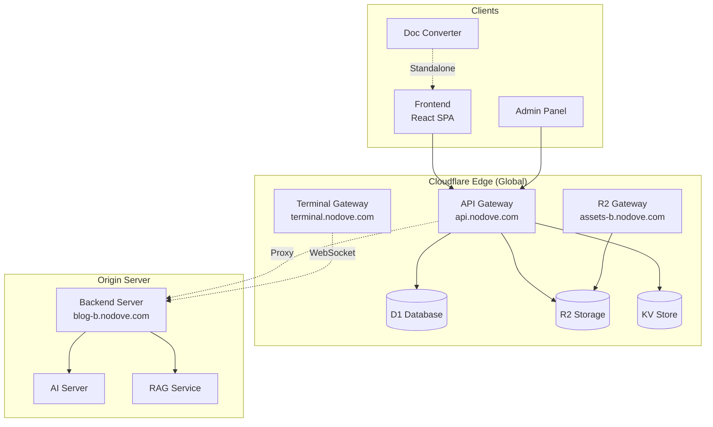
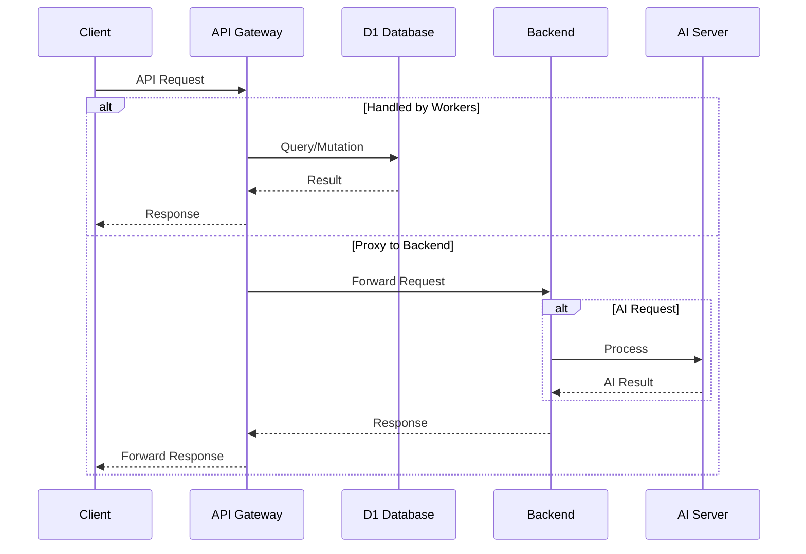
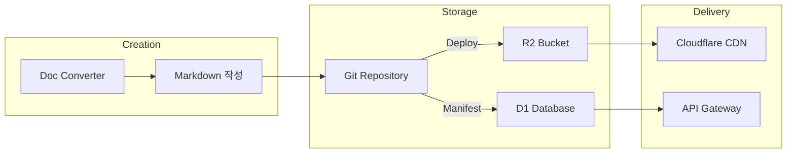

# Nodove Blog Platform

> Full-Stack 블로그 플랫폼 - Edge Computing 기반 고성능 아키텍처

## 🏗️ Architecture Overview



---

## 📚 Documentation Index

### Core Services

| Service | Description | Documentation |
|---------|-------------|---------------|
| **Cloudflare Workers** | Edge Computing 레이어 (API Gateway, R2, Terminal) | [📄 workers/README.md](./workers/README.md) |
| **API Gateway** | 통합 API 진입점 (인증, 콘텐츠, AI, 분석) | [📄 workers/api-gateway/README.md](./workers/api-gateway/README.md) |
| **R2 Gateway** | Object Storage 접근 제어 및 Edge 캐싱 | [📄 workers/r2-gateway/README.md](./workers/r2-gateway/README.md) |
| **Backend Server** | Origin 서버 (AI, RAG, OG Image) | [📄 backend/README.md](./backend/README.md) |

### Subsystems

| Subsystem | Description | Documentation |
|-----------|-------------|---------------|
| **AI Service** | 지능형 기능 (요약, 분석, RAG) | [📄 docs/AI_SERVICE_ANATOMY_MAP.md](./docs/AI_SERVICE_ANATOMY_MAP.md) |
| **CI/CD Pipeline** | GitHub Actions 자동 배포 | [📄 backend/README-CICD.md](./backend/README-CICD.md) |
| **Doc Converter** | DOCX/PDF → Markdown 변환기 | [📄 doc-converter/README.md](./doc-converter/README.md) |

---

## 🛠️ Tech Stack

### Edge Layer (Cloudflare)
- **Runtime**: Cloudflare Workers (V8 Isolate)
- **Framework**: Hono
- **Database**: D1 (SQLite)
- **Storage**: R2 (S3 Compatible)
- **Cache**: KV Store
- **Language**: TypeScript

### Frontend
- **Framework**: React 18 + Vite
- **Styling**: Tailwind CSS
- **State**: Zustand
- **Build**: Vite 5

### Backend
- **Runtime**: Node.js 20+
- **Framework**: Express 4
- **Image Processing**: Sharp
- **AI Backend**: OpenCode Server
- **Vector DB**: ChromaDB

---

## 🌐 Domain Structure

| Domain | Service | Purpose |
|--------|---------|---------|
| `noblog.nodove.com` | Frontend | React SPA (GitHub Pages) |
| `api.nodove.com` | API Gateway | All API requests |
| `assets-b.nodove.com` | R2 Gateway | Static assets, images |
| `terminal.nodove.com` | Terminal Gateway | WebSocket terminal |
| `blog-b.nodove.com` | Backend | Origin server |

---

## 📂 Project Structure

```
blog/
├── frontend/                    # React SPA
│   ├── src/                    # React 소스코드
│   └── public/
│       └── posts/              # Markdown 블로그 포스트
│
├── workers/                     # Cloudflare Workers
│   ├── api-gateway/            # 메인 API Gateway
│   │   ├── src/routes/         # API 라우트
│   │   ├── migrations/         # D1 마이그레이션
│   │   └── wrangler.toml       # Workers 설정
│   ├── r2-gateway/             # R2 스토리지 Gateway
│   └── terminal-gateway/       # WebSocket 터미널 Gateway
│
├── backend/                     # Node.js Origin Server
│   ├── src/
│   │   ├── routes/             # API 라우트
│   │   └── lib/                # 유틸리티 (AI, RAG, Agent)
│   ├── docker-compose.yml
│   └── Dockerfile
│
├── shared/                      # 공유 유틸리티
│
├── doc-converter/               # 문서 변환 도구
│   └── src/                    # React + Vite
│
├── docs/                        # 추가 문서
│   └── AI_SERVICE_ANATOMY_MAP.md
│
├── scripts/                     # 유틸리티 스크립트
│
└── .github/
    └── workflows/              # CI/CD 파이프라인
        ├── deploy-blog-workflow.yml
        └── deploy-api-gateway.yml
```

---

## 🚀 Quick Start

### Prerequisites
- Node.js 20+
- npm 9+
- Wrangler CLI (`npm i -g wrangler`)
- Docker (for backend)

### Local Development

```bash
# 1. Clone repository
git clone https://github.com/your-username/blog.git
cd blog

# 2. Install dependencies
npm install

# 3. Start all services
./start-all-local.sh
```

### Individual Service Development

```bash
# Frontend (React)
cd frontend
npm install
npm run dev
# → http://localhost:5173

# API Gateway (Workers)
cd workers/api-gateway
npm install
npx wrangler dev
# → http://localhost:8787

# Backend (Node.js)
cd backend
npm install
npm run dev
# → http://localhost:5080

# Doc Converter
cd doc-converter
npm install
npm run dev
# → http://localhost:5174
```

---

## 📋 API Overview

### Authentication
```
POST /api/v1/auth/login         - 로그인 (OTP 발송)
POST /api/v1/auth/verify-otp    - OTP 검증 → JWT 발급
POST /api/v1/auth/refresh       - Access Token 갱신
POST /api/v1/auth/logout        - 로그아웃
```

### Content
```
GET  /api/v1/posts              - 게시글 목록
GET  /api/v1/posts/:slug        - 게시글 상세
POST /api/v1/posts              - 게시글 생성 (Admin)
GET  /api/v1/comments           - 댓글 목록
POST /api/v1/comments           - 댓글 작성
```

### AI
```
POST /api/v1/ai/sketch          - 개념 스케치
POST /api/v1/ai/prism           - 다각도 분석
POST /api/v1/ai/chain           - 연쇄 사고 분석
POST /api/v1/rag/query          - RAG 질의응답
```

### Analytics
```
POST /api/v1/analytics/view     - 조회수 기록
GET  /api/v1/analytics/trending - 트렌딩 게시글
GET  /api/v1/analytics/editor-picks - 에디터 픽
```

---

## 🔧 Configuration

### Environment Variables

각 서비스별 환경변수는 해당 README를 참조하세요:
- [API Gateway Secrets](./workers/api-gateway/README.md#5-dependencies--environment-의존성)
- [Backend Environment](./backend/README.md#5-dependencies--environment-의존성)

### Cloudflare Setup

```bash
# Login to Cloudflare
npx wrangler login

# Deploy API Gateway
cd workers/api-gateway
npx wrangler deploy --env production

# Set secrets
npx wrangler secret put JWT_SECRET --env production
npx wrangler secret put ADMIN_USERNAME --env production
npx wrangler secret put ADMIN_PASSWORD --env production
```

---

## 📖 Documentation Deep Dive

### 1. Workers Layer
전체 Edge Computing 아키텍처 이해:
→ [workers/README.md](./workers/README.md)

### 2. API Gateway Details
인증, 라우팅, 프록시 메커니즘:
→ [workers/api-gateway/README.md](./workers/api-gateway/README.md)

### 3. R2 Storage Access
캐싱 전략, 접근 제어:
→ [workers/r2-gateway/README.md](./workers/r2-gateway/README.md)

### 4. Backend Server
AI 서비스, RAG, Agent 시스템:
→ [backend/README.md](./backend/README.md)

### 5. AI Service Architecture
Provider 선택, 스트리밍, Vision:
→ [docs/AI_SERVICE_ANATOMY_MAP.md](./docs/AI_SERVICE_ANATOMY_MAP.md)

### 6. CI/CD Pipeline
GitHub Actions, Docker 배포:
→ [backend/README-CICD.md](./backend/README-CICD.md)

### 7. Doc Converter Tool
DOCX/PDF 변환 워크플로우:
→ [doc-converter/README.md](./doc-converter/README.md)

---

## 🔄 Data Flow

### Request Lifecycle



### Content Publishing Flow



---

## 📊 Monitoring

### Health Checks

```bash
# API Gateway
curl https://api.nodove.com/health

# Backend
curl https://blog-b.nodove.com/api/v1/healthz

# R2 Gateway
curl https://assets-b.nodove.com/health
```

### Logs

```bash
# Workers 실시간 로그
npx wrangler tail --env production

# Backend 로그 (Docker)
docker compose logs -f api

# Backend 로그 (PM2)
pm2 logs blog-backend
```

---

## 🤝 Contributing

1. Fork the repository
2. Create feature branch (`git checkout -b feature/amazing-feature`)
3. Commit changes (`git commit -m 'Add amazing feature'`)
4. Push to branch (`git push origin feature/amazing-feature`)
5. Open Pull Request

---

## 📄 License

This project is private. All rights reserved.

---

## 📞 Contact

- **Author**: nodove
- **Blog**: [noblog.nodove.com](https://noblog.nodove.com)
- **API**: [api.nodove.com](https://api.nodove.com)
