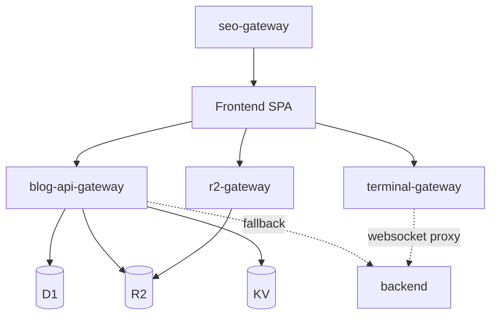

# Nodove Blog Platform

> 참고: 이 문서의 공개 호스트명과 운영 주소 예시는 모두 비식별 placeholder입니다.

## Overview

이 저장소는 블로그 프론트엔드, Cloudflare Workers 기반 edge 레이어, Node.js backend, k3s 배포 매니페스트를 함께 관리합니다.

- `frontend/`: React 18 + Vite SPA
- `workers/`: Cloudflare Workers (`api-gateway`, `r2-gateway`, `terminal-gateway`, `seo-gateway`)
- `backend/`: Node.js Express origin server
- `k3s/`: k3s base/optional manifests
- `docs/`: 운영 규칙과 분석 문서

## Runtime Topology


```mermaid
flowchart TB
    FE[Frontend SPA]
    SEO[seo-gateway]
    API[blog-api-gateway]
    R2GW[r2-gateway]
    TERM[terminal-gateway]
    BE[backend]
    D1[(D1)]
    R2[(R2)]
    KV[(KV)]

    FE --> API
    FE --> R2GW
    FE --> TERM
    SEO --> FE
    API --> D1
    API --> R2
    API --> KV
    API -. fallback .-> BE
    TERM -. websocket proxy .-> BE
    R2GW --> R2
```

## Documentation Index

| Area | Purpose | Document |
| --- | --- | --- |
| Edge layer | Worker roles, bindings, migrations, deployment | `workers/README.md` |
| Backend | Route boundaries, runtime dependencies, operations | `backend/README.md` |
| k3s | Base manifests, optional terminal runtime, rollout constraints | `k3s/README.md` |
| Post naming | Filename and slug convention | `docs/post-filename-convention.md` |
| Ownership | Worker/backend canonical owner matrix | `docs/canonical-owner-matrix.md` |
| Shared contracts | Shared schema rollout order | `docs/shared-contract-rollout.md` |
| AI config analysis | AI configuration consistency notes | `docs/ai-config-consistency-plan.md` |
| News analysis | News service notes | `docs/news-service-analysis.md` |
| Optimization analysis | Performance investigation notes | `docs/optimization-analysis.md` |

## Repository Layout

```text
blog/
|- frontend/              React SPA and build scripts
|- workers/               Cloudflare Workers and D1 migrations
|- backend/               Express origin server and terminal server
|- k3s/                   Kubernetes manifests for origin-side services
|- docs/                  Project documentation and analysis notes
|- scripts/               Repository utility scripts
`- docs/generated/        Generated governance and contract artifacts
```

## Local Development

일반 로컬 실행은 각 서비스 디렉토리에서 따로 실행합니다. 루트 `package.json`에는 k3s backend 연결 확인용 보조 스크립트만 둡니다.

### Frontend

```bash
cd frontend
npm ci
npm run dev
```

- dev server: `http://localhost:5173`
- `predev`에서 manifest와 `runtime-config.json`을 먼저 생성합니다.

#### k3s backend 연결 로컬 실행

브라우저 CORS를 피하면서 실제 k3s backend를 로컬 프론트에서 확인하려면 터미널 2개를 사용합니다.

```bash
npm run k3s:backend:tunnel
```

다른 터미널:

```bash
npm run dev:frontend:k3s
```

- `k3s:backend:tunnel`은 `ssh blog` 접속 후 원격 k3s에서 `blog/api:5080` 서비스를 로컬 `127.0.0.1:5081`로 포워딩합니다. SSH TCP forwarding이 막힌 환경을 위해 기본값은 `socat` 기반 stdio 브리지입니다.
- `dev:frontend:k3s`는 프론트를 `http://localhost:8093`에서 실행하고, 같은 origin의 `/api` 요청을 `http://127.0.0.1:5081`로 프록시합니다.
- 보호 라우트 호출을 위해 `dev:frontend:k3s`는 `ssh blog`로 k3s `blog-app-secrets/GATEWAY_SIGNING_SECRET`과 `BACKEND_KEY`를 읽고 Vite proxy에서 `X-Gateway-*` 서명과 `X-Backend-Key`를 붙입니다.
- 포트 변경: `K3S_BACKEND_LOCAL_PORT=5091 VITE_DEV_PORT=8094 npm run dev:frontend:k3s`

### Workers

```bash
cd workers
npm run bootstrap
npm run dev
```

- 루트 `workers/package.json`의 `npm run dev`는 `api-gateway` 하위 패키지로 위임됩니다.
- 개별 worker 작업 시 `workers/<name>/`에서 `npm ci && wrangler dev`를 직접 실행합니다.

### Backend

```bash
cd backend
npm ci
npm run dev
```

- default port: `5080`
- health check: `http://localhost:5080/api/v1/healthz`

## Verified Entrypoints

### Frontend

- 정적 컨텐츠와 SPA는 `frontend/`에서 관리합니다.
- build/dev/test/lint/typecheck 스크립트는 `frontend/package.json`에 정의되어 있습니다.

### Workers

- `blog-api-gateway`
  - health: `/_health`, `/healthz`
  - public config: `/public/config`, `/api/v1/public/config`
  - mounted API prefixes: `/auth`, `/posts`, `/comments`, `/ai`, `/chat`, `/images`, `/og`, `/analytics`, `/translate`, `/config`, `/rag`, `/memos`, `/memories`, `/admin/ai`, `/admin/secrets`, `/internal`, `/personas`, `/user-content`, `/search`, `/user`, `/debate`, `/subscribe`, `/contact`, `/notifications`, `/admin/logs`, `/gateway`
  - fallback: unhandled routes proxy to backend
  - cron: `0 6 * * *`
- `r2-gateway`
  - public prefixes: `ai-chat/`, `images/`, `posts/`, `assets/`
  - internal API: `/internal/{resource}/{userId}/{id?}`
- `terminal-gateway`
  - `/terminal` websocket path만 처리
  - JWT, rate limiting, single-session, geo blocking, `X-Backend-Key` 주입
- `seo-gateway`
  - crawler request만 HTML meta rewrite
  - non-crawler는 static/GitHub Pages 흐름으로 pass-through

### Backend

- public routes before backend-key guard:
  - `GET /api/v1/healthz`
  - `GET /api/v1/public/config`
  - `GET /metrics` (`X-Backend-Key` required by the route itself)
  - `/api/v1/notifications` (route-local auth)
- 이후 `requireBackendKey`가 적용되고 나머지 `/api/v1/*` backend routes가 mount 됩니다.

## Deployment Notes

### CI/CD metadata in this archive

- 현재 저장소에는 `.github/workflows/` 디렉터리가 포함되어 있지 않습니다.
- 따라서 이 문서에서는 실제 확인 가능한 `k3s/` 매니페스트와 생성된 governance 산출물을 기준으로 운영 모델을 설명합니다.
- GitHub Actions 세부 workflow 이름과 trigger는 현재 저장소만으로는 검증할 수 없습니다.

### k3s

- `k3s/kustomization.yaml` base set에는 `namespace.yaml`, `limitrange.yaml`, `resourcequota.yaml`, `configmap.yaml`, `postgres.yaml`, `redis.yaml`, `chromadb.yaml`, `surrealdb.yaml`, `open-notebook.yaml`, `api.yaml`, `ingress.yaml`, `middleware.yaml`, `piston.yaml`이 포함되고 terminal runtime은 제외됩니다.
- optional terminal runtime과 optional `cloudflared` tunnel connector는 각각 `k3s/optional/terminal`, `k3s/optional/cloudflared`로 분리됩니다.
- production bootstrap은 `k3s/argocd` 기준으로 Argo CD와 Argo CD Image Updater를 설치하는 흐름입니다.
- `docker-compose` 기반 재시작은 local/dev 또는 ad-hoc origin debugging 문맥으로만 해석하는 편이 안전합니다.

## Operations Quick Checks

```bash
# backend health
curl http://localhost:5080/api/v1/healthz

# backend metrics
curl -H 'X-Backend-Key: <key>' http://localhost:5080/metrics

# workers health (local or deployed base URL)
curl https://api.example.com/_health
curl https://api.example.com/healthz
```

## Notes And Boundaries

- 이 저장소 기준으로 루트에서 모든 서비스를 한 번에 실행하는 스크립트는 확인되지 않았습니다.
- `.github/workflows/`, `doc-converter/`, `backend/README-CICD.md`, `docs/AI_SERVICE_ANATOMY_MAP.md`는 현재 저장소에서 확인되지 않았으므로 이 문서에서 제외했습니다.
- 서비스별 상세 계약, 운영 지침, 제약은 `workers/README.md`, `backend/README.md`, `k3s/README.md`를 기준으로 확인하는 것이 안전합니다.
