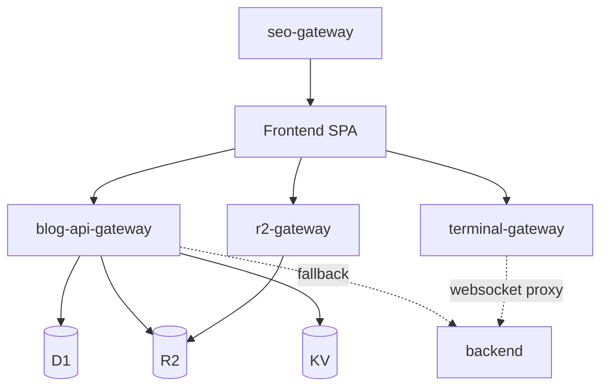

# Nodove Blog Platform

> 참고: 이 문서의 공개 호스트명과 운영 주소 예시는 모두 비식별 placeholder입니다.

## Overview

이 저장소는 블로그 프론트엔드, Cloudflare Workers 기반 edge 레이어, Node.js backend, k3s 배포 매니페스트를 함께 관리합니다.

- `frontend/`: React 18 + Vite SPA
- `workers/`: Cloudflare Workers (`api-gateway`, `r2-gateway`, `terminal-gateway`, `seo-gateway`)
- `backend/`: Node.js Express origin server
- `k3s/`: k3s base/optional manifests
- `docs/`: 운영 규칙과 분석 문서

## Runtime Topology


```mermaid
flowchart TB
    FE[Frontend SPA]
    SEO[seo-gateway]
    API[blog-api-gateway]
    R2GW[r2-gateway]
    TERM[terminal-gateway]
    BE[backend]
    D1[(D1)]
    R2[(R2)]
    KV[(KV)]

    FE --> API
    FE --> R2GW
    FE --> TERM
    SEO --> FE
    API --> D1
    API --> R2
    API --> KV
    API -. fallback .-> BE
    TERM -. websocket proxy .-> BE
    R2GW --> R2
```

## Documentation Index

| Area | Purpose | Document |
| --- | --- | --- |
| Edge layer | Worker roles, bindings, migrations, deployment | `workers/README.md` |
| Backend | Route boundaries, runtime dependencies, operations | `backend/README.md` |
| k3s | Base manifests, optional terminal runtime, rollout constraints | `k3s/README.md` |
| Post naming | Filename and slug convention | `docs/post-filename-convention.md` |
| Ownership | Worker/backend canonical owner matrix | `docs/canonical-owner-matrix.md` |
| Shared contracts | Shared schema rollout order | `docs/shared-contract-rollout.md` |
| AI config analysis | AI configuration consistency notes | `docs/ai-config-consistency-plan.md` |
| News analysis | News service notes | `docs/news-service-analysis.md` |
| Optimization analysis | Performance investigation notes | `docs/optimization-analysis.md` |

## Repository Layout

```text
blog/
|- frontend/              React SPA and build scripts
|- workers/               Cloudflare Workers and D1 migrations
|- backend/               Express origin server and terminal server
|- k3s/                   Kubernetes manifests for origin-side services
|- docs/                  Project documentation and analysis notes
|- scripts/               Repository utility scripts
`- .github/workflows/     GitHub Actions workflows
```

## Local Development

루트 `package.json`은 서비스 오케스트레이션을 제공하지 않습니다. 각 서비스는 자신의 디렉토리에서 따로 실행합니다.

### Frontend

```bash
cd frontend
npm ci
npm run dev
```

- dev server: `http://localhost:5173`
- `predev`에서 manifest와 `runtime-config.json`을 먼저 생성합니다.

### Workers

```bash
cd workers
npm ci
npm run dev
```

- 기본 `npm run dev`는 `wrangler dev`로 `api-gateway`를 띄웁니다.
- 개별 worker 작업 시 `workers/<name>/`에서 `wrangler dev`를 실행합니다.

### Backend

```bash
cd backend
npm ci
npm run dev
```

- default port: `5080`
- health check: `http://localhost:5080/api/v1/healthz`

## Verified Entrypoints

### Frontend

- 정적 컨텐츠와 SPA는 `frontend/`에서 관리합니다.
- build/dev/test/lint/typecheck 스크립트는 `frontend/package.json`에 정의되어 있습니다.

### Workers

- `blog-api-gateway`
  - health: `/_health`, `/healthz`
  - public config: `/public/config`, `/api/v1/public/config`
  - mounted API prefixes: `/auth`, `/posts`, `/comments`, `/ai`, `/chat`, `/images`, `/og`, `/analytics`, `/translate`, `/config`, `/rag`, `/memos`, `/memories`, `/admin/ai`, `/admin/secrets`, `/internal`, `/personas`, `/user-content`, `/search`, `/user`, `/debate`, `/subscribe`, `/contact`, `/notifications`, `/admin/logs`, `/gateway`
  - fallback: unhandled routes proxy to backend
  - cron: `0 6 * * *`
- `r2-gateway`
  - public prefixes: `ai-chat/`, `images/`, `posts/`, `assets/`
  - internal API: `/internal/{resource}/{userId}/{id?}`
- `terminal-gateway`
  - `/terminal` websocket path만 처리
  - JWT, rate limiting, single-session, geo blocking, `X-Backend-Key` 주입
- `seo-gateway`
  - crawler request만 HTML meta rewrite
  - non-crawler는 static/GitHub Pages 흐름으로 pass-through

### Backend

- public routes before backend-key guard:
  - `GET /api/v1/healthz`
  - `GET /api/v1/public/config`
  - `GET /metrics` (`X-Backend-Key` required by the route itself)
  - `/api/v1/notifications` (route-local auth)
- 이후 `requireBackendKey`가 적용되고 나머지 `/api/v1/*` backend routes가 mount 됩니다.

## Deployment Notes

### GitHub Actions

- `deploy-workers.yml`
  - trigger: `workers/**` 또는 workflow file 변경, 수동 실행
  - worker matrix 기준으로 production worker를 검증 후 배포
  - secret 주입은 `sync-workers-secrets.yml` 수동 workflow로 분리
- `deploy-blog-workflow.yml`
  - trigger: `backend/**` 또는 workflow file 변경, 수동 실행
  - `blog-api`, `blog-terminal` 이미지를 GHCR에 build/push
  - production rollout model은 GitOps 기준임
  - Argo CD가 저장소의 `k3s` 경로를 감시하고, Argo CD Image Updater가 immutable SHA tag를 선택한 뒤 auto-sync로 반영함
  - production 기준으로는 SSH 접속 후 수동 `git pull` 또는 수동 rollout restart를 전제하지 않음
- PR validation은 `deploy.yml`, `validate-workers.yml`, `validate-backend.yml`, `governance.yml`, `validate-k3s.yml`로 분리됩니다.

### k3s

- `k3s/kustomization.yaml` base set에는 `namespace.yaml`, `limitrange.yaml`, `resourcequota.yaml`, `configmap.yaml`, `postgres.yaml`, `redis.yaml`, `chromadb.yaml`, `surrealdb.yaml`, `open-notebook.yaml`, `api.yaml`, `ingress.yaml`, `middleware.yaml`, `piston.yaml`이 포함되고 terminal runtime은 제외됩니다.
- optional terminal runtime과 optional `cloudflared` tunnel connector는 각각 `k3s/optional/terminal`, `k3s/optional/cloudflared`로 분리됩니다.
- production bootstrap은 `k3s/argocd` 기준으로 Argo CD와 Argo CD Image Updater를 설치하는 흐름입니다.
- `docker-compose` 기반 재시작은 local/dev 또는 ad-hoc origin debugging 문맥으로만 해석하는 편이 안전합니다.

## Operations Quick Checks

```bash
# backend health
curl http://localhost:5080/api/v1/healthz

# backend metrics
curl -H 'X-Backend-Key: <key>' http://localhost:5080/metrics

# workers health (local or deployed base URL)
curl https://api.example.com/_health
curl https://api.example.com/healthz
```

## Notes And Boundaries

- 이 저장소 기준으로 루트에서 모든 서비스를 한 번에 실행하는 스크립트는 확인되지 않았습니다.
- `doc-converter/`, `backend/README-CICD.md`, `docs/AI_SERVICE_ANATOMY_MAP.md`는 현재 저장소에서 확인되지 않았으므로 이 문서에서 제외했습니다.
- 서비스별 상세 계약, 운영 지침, 제약은 `workers/README.md`, `backend/README.md`, `k3s/README.md`를 기준으로 확인하는 것이 안전합니다.
