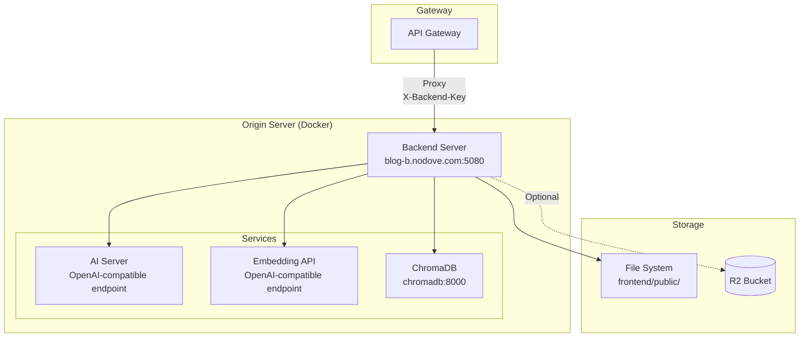
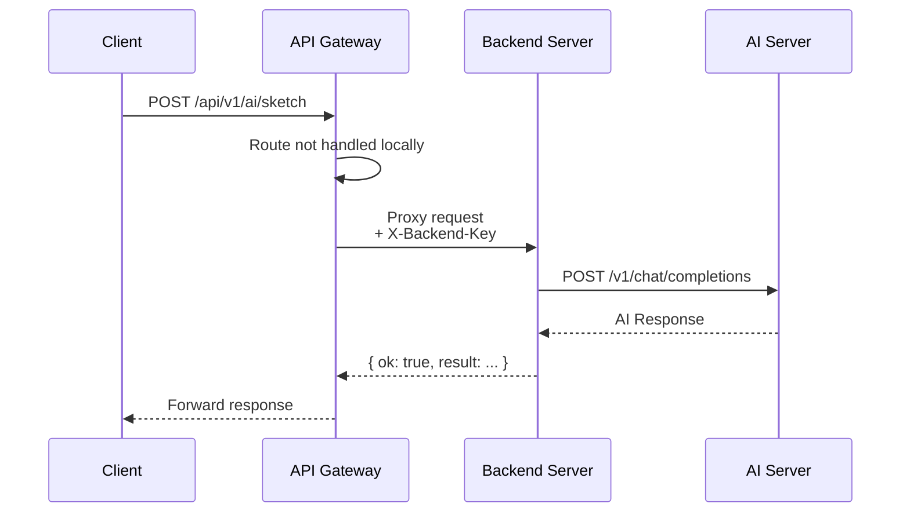

# Backend API Server

## 1. Service Overview (개요)

### 목적

Backend API Server는 블로그 플랫폼의 **Origin 서버**입니다. Gateway가 처리하지 않는 요청을 담당하며, 파일 시스템 기반 콘텐츠 관리, AI 서비스 연동, OG 이미지 생성 등을 제공합니다.

> **⚠️ 아키텍처 노트**
>
> - **주 진입점**: Gateway
> - **이 서버**: API Gateway의 백엔드 프록시 대상
> - API 요청은 서버/게이트웨이 구성에 따라 처리됩니다.

### 주요 기능

| 기능              | 설명                                          | 상태   |
| ----------------- | --------------------------------------------- | ------ |
| **Posts API**     | 파일 시스템 기반 게시글 CRUD, 매니페스트 생성 | Legacy |
| **Images API**    | 이미지 업로드/관리, Sharp 리사이징            | Legacy |
| **AI API**        | OpenAI SDK 호환 AI 기능 (요약, 분석)          | Active |
| **RAG API**       | ChromaDB 기반 벡터 검색 및 질의응답           | Active |
| **Agent API**     | Multi-tool AI Agent orchestration             | Active |
| **OG Image**      | Sharp 기반 Open Graph 이미지 동적 생성        | Active |
| **Comments API**  | 댓글 관리                                     | Active |
| **Analytics API** | 조회수/트렌딩                                 | Active |

### 기술 스택

- **Runtime**: Node.js 20+
- **Framework**: Express 4
- **Port**: `5080` (기본)
- **Image Processing**: Sharp
- **AI Backend**: OpenAI-compatible server (AI_SERVER_URL)
- **Vector DB**: ChromaDB + OpenAI-compatible Embeddings

---

## 2. Architecture & Data Flow (구조 및 흐름)

### System Architecture



### Request Flow (API Gateway Proxy)



### Content Path Resolution

```mermaid
flowchart LR
    subgraph "Path Resolution"
        CWD[process.cwd()<br/>= /app (Docker)]
        ROOT[repoRoot<br/>= /app/.. = /]
        PUBLIC[publicDir<br/>= /frontend/public]
        POSTS[postsDir<br/>= /frontend/public/posts]
        IMAGES[imagesDir<br/>= /frontend/public/images]
    end

    CWD --> ROOT
    ROOT --> PUBLIC
    PUBLIC --> POSTS
    PUBLIC --> IMAGES
```

**Docker에서의 경로 매핑:**

```
Host: ./frontend/public  →  Container: /frontend/public
```

---

## 3. API Specification (인터페이스 명세)

### Health & Config

| Method | Endpoint                | Output                             | Description |
| ------ | ----------------------- | ---------------------------------- | ----------- |
| `GET`  | `/api/v1/healthz`       | `{ ok, env, uptime }`              | 헬스체크    |
| `GET`  | `/api/v1/public/config` | `{ siteBaseUrl, apiBaseUrl, env }` | 공개 설정   |

### AI Routes (`/api/v1/ai`)

| Method | Endpoint     | Input                       | Output       | Description    |
| ------ | ------------ | --------------------------- | ------------ | -------------- |
| `POST` | `/summarize` | `{ text, instructions? }`   | `{ result }` | 텍스트 요약    |
| `POST` | `/generate`  | `{ prompt, temperature? }`  | `{ result }` | 텍스트 생성    |
| `POST` | `/sketch`    | `{ paragraph, postTitle? }` | `{ result }` | 개념 스케치    |
| `POST` | `/prism`     | `{ paragraph, postTitle? }` | `{ result }` | 다각도 분석    |
| `POST` | `/chain`     | `{ paragraph, postTitle? }` | `{ result }` | 연쇄 사고 분석 |

### RAG Routes (`/api/v1/rag`)

| Method | Endpoint  | Input              | Output                     | Description           |
| ------ | --------- | ------------------ | -------------------------- | --------------------- |
| `POST` | `/query`  | `{ query, topK? }` | `{ results, answer }`      | 벡터 검색 + 답변 생성 |
| `POST` | `/embed`  | `{ text }`         | `{ embedding }`            | 텍스트 임베딩         |
| `GET`  | `/status` | -                  | `{ indexed, lastUpdated }` | 인덱스 상태           |

### Agent Routes (`/api/v1/agent`)

| Method | Endpoint   | Input                     | Output                  | Description           |
| ------ | ---------- | ------------------------- | ----------------------- | --------------------- |
| `POST` | `/chat`    | `{ message, sessionId? }` | `{ response, actions }` | Agent 대화            |
| `POST` | `/execute` | `{ tool, params }`        | `{ result }`            | 도구 직접 실행        |
| `GET`  | `/tools`   | -                         | `{ tools[] }`           | 사용 가능한 도구 목록 |

### Posts Routes (`/api/v1/posts`) - Legacy

| Method   | Endpoint                | Input                           | Output        | Auth  |
| -------- | ----------------------- | ------------------------------- | ------------- | ----- |
| `GET`    | `/`                     | `?year=&includeDrafts=`         | `{ posts[] }` | -     |
| `GET`    | `/:year/:slug`          | -                               | `{ post }`    | -     |
| `POST`   | `/`                     | `{ title, slug, content, ... }` | `{ id }`      | Admin |
| `PUT`    | `/:year/:slug`          | `{ title, content, ... }`       | `{ ok }`      | Admin |
| `DELETE` | `/:year/:slug`          | -                               | `{ ok }`      | Admin |
| `POST`   | `/regenerate-manifests` | -                               | `{ ok }`      | Admin |

### Images Routes (`/api/v1/images`) - Legacy

| Method   | Endpoint                 | Input                         | Output        | Auth  |
| -------- | ------------------------ | ----------------------------- | ------------- | ----- |
| `POST`   | `/upload`                | `multipart/form-data` (files) | `{ urls[] }`  | Admin |
| `GET`    | `/`                      | `?year=&slug=` or `?dir=`     | `{ files[] }` | -     |
| `DELETE` | `/:year/:slug/:filename` | -                             | `{ ok }`      | Admin |

### OG Image (`/api/v1/og`)

| Method | Endpoint | Input                         | Output | Description |
| ------ | -------- | ----------------------------- | ------ | ----------- | -------------- |
| `GET`  | `/`      | `?title=&subtitle=&theme=dark | light` | `image/png` | OG 이미지 생성 |

### Response Format

```typescript
// Success
{ "ok": true, "data": { ... } }

// Error
{ "ok": false, "error": "Error message" }
```

---

## 4. Key Business Logic (핵심 로직 상세)

### AI Service Architecture

```
Request Flow:
1. Client → API Gateway → Backend /api/v1/ai/*
2. Backend (AIService) → OpenAI-compatible server (AI_SERVER_URL)
```

**AIService 설정 (OpenAI SDK 호환):**

```javascript
AI_SERVER_URL=https://api.openai.com/v1
AI_API_KEY=your-api-key
AI_DEFAULT_MODEL=gpt-4.1

# Optional alias if your provider uses this variable
OPENAI_API_BASE_URL=
```

### RAG (Retrieval-Augmented Generation)

```
Query Flow:
1. 사용자 질의 → OpenAI-compatible Embedding API → 벡터 변환
2. 벡터 → ChromaDB → 유사 문서 검색 (topK)
3. 관련 문서 + 질의 → LLM → 컨텍스트 기반 답변
```

**ChromaDB 설정:**

```javascript
config.rag = {
  embeddingUrl: "https://api.openai.com/v1",
  embeddingModel: "text-embedding-3-small",
  chromaUrl: "http://chromadb:8000",
  chromaCollection: "blog-posts-all-MiniLM-L6-v2",
};
```

### Agent Tool Orchestration

```
사용 가능한 도구:
├── web-search     - 웹 검색 (Exa AI)
├── rag-search     - 블로그 포스트 검색
├── blog-ops       - 블로그 운영 (게시글 관리)
├── code-execution - 코드 실행 (샌드박스)
└── mcp-client     - MCP 서버 연동
```

### Manifest Generation (Legacy)

게시글 CRUD 시 자동으로 매니페스트가 갱신됩니다:

```
frontend/public/
├── posts-manifest.json           # 통합 매니페스트
└── posts/
    ├── posts-manifest.json       # 복사본
    └── {year}/
        └── manifest.json         # 연도별 매니페스트
```

---

## 5. Dependencies & Environment (의존성)

### Required Environment Variables

```bash
# ============================================
# Server
# ============================================
APP_ENV=production              # development | staging | production
HOST=0.0.0.0
PORT=5080
TRUST_PROXY=1                   # Reverse proxy 앞에서 동작 시
ALLOWED_ORIGINS=https://noblog.nodove.com,https://api.nodove.com

# ============================================
# AI - OpenAI-Compatible
# ============================================
AI_SERVER_URL=https://api.openai.com/v1
AI_API_KEY=your-api-key
OPENAI_API_KEY=optional-openai-key
AI_DEFAULT_MODEL=gpt-4.1

# ============================================
# Redis (비동기 작업 큐, 캐싱)
# ============================================
REDIS_URL=redis://redis:6379

# ============================================
# SQLite Database (Docker 환경)
# ============================================
SQLITE_PATH=/app/.data/blog.db
SQLITE_MIGRATIONS_DIR=/app/migrations

# ============================================
# RAG (선택)
# ============================================
AI_EMBEDDING_URL=https://api.openai.com/v1
AI_EMBEDDING_API_KEY=your-embedding-key
AI_EMBED_MODEL=text-embedding-3-small
CHROMA_URL=http://chromadb:8000
CHROMA_COLLECTION=blog-posts-all-MiniLM-L6-v2

# ============================================
# Admin Auth
# ============================================
ADMIN_BEARER_TOKEN=your-secure-token
JWT_SECRET=your-jwt-secret
JWT_EXPIRES_IN=12h

# ============================================
# Content Paths (Docker 환경)
# ============================================
CONTENT_PUBLIC_DIR=/frontend/public
CONTENT_POSTS_DIR=/frontend/public/posts
CONTENT_IMAGES_DIR=/frontend/public/images
POSTS_SOURCE=filesystem           # filesystem | github | r2

# ============================================
# GitHub Integration (선택)
# ============================================
GITHUB_TOKEN=ghp_...
GITHUB_REPO_OWNER=your-username
GITHUB_REPO_NAME=blog

# ============================================
# Consul Service Discovery (선택)
# ============================================
USE_CONSUL=false                  # true to enable Consul KV
CONSUL_HOST=consul
CONSUL_PORT=8500
```

### Consul Configuration (Optional)

Consul을 사용하면 중앙 집중식 설정 관리가 가능합니다. 환경변수보다 Consul KV가 우선 적용되며, Consul이 불가능할 경우 환경변수로 자동 fallback됩니다.

```bash
# Consul 서버 시작
docker compose -f docker-compose.consul.yml up -d

# KV 초기화
./scripts/consul/seed-kv.sh

# 설정 확인
./scripts/consul/blog-config list
```

**Consul KV Schema:**

```
blog/
├── config/
│   ├── domains/{frontend,api,assets,terminal}
│   ├── cors/allowed_origins (JSON array)
│   └── features/
│       ├── ai_enabled        # AI 서비스 활성화 (default: true)
│       ├── rag_enabled       # RAG 검색 활성화 (default: true)
│       ├── terminal_enabled  # 터미널 서비스 활성화 (default: true)
│       ├── ai_inline         # 인라인 AI 기능 활성화 (default: true)
│       └── comments_enabled  # 댓글 기능 활성화 (default: true)
├── services/
│   └── {service-name}/
│       ├── url
│       ├── health_path
│       └── timeout
```

**Feature Flags 사용법:**

Feature flags는 환경변수 또는 Consul KV로 설정할 수 있습니다:

```bash
# 환경변수로 설정
FEATURE_AI_ENABLED=false
FEATURE_RAG_ENABLED=true
FEATURE_COMMENTS_ENABLED=true

# Consul CLI로 동적 변경
./scripts/consul/blog-config set config/features/ai_enabled false
./scripts/consul/blog-config set config/features/rag_enabled true

# 설정 확인
./scripts/consul/blog-config get config/features/ai_enabled
```

비활성화된 기능에 접근 시 503 응답과 함께 `FEATURE_DISABLED` 에러 코드가 반환됩니다.

### Docker Services (docker-compose)

| Service            | Port | Description                    |
| ------------------ | ---- | ------------------------------ |
| `api`              | 5080 | Backend API Server             |
| `nginx`            | 80   | Reverse Proxy                  |
| `redis`            | 6379 | Cache and Async Task Queue     |
| `chromadb`         | 8000 | Vector Database (RAG)          |
| `frontend`         | 80   | React SPA (NGINX)              |
| `terminal-server`  | 8080 | WebSocket Terminal Server      |

---

## 6. Deployment (배포)

### Local Development

```bash
cd backend
cp -n .env.example .env
npm ci
npm run dev
# http://localhost:5080/api/v1/healthz
```

### Docker Compose

```bash
cd backend

# .env 설정
cp -n .env.example .env
# .env 파일을 편집하여 필수 변수 설정:
# - AI_SERVER_URL (OpenAI-compatible API URL)
# - AI_API_KEY (AI API key)

# SSL 인증서 설정 (자체 서명 또는 Cloudflare Origin)
mkdir -p nginx/ssl
# 자체 서명 인증서 생성 (개발용):
openssl req -x509 -nodes -days 365 -newkey rsa:2048 \
  -keyout nginx/ssl/origin.key -out nginx/ssl/origin.crt \
  -subj "/CN=localhost"

# 데이터 디렉토리 생성
mkdir -p ../.data

# 실행
docker compose up -d

# Health check
curl http://localhost:8091/api/v1/healthz
```

### Production (PM2)

```bash
cd backend
npm ci --production
pm2 start ecosystem.config.js --env production
```

### Production (systemd)

```bash
# 서비스 설치
sudo cp deploy/blog-backend.service /etc/systemd/system/
sudo systemctl daemon-reload
sudo systemctl enable blog-backend
sudo systemctl start blog-backend
```

---

## 7. Edge Cases & Troubleshooting (운영 가이드)

### 예상 에러 상황

| 상황                  | HTTP Code | 원인                | 해결                              |
| --------------------- | --------- | ------------------- | --------------------------------- |
| 401 Unauthorized      | 401       | Bearer Token 불일치 | `ADMIN_BEARER_TOKEN` 확인         |
| 413 Payload Too Large | 413       | 업로드 용량 초과    | Nginx `client_max_body_size` 증가 |
| CORS Error            | -         | Origin 미허용       | `ALLOWED_ORIGINS`에 추가          |
| AI 요청 실패          | 500/502   | AI 서버 연결 실패   | `AI_SERVER_URL` 및 서버 상태 확인 |
| RAG 검색 실패         | 500       | ChromaDB 연결 실패  | `CHROMA_URL` 및 서버 상태 확인    |
| 매니페스트 미갱신     | -         | 파일 권한 문제      | 볼륨 마운트 경로/권한 확인        |

### 제약 사항

1. **파일 시스템 의존**: Posts/Images API는 파일 시스템 접근 필요
2. **Docker 볼륨**: 컨텐츠 영속성을 위해 반드시 볼륨 마운트 필요
3. **AI 서버 의존**: AI 기능은 AI_SERVER_URL 설정 필요
4. **메모리**: Sharp 이미지 처리 시 메모리 사용량 주의

### 디버깅

```bash
# 로컬 개발 (watch mode)
npm run dev

# 로그 확인 (Docker)
docker compose logs -f api

# 로그 확인 (PM2)
pm2 logs blog-backend

# Health check
curl http://localhost:5080/api/v1/healthz

# AI 서버 연결 테스트
curl http://localhost:5080/api/v1/ai/status

# RAG 상태 확인
curl http://localhost:5080/api/v1/rag/status
```

### Nginx 설정 (업로드 용량)

```nginx
# backend/nginx.conf
server {
    client_max_body_size 25m;  # 이미지 업로드 용량

    location / {
        proxy_pass http://api:5080;
        proxy_set_header Host $host;
        proxy_set_header X-Real-IP $remote_addr;
    }
}
```

---

## 8. Architecture (MVC + Repository Pattern)

### Layer Architecture

The backend follows an MVC-inspired architecture with separate layers for configuration, repositories, services, and routes.

```
┌─────────────────────────────────────────────────────────────────┐
│                         Routes (Controllers)                     │
│  Thin HTTP handlers - validation, response formatting            │
├─────────────────────────────────────────────────────────────────┤
│                         Services (Business Logic)                │
│  Domain logic, orchestration, external API integration           │
├─────────────────────────────────────────────────────────────────┤
│                         Repositories (Data Access)               │
│  Database queries, storage operations, caching                   │
├─────────────────────────────────────────────────────────────────┤
│                         Config Layer                             │
│  Environment validation, constants, feature flags                │
└─────────────────────────────────────────────────────────────────┘
```

### Backward Compatibility

Original files in `lib/` now contain re-export shims marked with `@deprecated` JSDoc. This ensures:
- Existing imports continue to work
- New code should import from `services/` or `repositories/`
- Gradual migration without breaking changes

```javascript
// lib/ai-service.js (re-export shim)
/**
 * @deprecated Import from '../services/ai/ai.service.js' instead
 */
export * from '../services/ai/ai.service.js';
```

### Service Layer Details

| Service | Location | Responsibility |
|---------|----------|----------------|
| **AI Service** | `services/ai/ai.service.js` | Unified AI completions (text, vision, JSON) |
| **OpenAI Client** | `services/ai/openai-client.service.js` | OpenAI SDK-compatible API client |
| **Task Queue** | `services/ai/task-queue.service.js` | Async AI task queue management |
| **Query Expander** | `services/ai/query-expander.service.js` | RAG query expansion/reformulation |
| **Rate Limiter** | `services/ai/rate-limiter.service.js` | AI API rate limiting |
| **Agent Coordinator** | `services/agent/coordinator.service.js` | Multi-tool agent orchestration |
| **Posts Service** | `services/posts.service.js` | Post CRUD, manifest generation |
| **Chat Service** | `services/chat.service.js` | Session management, RAG search |
| **Image Service** | `services/image.service.js` | Image processing with Sharp |
| **Comments Service** | `services/comments.service.js` | Comment normalization, SSE broadcast |
| **Model Service** | `services/model.service.js` | Model capabilities, fallbacks |

### Repository Layer Details

| Repository | Location | Responsibility |
|------------|----------|----------------|
| **D1 Repository** | `repositories/base/d1.repository.js` | Cloudflare D1 database access |
| **R2 Repository** | `repositories/r2.repository.js` | Cloudflare R2 storage access |
| **AI Usage Repository** | `repositories/ai-usage.repository.js` | AI usage logging/tracking |
| **Vector Repository** | `repositories/memory/vector.repository.js` | Vector embeddings storage |
| **Session Repository** | `repositories/memory/session.repository.js` | Chat session persistence |
| **Persistent Repository** | `repositories/memory/persistent.repository.js` | Long-term memory storage |
| **Posts Repository** | `repositories/posts.repository.js` | Post data access |
| **Comments Repository** | `repositories/comments.repository.js` | Comment data access |

### Agent Tools

| Tool | Location | Responsibility |
|------|----------|----------------|
| **RAG Search** | `services/agent/tools/rag-search.tool.js` | Blog content vector search |
| **Web Search** | `services/agent/tools/web-search.tool.js` | External web search (Exa AI) |
| **MCP Client** | `services/agent/tools/mcp-client.tool.js` | Model Context Protocol integration |
| **Blog Ops** | `services/agent/tools/blog-ops.tool.js` | Blog management operations |
| **Code Execution** | `services/agent/tools/code-execution.tool.js` | Sandboxed code execution |

---

## Quick Reference

### Directory Structure

```
backend/
├── src/
│   ├── index.js              # Entry point (Express app)
│   ├── config.js             # Environment parsing (Zod) - legacy
│   │
│   ├── config/               # Configuration layer (NEW)
│   │   ├── index.js          # Main config export
│   │   ├── constants.js      # Application constants
│   │   ├── schema.js         # Zod validation schemas
│   │   └── env.js            # Environment variable loader
│   │
│   ├── middleware/           # Express middleware (NEW)
│   │   ├── adminAuth.js      # Admin authentication
│   │   ├── errorHandler.js   # Global error handler
│   │   ├── validation.js     # Request validation
│   │   └── rateLimit.js      # Rate limiting
│   │
│   ├── repositories/         # Data access layer (NEW)
│   │   ├── base/
│   │   │   └── d1.repository.js      # D1 database client
│   │   ├── memory/
│   │   │   ├── vector.repository.js  # Vector storage
│   │   │   ├── session.repository.js # Session storage
│   │   │   └── persistent.repository.js
│   │   ├── r2.repository.js          # R2 storage
│   │   ├── ai-usage.repository.js    # AI usage logging
│   │   ├── posts.repository.js       # Posts data access
│   │   └── comments.repository.js    # Comments data access
│   │
│   ├── services/             # Business logic layer (NEW)
│   │   ├── ai/
│   │   │   ├── ai.service.js         # Unified AI service
│   │   │   ├── openai-client.service.js
│   │   │   ├── task-queue.service.js
│   │   │   ├── query-expander.service.js
│   │   │   └── rate-limiter.service.js
│   │   ├── agent/
│   │   │   ├── coordinator.service.js
│   │   │   └── tools/
│   │   │       ├── index.js
│   │   │       ├── rag-search.tool.js
│   │   │       ├── web-search.tool.js
│   │   │       ├── mcp-client.tool.js
│   │   │       ├── blog-ops.tool.js
│   │   │       └── code-execution.tool.js
│   │   ├── posts.service.js          # Post business logic
│   │   ├── chat.service.js           # Chat/session logic
│   │   ├── image.service.js          # Image processing
│   │   ├── comments.service.js       # Comment logic + SSE
│   │   └── model.service.js          # Model capabilities
│   │
│   ├── routes/               # HTTP route handlers
│   │   ├── ai.js             # AI API
│   │   ├── rag.js            # RAG API
│   │   ├── agent.js          # Agent API
│   │   ├── posts.js          # Posts API
│   │   ├── images.js         # Images API
│   │   ├── og.js             # OG Image generation
│   │   ├── comments.js       # Comments API
│   │   ├── analytics.js      # Analytics API
│   │   └── ...
│   │
│   └── lib/                  # Legacy (re-exports to services/)
│       ├── ai-service.js     # → services/ai/ai.service.js
│       ├── openai-compat-client.js # → services/ai/openai-client.service.js
│       ├── d1.js             # → repositories/base/d1.repository.js
│       ├── r2.js             # → repositories/r2.repository.js
│       └── agent/            # → services/agent/
│           ├── coordinator.js
│           ├── tools/
│           ├── memory/
│           └── prompts/
│
├── deploy/
│   ├── blog-backend.service  # systemd service
│   └── nginx-blog-api.conf   # Nginx config
├── docker-compose.yml
├── Dockerfile
├── ecosystem.config.js       # PM2 config
└── package.json
```

### API Route Mounting

```javascript
// src/index.js
app.use("/api/v1/ai", aiRouter);
app.use("/api/v1/rag", ragRouter);
app.use("/api/v1/agent", agentRouter);
app.use("/api/v1/posts", postsRouter);
app.use("/api/v1/images", imagesRouter);
app.use("/api/v1/og", ogRouter);
app.use("/api/v1/comments", commentsRouter);
app.use("/api/v1/analytics", analyticsRouter);
app.use("/api/v1/auth", authRouter);
app.use("/api/v1/admin", adminRouter);
```

### Import Patterns (New vs Legacy)

```javascript
// NEW: Import from services layer (recommended)
import { aiComplete, aiCompleteJSON } from './services/ai/ai.service.js';
import { listPosts, createPost } from './services/posts.service.js';
import { performRAGSearch } from './services/chat.service.js';
import { getModelCapabilities } from './services/model.service.js';

// NEW: Import from repositories layer
import { d1Query, d1Execute } from './repositories/base/d1.repository.js';
import { r2Get, r2Put } from './repositories/r2.repository.js';

// LEGACY: These still work but are deprecated
import { aiComplete } from './lib/ai-service.js';  // @deprecated
import { d1Query } from './lib/d1.js';             // @deprecated
```

### Related Documentation

- [Workers API Gateway](../workers/api-gateway/README.md) - Main entry point
- [Workers Overview](../workers/README.md) - Edge Computing layer
- [CI/CD Documentation](./README-CICD.md) - Deployment pipeline
