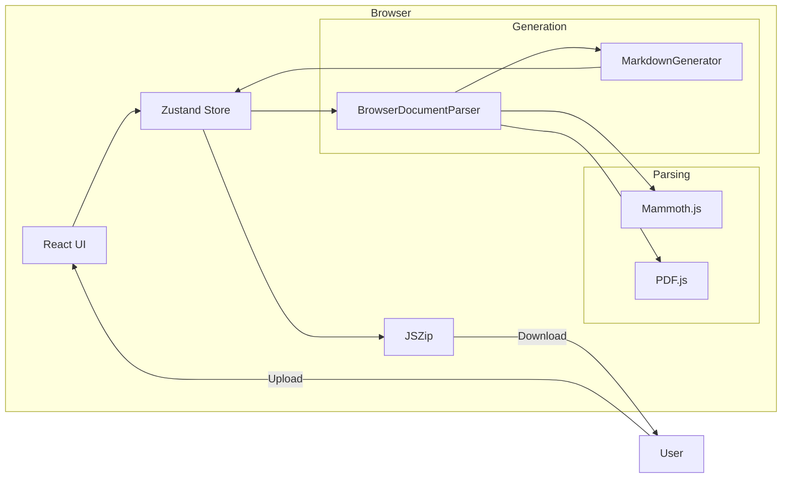
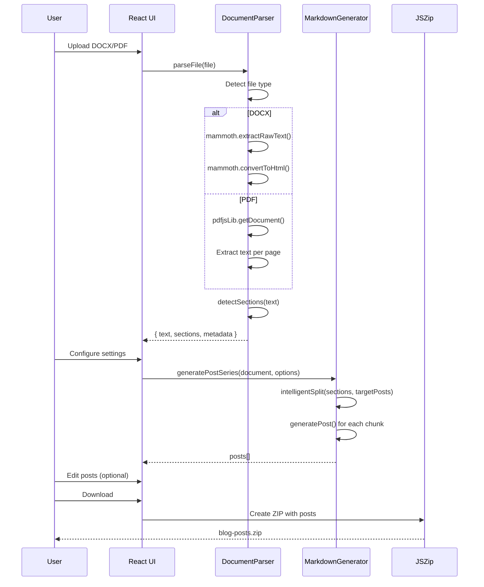

# Document to Blog Converter (문서 → 블로그 변환기)

## 1. Service Overview (개요)

### 목적
Document to Blog Converter는 **브라우저 기반 문서 변환 도구**입니다. DOCX, PDF 문서를 개인적 경험담 스타일의 Markdown 블로그 포스트로 변환합니다. 100% 클라이언트 사이드에서 처리되어 데이터 프라이버시를 보장합니다.

### 주요 기능

| 기능 | 설명 |
|------|------|
| **문서 파싱** | DOCX (Mammoth.js), PDF (PDF.js) 브라우저 내 파싱 |
| **지능형 분할** | 섹션 헤더 감지, 적절한 길이로 자동 분할 |
| **스타일 변환** | 기술 문서 → 개인적 경험담 스타일로 변환 |
| **다국어 지원** | 한국어/영어 포스트 생성 |
| **실시간 편집** | 생성된 포스트 즉시 편집 |
| **일괄 다운로드** | ZIP 파일로 모든 포스트 다운로드 |

### 기술 스택
- **Frontend**: React 18 + Vite
- **Styling**: Tailwind CSS
- **State Management**: Zustand
- **Document Parsing**: Mammoth.js (DOCX), PDF.js (PDF)
- **File Processing**: JSZip, FileSaver.js
- **Icons**: Lucide React

---

## 2. Architecture & Data Flow (구조 및 흐름)

### System Architecture



### Conversion Flow



---

## 3. API Specification (인터페이스 명세)

### BrowserDocumentParser

```typescript
class BrowserDocumentParser {
  supportedFormats: string[];  // ['docx', 'pdf']
  
  // 파일 파싱 진입점
  async parseFile(file: File): Promise<DocumentResult>;
  
  // DOCX 파싱
  async parseDocx(file: File): Promise<DocumentResult>;
  
  // PDF 파싱
  async parsePdf(file: File): Promise<DocumentResult>;
  
  // 섹션 감지
  detectSections(text: string): Section[];
  
  // 단어 수 계산
  countWords(text: string): number;
}

interface DocumentResult {
  type: 'docx' | 'pdf';
  filename: string;
  text: string;
  html?: string;           // DOCX only
  sections: Section[];
  wordCount: number;
  metadata: {
    size: number;
    lastModified: Date;
    parsedAt: Date;
    pageCount?: number;    // PDF only
  };
}

interface Section {
  title: string;
  content: string;
  level: number;           // 1-6 (heading level)
  wordCount: number;
}
```

### MarkdownGenerator

```typescript
class MarkdownGenerator {
  // 포스트 시리즈 생성
  generatePostSeries(document: DocumentResult, options: GeneratorOptions): Post[];
  
  // 지능형 분할
  intelligentSplit(sections: Section[], targetPosts: number): Chunk[];
  
  // 개별 포스트 생성
  generatePost(config: PostConfig): Post;
  
  // 시리즈 제목 추출
  extractSeriesTitle(document: DocumentResult): string;
}

interface GeneratorOptions {
  targetPosts: number;        // 생성할 포스트 수 (1-15)
  language: 'ko' | 'en';      // 언어
  narrativeStyle: NarrativeStyle;
  seriesTitle?: string;       // 시리즈 제목 (선택)
  authorName?: string;        // 작성자명
}

type NarrativeStyle = 
  | 'experience'    // 개인 경험담
  | 'learning'      // 학습 여정
  | 'problem'       // 문제 해결기
  | 'reflection';   // 기술 회고
```

### Generated Post Format

```typescript
interface Post {
  filename: string;           // e.g., "series-part-1.md"
  frontmatter: {
    title: string;
    date: string;             // ISO date
    tags: string[];
    series: string;
    part: number;
    totalParts: number;
    language: 'ko' | 'en';
    author: string;
    category: string;
    description: string;
  };
  content: string;            // Markdown body
}
```

---

## 4. Key Business Logic (핵심 로직 상세)

### Section Detection Algorithm

```javascript
// browserDocumentParser.js
detectSections(text) {
  const lines = text.split('\n');
  const sections = [];
  let currentSection = null;
  
  const headingPatterns = [
    /^#+\s+(.+)$/,                    // Markdown headings
    /^(\d+\.)+\s+(.+)$/,              // Numbered headings (1.1, 1.1.1)
    /^[A-Z][A-Z\s]{3,}$/,             // ALL CAPS headings
    /^(Chapter|Section|Part)\s+\d+/i  // Chapter/Section markers
  ];
  
  for (const line of lines) {
    const trimmed = line.trim();
    
    for (const pattern of headingPatterns) {
      if (pattern.test(trimmed)) {
        // Save previous section
        if (currentSection) {
          sections.push(currentSection);
        }
        // Start new section
        currentSection = {
          title: trimmed,
          content: '',
          level: this.detectLevel(trimmed),
          wordCount: 0
        };
        break;
      }
    }
    
    if (currentSection) {
      currentSection.content += line + '\n';
      currentSection.wordCount = this.countWords(currentSection.content);
    }
  }
  
  return sections;
}
```

### Intelligent Split Algorithm

```javascript
// markdownGenerator.js
intelligentSplit(sections, targetPosts) {
  const totalWords = sections.reduce((sum, s) => sum + s.wordCount, 0);
  const avgWordsPerPost = Math.ceil(totalWords / targetPosts);
  const minWords = avgWordsPerPost * 0.5;
  const maxWords = avgWordsPerPost * 1.5;
  
  const chunks = [];
  let currentChunk = { sections: [], wordCount: 0 };
  
  for (const section of sections) {
    const wouldExceed = currentChunk.wordCount + section.wordCount > maxWords;
    const hasEnough = currentChunk.wordCount >= minWords;
    
    if (wouldExceed && hasEnough) {
      // Start new chunk
      chunks.push(currentChunk);
      currentChunk = { sections: [section], wordCount: section.wordCount };
    } else {
      // Add to current chunk
      currentChunk.sections.push(section);
      currentChunk.wordCount += section.wordCount;
    }
  }
  
  // Don't forget last chunk
  if (currentChunk.sections.length > 0) {
    chunks.push(currentChunk);
  }
  
  return chunks;
}
```

### Narrative Style Transformation

```javascript
// markdownGenerator.js
transformToNarrative(content, style) {
  const transforms = {
    experience: {
      intros: ['이번 포스트에서는', '오늘 다룰 내용은', '직접 경험해보니'],
      transitions: ['실제로 해보니', '개인적으로는', '여기서 주의할 점은'],
      outros: ['다음 포스트에서 계속 이어가겠습니다.']
    },
    learning: {
      intros: ['학습하면서 알게 된 것은', '공부하다 보니'],
      transitions: ['새롭게 배운 것은', '이해하기 어려웠던 부분은'],
      outros: ['다음 편에서 더 깊이 알아보겠습니다.']
    }
    // ... other styles
  };
  
  const { intros, transitions, outros } = transforms[style];
  
  // Apply transformations
  return content
    .replace(/^(In this section|Here we)/gi, this.random(intros))
    .replace(/^(Note:|Important:)/gi, this.random(transitions))
    .concat('\n\n' + this.random(outros));
}
```

---

## 5. Dependencies & Environment (의존성)

### Package Dependencies

```json
{
  "dependencies": {
    "react": "^18.x",
    "zustand": "^4.x",
    "mammoth": "^1.x",
    "pdfjs-dist": "^3.x",
    "jszip": "^3.x",
    "file-saver": "^2.x",
    "lucide-react": "^0.x"
  },
  "devDependencies": {
    "vite": "^5.x",
    "tailwindcss": "^3.x",
    "postcss": "^8.x",
    "autoprefixer": "^10.x"
  }
}
```

### Browser Requirements

| Feature | Requirement |
|---------|-------------|
| **FileReader API** | File upload/reading |
| **ArrayBuffer** | Binary file processing |
| **Web Workers** | PDF.js worker |
| **Blob** | ZIP file download |

### Supported File Formats

| Format | Library | Max Size | Notes |
|--------|---------|----------|-------|
| DOCX | Mammoth.js | 50MB | Extracts text + HTML |
| PDF | PDF.js | 50MB | Text extraction only |

---

## 6. Usage (사용법)

### Development

```bash
cd doc-converter

# 의존성 설치
npm install

# 개발 서버 실행
npm run dev
# http://localhost:5173

# 빌드
npm run build

# 빌드 미리보기
npm run preview
```

### Workflow

1. **문서 업로드**: DOCX/PDF 드래그 앤 드롭 또는 파일 선택
2. **설정 구성**:
   - 포스트 수 (1-15개)
   - 언어 (한국어/English)
   - 글쓰기 스타일
3. **미리보기/편집**: 생성된 포스트 확인 및 수정
4. **다운로드**: ZIP 파일로 일괄 다운로드
5. **배포**: `frontend/public/posts/`에 복사 → Git push

---

## 7. Edge Cases & Troubleshooting (운영 가이드)

### 예상 문제 상황

| 문제 | 원인 | 해결 |
|------|------|------|
| 파일 파싱 실패 | 손상된 파일 또는 지원하지 않는 형식 | 파일 확인, DOCX/PDF만 지원 |
| 섹션 미감지 | 헤딩 패턴 미일치 | 문서 구조 확인, 수동 분할 |
| 빈 포스트 생성 | 텍스트 추출 실패 | PDF 이미지 기반 여부 확인 |
| ZIP 다운로드 실패 | 브라우저 제한 | Blob URL 지원 브라우저 사용 |

### Limitations

1. **이미지 기반 PDF**: 텍스트 추출 불가 (OCR 미지원)
2. **복잡한 표/차트**: 구조 유지되지 않음
3. **폰트/스타일**: 원본 스타일링 손실
4. **암호화된 문서**: 지원하지 않음

---

## Quick Reference

### Directory Structure

```
doc-converter/
├── src/
│   ├── components/
│   │   ├── DocumentUploader.jsx    # 파일 업로드 UI
│   │   ├── DocumentPreview.jsx     # 문서 미리보기
│   │   ├── ConversionSettings.jsx  # 변환 설정
│   │   ├── PostGenerator.jsx       # 포스트 생성
│   │   ├── PostPreview.jsx         # 포스트 미리보기
│   │   └── PostDownloader.jsx      # ZIP 다운로드
│   ├── utils/
│   │   ├── browserDocumentParser.js # 문서 파싱
│   │   └── markdownGenerator.js     # Markdown 생성
│   ├── stores/
│   │   └── documentStore.js         # Zustand 상태
│   ├── App.jsx
│   └── main.jsx
├── vite.config.js
├── tailwind.config.js
└── package.json
```

### Generated Markdown Example

```markdown
---
title: 'Docker 시리즈 Part 1: 기본 개념'
date: 2025-01-11
tags: ['docker', 'container', 'devops']
series: 'Docker 완전 정복'
part: 1
totalParts: 5
language: 'ko'
author: 'nodove'
category: 'infrastructure'
description: 'Docker의 기본 개념을 실제 경험을 바탕으로 설명합니다.'
---

이번 포스트에서는 Docker의 기본적인 개념에 대해 알아보겠습니다.

## 컨테이너란?

실제로 사용해보니 컨테이너는...

다음 포스트에서 계속 이어가겠습니다.
```

### 관련 문서

- [Frontend README](../frontend/README.md)
- [Backend README](../backend/README.md)
