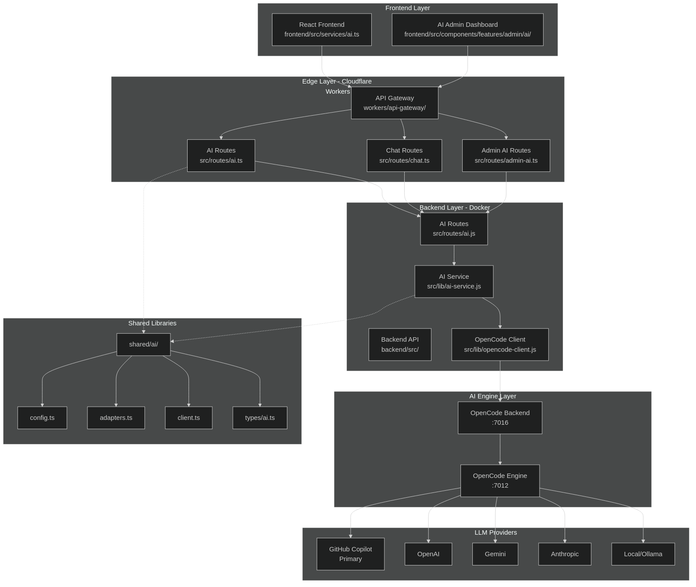
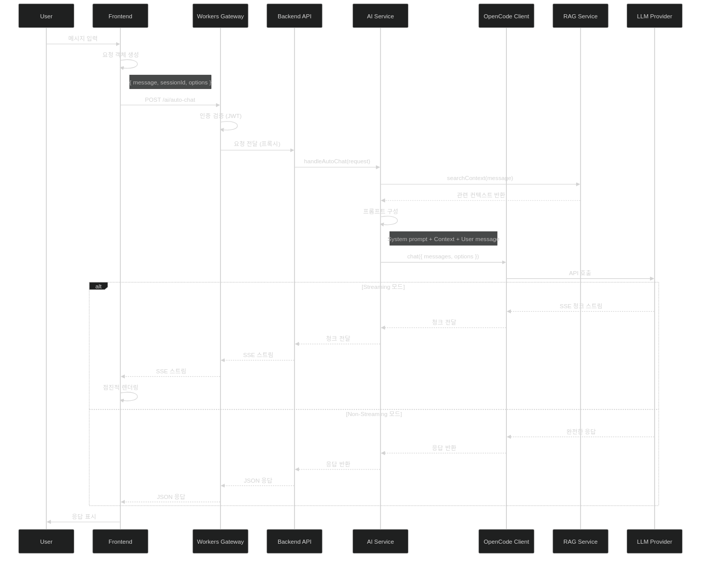
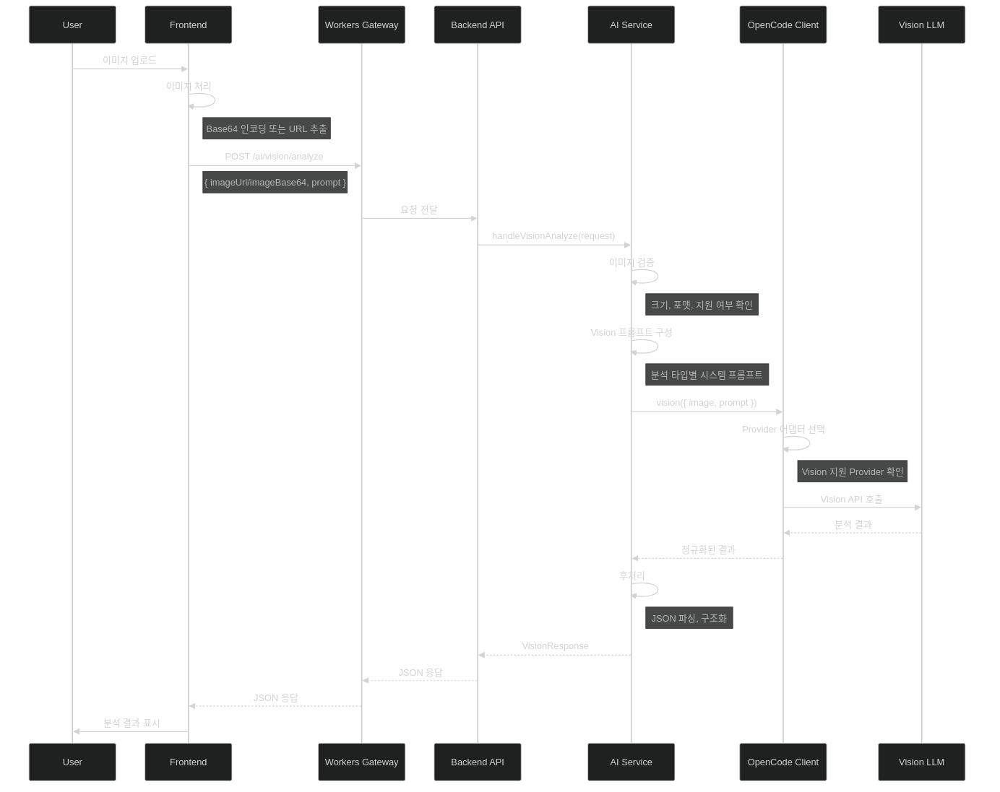
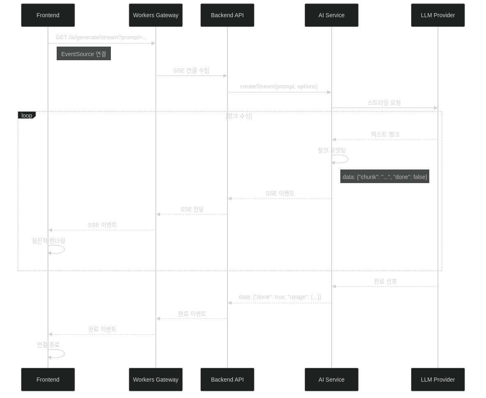
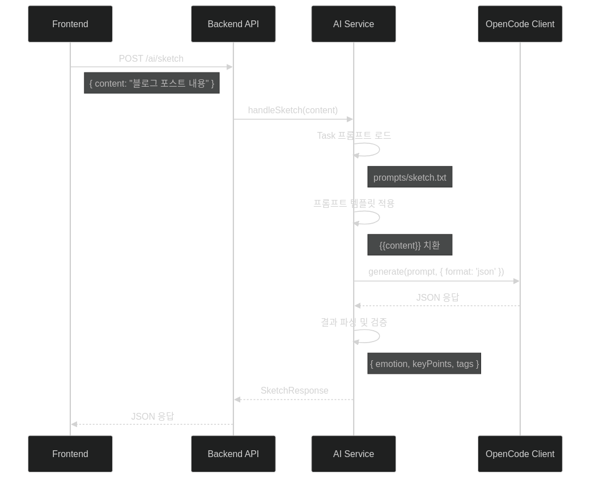
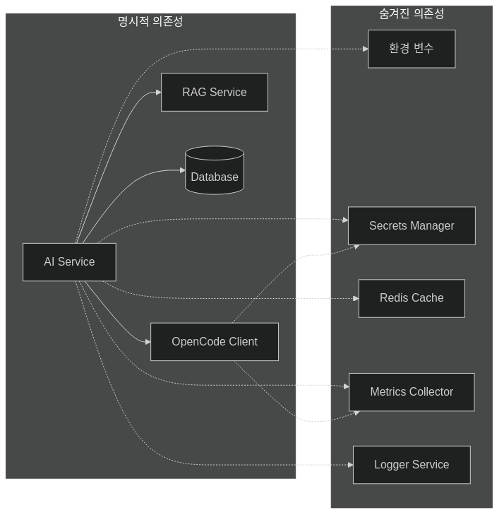
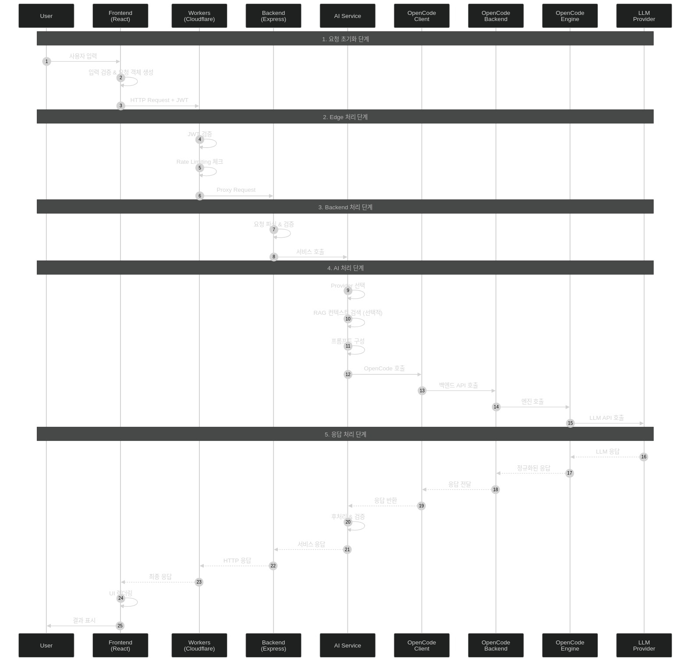

# AI 서비스 해부학 지도 (Service Anatomy Map)

> **문서 버전**: 1.0  
> **최종 업데이트**: 2026-01-11  
> **대상 독자**: 개발자, 시스템 아키텍트, 운영팀

---

## 목차

1. [거시적 지형도 (Macro View)](#1-거시적-지형도-macro-view)
2. [엔드포인트 & 진입점 (Entry Points)](#2-엔드포인트--진입점-entry-points)
3. [데이터 흐름 및 변형 추적 (Data Transformation Flow)](#3-데이터-흐름-및-변형-추적-data-transformation-flow)
4. [미시적 세부 사항 (Micro Details)](#4-미시적-세부-사항-micro-details)
5. [네비게이션 요약 (Navigation Summary)](#5-네비게이션-요약-navigation-summary)

---

## 1. 거시적 지형도 (Macro View)

### 1.1 서비스 정의

**AI 서비스**는 블로그 플랫폼에 지능형 기능을 제공하는 핵심 서브시스템입니다.

| 항목 | 설명 |
|------|------|
| **서비스명** | nodove AI Service |
| **주요 기능** | 대화형 AI, 텍스트 생성, 이미지 분석, RAG 기반 컨텍스트 검색 |
| **지원 Provider** | GitHub Copilot, OpenAI, Gemini, Anthropic, Local (Ollama) |
| **배포 환경** | Cloudflare Workers + Docker Backend |

### 1.2 아키텍처 다이어그램



### 1.3 핵심 컴포넌트

| 컴포넌트 | 파일 경로 | 책임 |
|----------|-----------|------|
| **Frontend AI Service** | `frontend/src/services/ai.ts` | API 호출, 스트리밍 처리, 에러 핸들링 |
| **Workers AI Router** | `workers/api-gateway/src/routes/ai.ts` | Edge에서 요청 라우팅, 인증 검증 |
| **Backend AI Router** | `backend/src/routes/ai.js` | API 엔드포인트 정의, 요청 검증 |
| **AI Service** | `backend/src/lib/ai-service.js` | 비즈니스 로직, Provider 추상화 |
| **OpenCode Client** | `backend/src/lib/opencode-client.js` | OpenCode SDK 통신 |
| **Shared Config** | `shared/ai/config.ts` | Provider 설정, 모델 정의 |
| **Shared Adapters** | `shared/ai/adapters.ts` | Provider별 어댑터 패턴 |

### 1.4 지원 Provider 상세

```typescript
// shared/ai/config.ts
export const AI_PROVIDERS = {
  'github-copilot': {
    name: 'GitHub Copilot',
    models: ['gpt-4o', 'gpt-4.1', 'claude-sonnet-4', 'gemini-2.0-flash'],
    supportsStreaming: true,
    supportsVision: true
  },
  'openai': {
    name: 'OpenAI',
    models: ['gpt-4o', 'gpt-4o-mini', 'o1-preview'],
    supportsStreaming: true,
    supportsVision: true
  },
  'gemini': {
    name: 'Google Gemini',
    models: ['gemini-2.0-flash', 'gemini-2.0-flash-thinking'],
    supportsStreaming: true,
    supportsVision: true
  },
  'anthropic': {
    name: 'Anthropic',
    models: ['claude-sonnet-4', 'claude-3-5-sonnet'],
    supportsStreaming: true,
    supportsVision: true
  },
  'local': {
    name: 'Local (Ollama)',
    models: ['llama3.2', 'qwen2.5'],
    supportsStreaming: true,
    supportsVision: false
  }
}
```

---

## 2. 엔드포인트 & 진입점 (Entry Points)

### 2.1 Public AI Endpoints

| Method | Path | Handler | 설명 |
|--------|------|---------|------|
| `POST` | `/ai/auto-chat` | `handleAutoChat` | RAG 통합 대화형 AI |
| `POST` | `/ai/generate` | `handleGenerate` | 텍스트 생성 |
| `GET` | `/ai/generate/stream` | `handleGenerateStream` | SSE 스트리밍 생성 |
| `POST` | `/ai/vision/analyze` | `handleVisionAnalyze` | 이미지 분석 |
| `POST` | `/ai/sketch` | `handleSketch` | 감정/핵심 요점 추출 |
| `POST` | `/ai/prism` | `handlePrism` | 다각도 관점 분석 |
| `POST` | `/ai/chain` | `handleChain` | 후속 질문 생성 |
| `POST` | `/ai/summarize` | `handleSummarize` | 텍스트 요약 |
| `POST` | `/ai/catalyst` | `handleCatalyst` | 창의적 아이디어 생성 |
| `GET` | `/ai/models` | `handleGetModels` | 사용 가능 모델 목록 |
| `GET` | `/ai/health` | `handleHealthCheck` | 헬스 체크 |

### 2.2 Admin AI Endpoints (인증 필요)

| Method | Path | Handler | 설명 |
|--------|------|---------|------|
| `GET` | `/admin/ai/providers` | `getProviders` | Provider 목록 조회 |
| `POST` | `/admin/ai/providers` | `createProvider` | Provider 생성 |
| `PUT` | `/admin/ai/providers/:id` | `updateProvider` | Provider 수정 |
| `DELETE` | `/admin/ai/providers/:id` | `deleteProvider` | Provider 삭제 |
| `GET` | `/admin/ai/models` | `getModels` | 모델 목록 조회 |
| `POST` | `/admin/ai/models` | `createModel` | 모델 생성 |
| `PUT` | `/admin/ai/models/:id` | `updateModel` | 모델 수정 |
| `DELETE` | `/admin/ai/models/:id` | `deleteModel` | 모델 삭제 |
| `GET` | `/admin/ai/routes` | `getRoutes` | 라우팅 규칙 조회 |
| `POST` | `/admin/ai/routes` | `createRoute` | 라우팅 규칙 생성 |
| `GET` | `/admin/ai/usage` | `getUsage` | 사용량 통계 |
| `GET` | `/admin/ai/usage/stats` | `getUsageStats` | 상세 통계 |

### 2.3 Chat Endpoints (Inline Task)

| Method | Path | Handler | 설명 |
|--------|------|---------|------|
| `POST` | `/chat/stream` | `handleChatStream` | 스트리밍 채팅 |
| `POST` | `/chat/inline-task` | `handleInlineTask` | 인라인 작업 처리 |
| `GET` | `/chat/sessions` | `getSessions` | 채팅 세션 목록 |
| `GET` | `/chat/sessions/:id` | `getSession` | 세션 상세 조회 |
| `DELETE` | `/chat/sessions/:id` | `deleteSession` | 세션 삭제 |

### 2.4 요청/응답 스키마

#### Chat 요청 스키마
```typescript
// POST /ai/auto-chat
interface AutoChatRequest {
  message: string;           // 사용자 메시지
  sessionId?: string;        // 세션 ID (옵션)
  context?: {                // 컨텍스트 (옵션)
    postId?: string;
    categoryId?: string;
  };
  options?: {
    model?: string;          // 사용할 모델
    temperature?: number;    // 창의성 (0-1)
    maxTokens?: number;      // 최대 토큰
    stream?: boolean;        // 스트리밍 여부
  };
}
```

#### Generate 요청 스키마
```typescript
// POST /ai/generate
interface GenerateRequest {
  prompt: string;            // 프롬프트
  type?: 'text' | 'code' | 'creative';  // 생성 타입
  options?: {
    model?: string;
    temperature?: number;
    maxTokens?: number;
  };
}
```

#### Vision 요청 스키마
```typescript
// POST /ai/vision/analyze
interface VisionAnalyzeRequest {
  imageUrl?: string;         // 이미지 URL
  imageBase64?: string;      // Base64 인코딩 이미지
  prompt?: string;           // 분석 프롬프트
  analysisType?: 'describe' | 'extract' | 'ocr';
}
```

#### Task 요청 스키마 (sketch, prism, chain, summarize)
```typescript
// POST /ai/sketch, /ai/prism, /ai/chain, /ai/summarize
interface TaskRequest {
  content: string;           // 분석할 콘텐츠
  options?: {
    model?: string;
    language?: 'ko' | 'en';
    format?: 'json' | 'text';
  };
}
```

---

## 3. 데이터 흐름 및 변형 추적 (Data Transformation Flow)

### 3.1 시나리오 1: 대화형 AI (Auto-Chat)



#### 데이터 변형 단계

| 단계 | 위치 | 입력 | 출력 | 변형 내용 |
|------|------|------|------|-----------|
| 1 | Frontend | 사용자 입력 | `AutoChatRequest` | 요청 객체 생성 |
| 2 | Workers | `AutoChatRequest` | `ProxyRequest` | 헤더 추가 (인증, 트레이싱) |
| 3 | Backend | `ProxyRequest` | `ServiceRequest` | 검증, 기본값 설정 |
| 4 | AI Service | `ServiceRequest` | `ContextualPrompt` | RAG 컨텍스트 주입 |
| 5 | OpenCode | `ContextualPrompt` | `LLMRequest` | Provider 포맷 변환 |
| 6 | LLM | `LLMRequest` | `LLMResponse` | AI 추론 |
| 7 | OpenCode | `LLMResponse` | `NormalizedResponse` | 응답 정규화 |
| 8 | AI Service | `NormalizedResponse` | `ServiceResponse` | 메타데이터 추가 |
| 9 | Frontend | `ServiceResponse` | UI 렌더링 | Markdown 파싱, 하이라이팅 |

### 3.2 시나리오 2: 이미지 분석 (Vision)



### 3.3 시나리오 3: 스트리밍 생성 (SSE)



### 3.4 시나리오 4: Task 처리 (Sketch/Prism/Chain)



#### Task별 출력 스키마

```typescript
// Sketch 결과
interface SketchResult {
  emotion: {
    primary: string;      // 주요 감정
    secondary?: string;   // 부차적 감정
    intensity: number;    // 강도 (1-10)
  };
  keyPoints: string[];    // 핵심 요점 (3-5개)
  tags: string[];         // 자동 생성 태그
}

// Prism 결과
interface PrismResult {
  perspectives: Array<{
    viewpoint: string;    // 관점명
    analysis: string;     // 분석 내용
    confidence: number;   // 신뢰도 (0-1)
  }>;
  consensus?: string;     // 공통 결론
  controversy?: string;   // 논쟁점
}

// Chain 결과
interface ChainResult {
  questions: Array<{
    question: string;     // 후속 질문
    rationale: string;    // 질문 이유
    depth: 'shallow' | 'medium' | 'deep';
  }>;
}

// Summarize 결과
interface SummarizeResult {
  summary: string;        // 요약문
  length: 'brief' | 'standard' | 'detailed';
  bulletPoints?: string[];
}
```

---

## 4. 미시적 세부 사항 (Micro Details)

### 4.1 핵심 알고리즘

#### 4.1.1 Provider 선택 알고리즘

```typescript
// backend/src/lib/ai-service.js
function selectProvider(request: AIRequest): Provider {
  const { model, capability, priority } = request;
  
  // 1. 모델 명시적 지정 시
  if (model) {
    const provider = findProviderByModel(model);
    if (provider && isProviderHealthy(provider)) {
      return provider;
    }
  }
  
  // 2. 기능 기반 선택 (vision, streaming 등)
  if (capability) {
    const candidates = providers.filter(p => 
      p.capabilities.includes(capability) && isProviderHealthy(p)
    );
    return selectByPriority(candidates, priority);
  }
  
  // 3. 기본 Provider (github-copilot)
  return getDefaultProvider();
}

function selectByPriority(providers: Provider[], priority: string): Provider {
  switch (priority) {
    case 'cost':
      return providers.sort((a, b) => a.costPerToken - b.costPerToken)[0];
    case 'speed':
      return providers.sort((a, b) => a.avgLatency - b.avgLatency)[0];
    case 'quality':
    default:
      return providers.sort((a, b) => b.qualityScore - a.qualityScore)[0];
  }
}
```

#### 4.1.2 RAG 컨텍스트 검색

```typescript
// backend/src/lib/ai-service.js
async function searchContext(query: string, options: ContextOptions): Promise<Context[]> {
  // 1. 쿼리 임베딩 생성
  const queryEmbedding = await generateEmbedding(query);
  
  // 2. 벡터 유사도 검색
  const candidates = await vectorStore.search(queryEmbedding, {
    limit: options.maxResults || 5,
    threshold: options.minSimilarity || 0.7,
    filter: {
      categoryId: options.categoryId,
      publishedOnly: true
    }
  });
  
  // 3. 리랭킹 (선택적)
  if (options.rerank) {
    return await rerankByRelevance(query, candidates);
  }
  
  return candidates;
}
```

#### 4.1.3 스트리밍 청크 처리

```typescript
// backend/src/lib/opencode-client.js
async function* streamChat(messages: Message[], options: StreamOptions): AsyncGenerator<Chunk> {
  const response = await fetch(OPENCODE_URL + '/chat/stream', {
    method: 'POST',
    headers: { 'Content-Type': 'application/json' },
    body: JSON.stringify({ messages, ...options })
  });
  
  const reader = response.body.getReader();
  const decoder = new TextDecoder();
  let buffer = '';
  
  while (true) {
    const { done, value } = await reader.read();
    if (done) break;
    
    buffer += decoder.decode(value, { stream: true });
    
    // SSE 파싱
    const lines = buffer.split('\n');
    buffer = lines.pop() || '';
    
    for (const line of lines) {
      if (line.startsWith('data: ')) {
        const data = JSON.parse(line.slice(6));
        if (data.content) {
          yield { type: 'content', text: data.content };
        }
        if (data.done) {
          yield { type: 'done', usage: data.usage };
        }
      }
    }
  }
}
```

### 4.2 예외 처리 전략

#### 4.2.1 에러 타입 정의

```typescript
// shared/types/ai.ts
export enum AIErrorCode {
  // Provider 에러
  PROVIDER_UNAVAILABLE = 'PROVIDER_UNAVAILABLE',
  PROVIDER_RATE_LIMITED = 'PROVIDER_RATE_LIMITED',
  PROVIDER_QUOTA_EXCEEDED = 'PROVIDER_QUOTA_EXCEEDED',
  
  // 요청 에러
  INVALID_REQUEST = 'INVALID_REQUEST',
  CONTENT_TOO_LONG = 'CONTENT_TOO_LONG',
  UNSUPPORTED_MODEL = 'UNSUPPORTED_MODEL',
  UNSUPPORTED_CAPABILITY = 'UNSUPPORTED_CAPABILITY',
  
  // 응답 에러
  RESPONSE_PARSE_ERROR = 'RESPONSE_PARSE_ERROR',
  RESPONSE_TIMEOUT = 'RESPONSE_TIMEOUT',
  CONTENT_FILTERED = 'CONTENT_FILTERED',
  
  // 시스템 에러
  INTERNAL_ERROR = 'INTERNAL_ERROR',
  SERVICE_UNAVAILABLE = 'SERVICE_UNAVAILABLE'
}
```

#### 4.2.2 Retry 및 Fallback 전략

```typescript
// backend/src/lib/ai-service.js
async function executeWithRetry<T>(
  operation: () => Promise<T>,
  options: RetryOptions
): Promise<T> {
  const { maxRetries = 3, backoffMs = 1000, fallbackProviders = [] } = options;
  
  let lastError: Error;
  let currentProvider = options.provider;
  
  for (let attempt = 0; attempt <= maxRetries; attempt++) {
    try {
      return await operation();
    } catch (error) {
      lastError = error;
      
      // Rate limit 시 지수 백오프
      if (error.code === 'PROVIDER_RATE_LIMITED') {
        await sleep(backoffMs * Math.pow(2, attempt));
        continue;
      }
      
      // Provider 장애 시 Fallback
      if (error.code === 'PROVIDER_UNAVAILABLE' && fallbackProviders.length > 0) {
        currentProvider = fallbackProviders.shift();
        markProviderUnhealthy(options.provider);
        options.provider = currentProvider;
        continue;
      }
      
      // 복구 불가능한 에러
      if (isUnrecoverable(error)) {
        throw error;
      }
    }
  }
  
  throw lastError;
}
```

### 4.3 숨겨진 의존성



#### 환경 변수 의존성

| 변수명 | 설명 | 기본값 |
|--------|------|--------|
| `OPENCODE_API_URL` | OpenCode 엔진 URL | `http://opencode:7012` |
| `OPENCODE_BACKEND_URL` | OpenCode 백엔드 URL | `http://opencode-backend:7016` |
| `AI_DEFAULT_PROVIDER` | 기본 Provider | `github-copilot` |
| `AI_DEFAULT_MODEL` | 기본 모델 | `gpt-4o` |
| `AI_MAX_TOKENS` | 최대 토큰 | `4096` |
| `AI_TIMEOUT_MS` | 타임아웃 | `30000` |
| `RAG_SIMILARITY_THRESHOLD` | RAG 유사도 임계값 | `0.7` |

### 4.4 성능 특성

| 메트릭 | 값 | 설명 |
|--------|-----|------|
| **평균 응답 시간** | ~2-5초 | 비스트리밍 모드 |
| **첫 토큰 시간 (TTFT)** | ~500ms | 스트리밍 모드 |
| **동시 요청 처리** | 100+ | Workers 한도 |
| **토큰 처리율** | ~50 tokens/sec | 스트리밍 출력 |
| **RAG 검색 시간** | ~100ms | 벡터 검색 |

### 4.5 보안 고려사항

```typescript
// 입력 검증
function validateInput(input: string): void {
  // 1. 길이 제한
  if (input.length > MAX_INPUT_LENGTH) {
    throw new AIError('CONTENT_TOO_LONG');
  }
  
  // 2. 프롬프트 인젝션 방지
  if (containsPromptInjection(input)) {
    throw new AIError('INVALID_REQUEST', 'Potential prompt injection detected');
  }
  
  // 3. PII 검출 (선택적)
  if (containsPII(input) && !options.allowPII) {
    logSecurityWarning('PII detected in AI request');
  }
}

// 출력 필터링
function sanitizeOutput(output: string): string {
  // 1. 민감 정보 마스킹
  output = maskSensitiveData(output);
  
  // 2. 유해 콘텐츠 필터링
  if (isHarmfulContent(output)) {
    return '[Content filtered due to policy violation]';
  }
  
  return output;
}
```

---

## 5. 네비게이션 요약 (Navigation Summary)

### 5.1 완전한 요청 흐름 다이어그램



### 5.2 코드 네비게이션 가이드

#### "대화형 AI 기능을 수정하려면?"

```
Frontend (UI/UX)
├── frontend/src/components/features/ai/ChatWidget.tsx    # 채팅 UI
├── frontend/src/hooks/useAIChat.ts                       # 채팅 훅
└── frontend/src/services/ai.ts                           # API 클라이언트
    └── autoChat()                                        # 채팅 API 호출

Workers (Edge Routing)
└── workers/api-gateway/src/routes/ai.ts                  # 라우팅
    └── POST /ai/auto-chat

Backend (Business Logic)
├── backend/src/routes/ai.js                              # 엔드포인트
│   └── router.post('/auto-chat')
└── backend/src/lib/ai-service.js                         # 서비스
    └── handleAutoChat()

OpenCode (AI Engine)
├── backend/src/lib/opencode-client.js                    # SDK 클라이언트
│   └── chat()
└── (외부) OpenCode Backend/Engine                        # AI 엔진
```

#### "새로운 AI Provider를 추가하려면?"

```
1. shared/ai/config.ts                 # Provider 설정 추가
2. shared/ai/adapters.ts               # Provider 어댑터 구현
3. backend/src/lib/ai-service.js       # 서비스에 Provider 로직 추가
4. frontend/src/components/features/admin/ai/
   └── ProviderForm.tsx                # Admin UI 업데이트
```

#### "AI 응답 형식을 변경하려면?"

```
1. shared/types/ai.ts                  # 타입 정의 수정
2. backend/src/lib/ai-service.js       # 응답 포맷팅 로직
3. frontend/src/services/ai.ts         # 프론트엔드 파싱 로직
4. frontend/src/components/...         # UI 컴포넌트 업데이트
```

### 5.3 트러블슈팅 가이드

| 증상 | 가능한 원인 | 확인 위치 |
|------|-------------|-----------|
| 응답 없음 | Provider 장애 | `GET /ai/health` |
| 느린 응답 | 모델 과부하 | Workers/Backend 로그 |
| 스트리밍 끊김 | SSE 연결 문제 | 네트워크 탭, Workers 로그 |
| 이상한 응답 | 프롬프트 이슈 | `prompts/*.txt` 파일 |
| 인증 실패 | JWT 만료 | Workers 인증 로직 |
| Rate Limit | 요청 초과 | `redis:ai:ratelimit:*` |

### 5.4 파일 참조 맵

```
/home/nodove/workspace/blog/
├── shared/
│   ├── ai/
│   │   ├── config.ts          # AI 설정
│   │   ├── adapters.ts        # Provider 어댑터
│   │   └── client.ts          # 통합 클라이언트
│   └── types/
│       └── ai.ts              # AI 타입 정의
│
├── frontend/
│   └── src/
│       ├── services/
│       │   └── ai.ts          # API 클라이언트
│       └── components/
│           └── features/
│               └── admin/
│                   └── ai/    # Admin UI 컴포넌트
│
├── workers/
│   └── api-gateway/
│       └── src/
│           ├── lib/
│           │   └── ai-service.ts
│           └── routes/
│               ├── ai.ts      # Public AI 라우트
│               ├── admin-ai.ts # Admin AI 라우트
│               └── chat.ts    # Chat 라우트
│
└── backend/
    └── src/
        ├── lib/
        │   ├── ai-service.js      # AI 서비스
        │   └── opencode-client.js # OpenCode SDK
        └── routes/
            ├── ai.js          # AI 라우트
            └── aiAdmin.js     # Admin 라우트
```

---

## 부록

### A. 용어 사전

| 용어 | 설명 |
|------|------|
| **Provider** | LLM 서비스 제공자 (OpenAI, Anthropic 등) |
| **RAG** | Retrieval-Augmented Generation, 검색 증강 생성 |
| **SSE** | Server-Sent Events, 서버에서 클라이언트로 스트리밍 |
| **OpenCode** | 자체 AI 엔진 추상화 레이어 |
| **Sketch** | 콘텐츠 감정/요점 분석 기능 |
| **Prism** | 다각도 관점 분석 기능 |
| **Chain** | 후속 질문 생성 기능 |

### B. 관련 문서

- [Cloudflare Workers 문서](https://developers.cloudflare.com/workers/)
- [OpenAI API 문서](https://platform.openai.com/docs/)
- [Anthropic API 문서](https://docs.anthropic.com/)
- [Google AI 문서](https://ai.google.dev/docs)

---

*이 문서는 자동 생성되었으며, 코드 변경 시 업데이트가 필요할 수 있습니다.*
