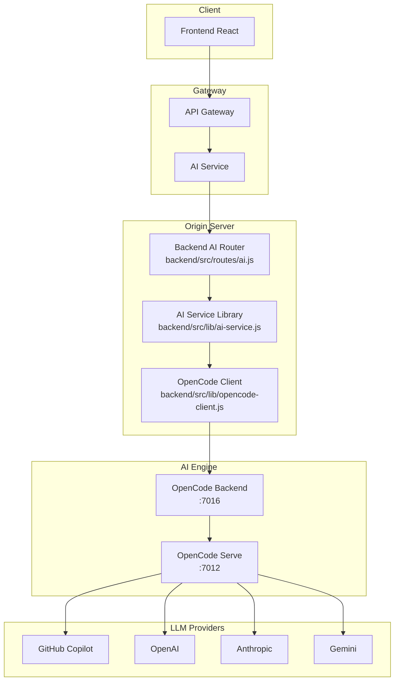
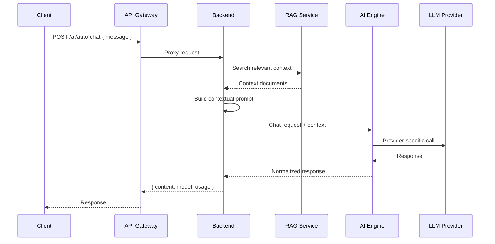
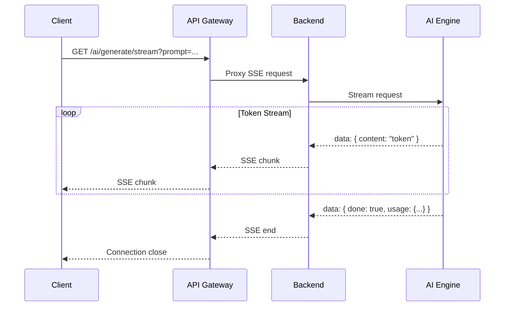
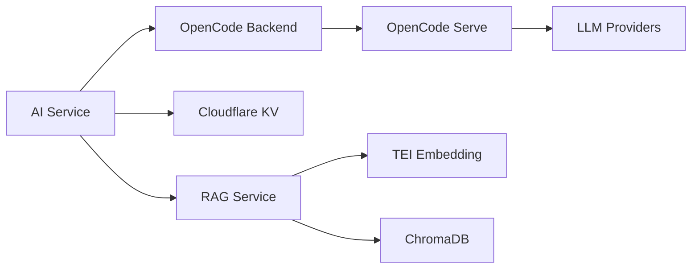

# AI Service Anatomy Map (AI 서비스 해부학 지도)

## 1. Service Overview (개요)

### 목적

AI 서비스는 블로그 플랫폼에 **지능형 기능을 제공하는 핵심 서브시스템**입니다. 대화형 AI, 텍스트 분석, 이미지 인식, RAG 기반 질의응답 등 다양한 AI 기능을 통합 인터페이스로 제공합니다.

### 주요 기능

| 기능                | 설명                                   | 엔드포인트                             |
| ------------------- | -------------------------------------- | -------------------------------------- |
| **Task Analysis**   | 감정 분석, 다각도 분석, 후속 질문 생성 | `/ai/sketch`, `/ai/prism`, `/ai/chain` |
| **Text Generation** | 프롬프트 기반 텍스트 생성              | `/ai/generate`                         |
| **Streaming**       | SSE 기반 실시간 토큰 스트리밍          | `/ai/generate/stream`                  |
| **Vision**          | 이미지 분석 및 설명 생성               | `/ai/vision/analyze`                   |
| **RAG Chat**        | 컨텍스트 기반 질의응답                 | `/ai/auto-chat`                        |
| **Summarization**   | 텍스트 요약                            | `/ai/summarize`                        |

### 지원 Provider

| Provider           | 모델                                        | Streaming | Vision |
| ------------------ | ------------------------------------------- | --------- | ------ |
| **GitHub Copilot** | gpt-4.1, claude-sonnet-4, gemini-2.0-flash  | ✅        | ✅     |
| **OpenAI**         | gpt-4o, gpt-4o-mini, o1-preview             | ✅        | ✅     |
| **Anthropic**      | claude-sonnet-4, claude-3-5-sonnet          | ✅        | ✅     |
| **Gemini**         | gemini-2.0-flash, gemini-2.0-flash-thinking | ✅        | ✅     |
| **Local (Ollama)** | llama3.2, qwen2.5                           | ✅        | ❌     |

---

## 2. Architecture & Data Flow (구조 및 흐름)

### System Architecture



### Request Flow (Auto-Chat with RAG)



### Request Flow (Streaming)



---

## 3. API Specification (인터페이스 명세)

### Public Endpoints (`/api/v1/ai`)

| Method | Endpoint           | Input                                 | Output                           | Description         |
| ------ | ------------------ | ------------------------------------- | -------------------------------- | ------------------- |
| `POST` | `/sketch`          | `{ paragraph, postTitle?, persona? }` | `{ emotion, keyPoints, tags }`   | 감정/핵심 요점 추출 |
| `POST` | `/prism`           | `{ paragraph, postTitle? }`           | `{ perspectives[], consensus? }` | 다각도 관점 분석    |
| `POST` | `/chain`           | `{ paragraph, postTitle? }`           | `{ questions[] }`                | 후속 질문 생성      |
| `POST` | `/generate`        | `{ prompt, temperature? }`            | `{ text }`                       | 텍스트 생성         |
| `GET`  | `/generate/stream` | `?prompt=&model=`                     | SSE stream                       | 스트리밍 생성       |
| `POST` | `/summarize`       | `{ text, instructions? }`             | `{ summary }`                    | 텍스트 요약         |
| `POST` | `/vision/analyze`  | `{ imageUrl?, imageBase64? }`         | `{ description }`                | 이미지 분석         |
| `POST` | `/auto-chat`       | `{ message, sessionId?, context? }`   | `{ content, model }`             | RAG 통합 채팅       |
| `GET`  | `/models`          | -                                     | `{ models[] }`                   | 사용 가능 모델 목록 |
| `GET`  | `/health`          | -                                     | `{ ok, providers }`              | 서비스 상태         |

### Admin Endpoints (`/api/v1/admin/ai`)

| Method   | Endpoint         | Description        | Auth  |
| -------- | ---------------- | ------------------ | ----- |
| `GET`    | `/providers`     | Provider 목록 조회 | Admin |
| `POST`   | `/providers`     | Provider 생성      | Admin |
| `PUT`    | `/providers/:id` | Provider 수정      | Admin |
| `DELETE` | `/providers/:id` | Provider 삭제      | Admin |
| `GET`    | `/models`        | 모델 목록 조회     | Admin |
| `POST`   | `/models`        | 모델 생성          | Admin |
| `GET`    | `/usage`         | 사용량 통계        | Admin |

### Request/Response Schema

```typescript
// Task Request (sketch, prism, chain)
interface TaskRequest {
  paragraph: string; // 분석할 텍스트 (필수)
  postTitle?: string; // 게시글 제목 (컨텍스트)
  persona?: string; // 분석 페르소나
}

// Sketch Response
interface SketchResponse {
  emotion: {
    primary: string; // 주요 감정
    secondary?: string; // 부차적 감정
    intensity: number; // 강도 (1-10)
  };
  keyPoints: string[]; // 핵심 요점 (3-5개)
  tags: string[]; // 자동 생성 태그
}

// Prism Response
interface PrismResponse {
  perspectives: Array<{
    viewpoint: string; // 관점명
    analysis: string; // 분석 내용
    confidence: number; // 신뢰도 (0-1)
  }>;
  consensus?: string; // 공통 결론
  controversy?: string; // 논쟁점
}

// Chain Response
interface ChainResponse {
  questions: Array<{
    question: string; // 후속 질문
    rationale: string; // 질문 이유
    depth: "shallow" | "medium" | "deep";
  }>;
}
```

---

## 4. Key Business Logic (핵심 로직 상세)

### Provider Selection Algorithm

```typescript
// workers/api-gateway/src/lib/ai-service.ts
async function selectProvider(request: AIRequest): Promise<Provider> {
  // 1. 모델 명시적 지정 시
  if (request.model) {
    const provider = findProviderByModel(request.model);
    if (provider && isHealthy(provider)) return provider;
  }

  // 2. 기능 기반 선택 (vision, streaming)
  if (request.capability) {
    const candidates = providers.filter(
      (p) => p.capabilities.includes(request.capability) && isHealthy(p),
    );
    return selectByPriority(candidates, request.priority);
  }

  // 3. 기본 Provider (GitHub Copilot)
  return getDefaultProvider(); // 'github-copilot'
}

function selectByPriority(providers, priority) {
  switch (priority) {
    case "cost":
      return providers.sort((a, b) => a.costPerToken - b.costPerToken)[0];
    case "speed":
      return providers.sort((a, b) => a.avgLatency - b.avgLatency)[0];
    case "quality":
    default:
      return providers.sort((a, b) => b.qualityScore - a.qualityScore)[0];
  }
}
```

### RAG Context Injection

```typescript
// backend/src/lib/ai-service.js
async function buildContextualPrompt(query: string, options: ContextOptions) {
  // 1. 벡터 검색으로 관련 문서 조회
  const embedding = await generateEmbedding(query);
  const contexts = await vectorStore.search(embedding, {
    limit: options.maxResults || 5,
    threshold: options.minSimilarity || 0.7,
  });

  // 2. 컨텍스트 주입된 프롬프트 생성
  const contextText = contexts
    .map((c) => `[Source: ${c.title}]\n${c.content}`)
    .join("\n\n---\n\n");

  return `Based on the following context, answer the question.

Context:
${contextText}

Question: ${query}

Answer:`;
}
```

### Task Prompt Templates

```typescript
// workers/api-gateway/src/lib/prompts.ts
export const TASK_PROMPTS = {
  sketch: `Analyze the following paragraph and extract:
1. Primary emotion (with intensity 1-10)
2. Key points (3-5 bullet points)
3. Relevant tags

Paragraph: {paragraph}
Post Title: {postTitle}

Respond in JSON format.`,

  prism: `Analyze the following content from multiple perspectives:
1. Academic/Analytical viewpoint
2. Practical/Applied viewpoint
3. Critical/Skeptical viewpoint

Content: {paragraph}

Provide each perspective with confidence score (0-1).`,

  chain: `Based on the following content, generate follow-up questions
that would deepen understanding.

Content: {paragraph}

Generate 3-5 questions with rationale.`,
};
```

### Fallback Strategy

```typescript
// workers/api-gateway/src/lib/ai-service.ts
async function executeWithFallback<T>(
  operation: () => Promise<T>,
  options: FallbackOptions,
): Promise<T> {
  const { maxRetries = 3, fallbackProviders = [] } = options;
  let currentProvider = options.provider;

  for (let attempt = 0; attempt <= maxRetries; attempt++) {
    try {
      return await operation();
    } catch (error) {
      // Rate limit: 지수 백오프
      if (error.code === "RATE_LIMITED") {
        await sleep(1000 * Math.pow(2, attempt));
        continue;
      }

      // Provider 장애: Fallback
      if (error.code === "PROVIDER_UNAVAILABLE") {
        if (fallbackProviders.length > 0) {
          currentProvider = fallbackProviders.shift();
          markUnhealthy(options.provider);
          continue;
        }
      }

      // 복구 불가: Fallback 데이터 반환
      return getFallbackData(options.taskType);
    }
  }
}
```

---

## 5. Dependencies & Environment (의존성)

### Environment Variables

| Variable                   | Description       | Default                         |
| -------------------------- | ----------------- | ------------------------------- |
| `OPENCODE_BASE_URL`        | OpenCode 엔진 URL | `http://ai-server-backend:7016` |
| `OPENCODE_API_KEY`         | OpenCode API 키   | -                               |
| `AI_DEFAULT_PROVIDER`      | 기본 Provider     | `github-copilot`                |
| `AI_DEFAULT_MODEL`         | 기본 모델         | `gpt-4.1`                       |
| `AI_MAX_TOKENS`            | 최대 토큰         | `4096`                          |
| `AI_TIMEOUT_MS`            | 타임아웃          | `30000`                         |
| `RAG_SIMILARITY_THRESHOLD` | RAG 유사도 임계값 | `0.7`                           |

### Service Dependencies



### Database Tables (D1)

| Table          | Description                                     |
| -------------- | ----------------------------------------------- |
| `ai_providers` | Provider 설정 (name, endpoint, api_key 등)      |
| `ai_models`    | 모델 설정 (provider_id, model_id, capabilities) |
| `ai_routes`    | 라우팅 규칙 (task_type → model)                 |
| `ai_usage`     | 사용량 통계 (tokens, requests, costs)           |
| `ai_traces`    | 요청 추적 (trace_id, latency, success)          |

---

## 6. Edge Cases & Troubleshooting (운영 가이드)

### Error Codes

| Code                   | Description        | Resolution                           |
| ---------------------- | ------------------ | ------------------------------------ |
| `PROVIDER_UNAVAILABLE` | Provider 연결 실패 | Fallback provider 사용, 상태 확인    |
| `RATE_LIMITED`         | 요청 한도 초과     | 백오프 후 재시도, 다른 provider 사용 |
| `CONTENT_TOO_LONG`     | 입력 길이 초과     | 텍스트 분할 또는 요약 후 재요청      |
| `UNSUPPORTED_MODEL`    | 지원하지 않는 모델 | 모델 목록 확인, 기본 모델 사용       |
| `RESPONSE_TIMEOUT`     | 응답 시간 초과     | 타임아웃 증가, 더 작은 요청으로 분할 |

### Performance Metrics

| Metric                  | Value          | Description     |
| ----------------------- | -------------- | --------------- |
| **평균 응답 시간**      | 2-5초          | 비스트리밍 모드 |
| **첫 토큰 시간 (TTFT)** | ~500ms         | 스트리밍 모드   |
| **동시 요청**           | 100+           | Workers 한도    |
| **토큰 처리율**         | ~50 tokens/sec | 스트리밍 출력   |
| **RAG 검색 시간**       | ~100ms         | 벡터 검색       |

### Debugging

```bash
# Workers 실시간 로그
npx wrangler tail --env production

# Backend AI 로그
docker compose logs -f api | grep -i ai

# OpenCode 상태 확인
curl http://localhost:7016/health

# 특정 요청 추적
curl -H "X-Trace-ID: debug-$(date +%s)" \
  -X POST https://api.nodove.com/api/v1/ai/sketch \
  -d '{"paragraph": "test"}'
```

---

## 7. Code Navigation (코드 네비게이션)

### File Reference Map

```
/home/nodove/workspace/blog/
├── workers/api-gateway/src/
│   ├── routes/
│   │   ├── ai.ts              # AI 엔드포인트 라우팅
│   │   ├── admin-ai.ts        # Admin AI 관리
│   │   └── chat.ts            # 채팅 엔드포인트
│   └── lib/
│       ├── ai-service.ts      # Workers AI 서비스
│       ├── prompts.ts         # 프롬프트 템플릿
│       └── config.ts          # AI 설정 로더
│
├── backend/src/
│   ├── routes/
│   │   ├── ai.js              # Backend AI 라우트
│   │   ├── aiAdmin.js         # Admin 라우트
│   │   └── chat.js            # 채팅 라우트
│   └── lib/
│       ├── ai-service.js      # AI 비즈니스 로직
│       └── opencode-client.js # OpenCode SDK
│
├── shared/
│   └── ai/
│       ├── config.ts          # Provider 설정
│       ├── adapters.ts        # Provider 어댑터
│       └── types.ts           # 타입 정의
│
└── frontend/src/
    ├── services/
    │   └── ai.ts              # API 클라이언트
    └── components/features/
        └── ai/                # AI UI 컴포넌트
```

### Common Modification Scenarios

| 작업           | 수정 파일                                                      |
| -------------- | -------------------------------------------------------------- |
| 새 Task 추가   | `workers/.../routes/ai.ts`, `workers/.../lib/prompts.ts`       |
| Provider 추가  | `shared/ai/config.ts`, `backend/.../lib/ai-service.js`         |
| 응답 형식 변경 | `workers/.../lib/ai-service.ts`, `frontend/.../services/ai.ts` |
| 프롬프트 수정  | `workers/.../lib/prompts.ts`                                   |
| Admin UI 수정  | `frontend/.../components/features/admin/ai/`                   |

---

## Quick Reference

### 요청 예시

```bash
# Sketch (감정 분석)
curl -X POST https://api.nodove.com/api/v1/ai/sketch \
  -H "Content-Type: application/json" \
  -d '{"paragraph": "오늘은 정말 기분 좋은 날이다..."}'

# Generate (텍스트 생성)
curl -X POST https://api.nodove.com/api/v1/ai/generate \
  -H "Content-Type: application/json" \
  -d '{"prompt": "블로그 소개글을 작성해주세요", "temperature": 0.7}'

# Streaming (SSE)
curl -N "https://api.nodove.com/api/v1/ai/generate/stream?prompt=hello"

# Health Check
curl https://api.nodove.com/api/v1/ai/health
```

### 관련 문서

- [Workers API Gateway](../workers/api-gateway/README.md)
- [Backend README](../backend/README.md)
- [OpenCode 문서](https://github.com/sst/opencode)
