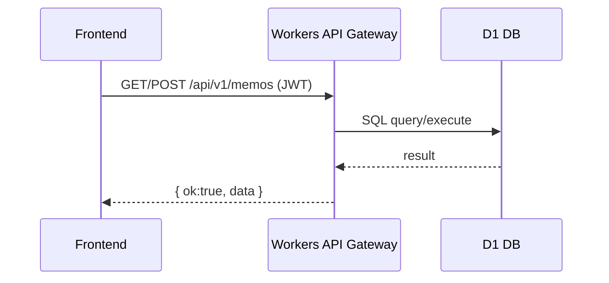
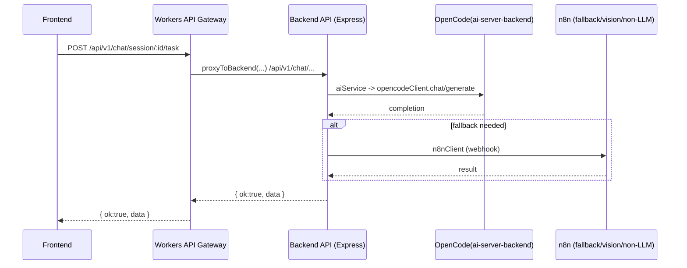
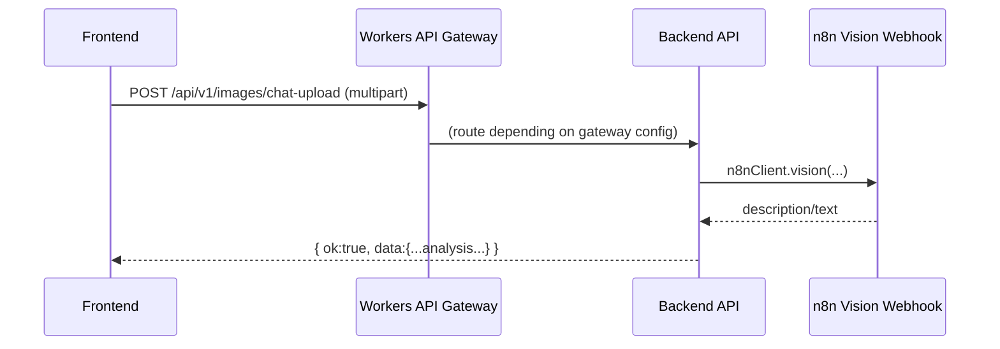

요청하신 **“프론트엔드 기준 → 어떤 백엔드/서브서비스가 실제 처리하는지”**를, 코드에 근거해 **Workers API Gateway / Backend(API) / n8n / AI Agent(backend agent route) / OpenCode(ai-server-backend)**까지 끝까지 추적하는 형태로 정리하겠습니다.
먼저 전체 엔드포인트를 “프론트가 호출하는 URI” 기준으로 표로 정리하고, 그 다음에 **대표 시나리오별로 데이터 변형(변수명/함수명/파일명)**을 단계별로 추적한 뒤, 마지막에 **n8n vs AI agent의 실제 호출 지점/용도 차이**를 별도 섹션으로 분리해 설명하겠습니다.

# [서비스 해부학 지도] (프론트엔드 기준) — 어떤 “백엔드 서비스/서버”가 실제 처리하는가 + n8n vs AI Agent 호출 구분

## 1. 🗺️ 거시적 지형도 (Macro View)

### 서비스 정의 (1줄)

프론트엔드가 호출하는 **단일 API 엔트리(`/api/v1/*`)**는 대부분 **Cloudflare Workers API Gateway**로 들어오며, 여기서 **(1) Workers 내부에서 D1/R2 기반으로 직접 처리**하거나 **(2) Backend Express API로 프록시**한 뒤, AI는 다시 **OpenCode(ai-server-backend) / n8n / (필요 시) Agent 라우트**로 라우팅됩니다.

### 아키텍처 다이어그램 (Mermaid flowchart)

```mermaid
flowchart LR
  FE[Frontend<br/>frontend/src/services/*] -->|fetch /api/v1/*| W[Workers API Gateway<br/>workers/api-gateway/src/index.ts]

  W -->|D1 direct| D1[(Cloudflare D1 DB)]
  W -->|R2 direct| R2[(Cloudflare R2)]
  W -->|proxyToBackend()| BE[Backend Express API<br/>backend/src/index.js]

  W -->|internal AI service -> /api/v1/ai/*| BE

  BE -->|aiService| OC[OpenCode Backend<br/>backend/src/lib/opencode-client.js<br/>ai-server-backend:7016]
  BE -->|n8nClient (non-LLM / vision)| N8N[n8n Webhooks<br/>backend/src/lib/n8n-client.js]
  BE -->|/api/v1/rag/*| RAG[RAG stack<br/>ChromaDB + TEI embeddings]

  BE -->|/api/v1/agent/*| AGENT[AI Agent Orchestrator<br/>backend/src/routes/agent.js]
```

### 핵심 컴포넌트(역할)

- **[Frontend]** `frontend/src/services/*`
  - **역할**: 모든 호출을 [getApiBaseUrl()](cci:1://file:///home/nodove/workspace/blog/workers/api-gateway/src/lib/config.ts:133:0-143:1) 기반으로 `/api/v1/*`에 요청.
- **[Workers API Gateway]** `workers/api-gateway/src/index.ts`
  - **역할**: `/api/v1/*` 라우팅. 일부는 **Workers 내부(D1/R2)**에서 처리, 나머지는 `proxyToBackend()`로 Backend로 전달.
- **[Backend API]** [backend/src/index.js](cci:7://file:///home/nodove/workspace/blog/backend/src/index.js:0:0-0:0)
  - **역할**: Express 라우터 집합(`/api/v1/ai`, `/api/v1/chat`, `/api/v1/rag`, `/api/v1/images` 등). AI 호출은 내부 `aiService`를 통해 외부 AI 서비스로.
- **[OpenCode(ai-server-backend)]** [backend/src/lib/opencode-client.js](cci:7://file:///home/nodove/workspace/blog/backend/src/lib/opencode-client.js:0:0-0:0)
  - **역할**: “LLM 기반 chat/generate(주력)” 처리.
- **[n8n]** [backend/src/lib/n8n-client.js](cci:7://file:///home/nodove/workspace/blog/backend/src/lib/n8n-client.js:0:0-0:0)
  - **역할**: “비-LLM성(translate/task/embeddings)” 및 “vision(이미지 분석)” 중심 + LLM 실패 시 fallback.
- **[AI Agent(Orchestrator)]** [backend/src/routes/agent.js](cci:7://file:///home/nodove/workspace/blog/backend/src/routes/agent.js:0:0-0:0)
  - **역할**: 멀티턴 에이전트 실행/툴콜/세션 관리. **프론트에서 직접 호출하는 흔적은 현재 거의 없음**(아래에 근거 포함).

---

## 2. 📍 엔드포인트 & 진입점 (Entry Points)

> 표는 **프론트 기준 호출 URI**를 “1차 진입점(Workers)”과 “실제 처리 주체(Workers vs Backend)”로 나눠서 적습니다.
> (기본적으로 프론트는 [getApiBaseUrl()](cci:1://file:///home/nodove/workspace/blog/workers/api-gateway/src/lib/config.ts:133:0-143:1)로 얻은 base에 `/api/v1/...`를 붙여 호출)

### A) 인증(Auth) — Workers에서 “직접” 처리

| 메서드 | 엔드포인트(URI)                    | 역할                  | 필수 파라미터                     | 인증/권한   |
| :----: | :--------------------------------- | :-------------------- | :-------------------------------- | :---------- |
|  POST  | `/api/v1/auth/login`             | OTP 로그인 시작       | `{ email }`                     | 없음        |
|  POST  | `/api/v1/auth/verify-otp`        | OTP 검증 후 토큰 발급 | `{ email, otp }`                | 없음        |
|  POST  | `/api/v1/auth/resend-otp`        | OTP 재전송            | `{ email }`                     | 없음        |
|  POST  | `/api/v1/auth/refresh`           | 토큰 갱신             | refresh token(쿠키/헤더)          | 사용자      |
|  POST  | `/api/v1/auth/logout`            | 로그아웃              | -                                 | 사용자      |
|  GET  | `/api/v1/auth/me`                | 내 정보               | -                                 | 사용자      |
|  POST  | `/api/v1/auth/anonymous`         | 익명 JWT 발급         | -                                 | 없음        |
|  POST  | `/api/v1/auth/anonymous/refresh` | 익명 JWT 갱신         | `Authorization: Bearer <token>` | 익명 사용자 |

- **프론트 근거**: [frontend/src/services/auth.ts](cci:7://file:///home/nodove/workspace/blog/frontend/src/services/auth.ts:0:0-0:0) ([requestAnonymousToken()](cci:1://file:///home/nodove/workspace/blog/frontend/src/services/auth.ts:255:0-274:1), [refreshAnonymousToken()](cci:1://file:///home/nodove/workspace/blog/frontend/src/services/auth.ts:276:0-298:1))
- **Workers 근거**: `workers/api-gateway/src/routes/auth.ts` (OTP/토큰/세션 KV 관리)

### B) Chat / Inline AI Task — Workers가 “백엔드로 프록시”

|    메서드    | 엔드포인트(URI)                          | 역할                                   | 필수 파라미터                | 인증/권한        |
| :----------: | :--------------------------------------- | :------------------------------------- | :--------------------------- | :--------------- |
| POST/GET/... | `/api/v1/chat/session`                 | 세션 생성/조회/관리                    | 세션 관련 body               | 주로 사용자/관리 |
|     POST     | `/api/v1/chat/session/:id/message`     | 채팅 메시지 전송(스트리밍)             | `{ messages, ... }`        | 사용자           |
|     POST     | `/api/v1/chat/session/:sessionId/task` | 인라인 태스크 실행                     | `{ taskType, input, ... }` | 사용자           |
|     POST     | `/api/v1/chat/aggregate`               | 집계/요약성 작업(게이트웨이 로직 포함) | body                         | 사용자/관리      |

- **프론트 근거**:
  - `frontend/src/services/ai.ts` → `invokeTask()`가 `/api/v1/chat/session/:sessionId/task`
  - `frontend/src/services/chat/session.ts`, [chat/api.ts](cci:7://file:///home/nodove/workspace/blog/frontend/src/services/chat/api.ts:0:0-0:0), `chat/stream.ts`
- **Workers 근거**: `workers/api-gateway/src/routes/chat.ts`
  - 세션/메시지/태스크는 **Backend로 프록시** (원본 요청을 `proxyToBackend`로 전달)
  - `aggregate`는 Workers 내부 로직도 포함(단, 내부 AI service가 결국 backend `/api/v1/ai/*`로 이어짐)
- **Backend 근거**: [backend/src/routes/chat.js](cci:7://file:///home/nodove/workspace/blog/backend/src/routes/chat.js:0:0-0:0) (SSE 스트리밍 처리, aiService 호출)

### C) AI (스케치/프리즘/체인/비전/생성) — “겉보기는 Workers 처리지만 실제 AI 실행은 Backend로”

| 메서드 | 엔드포인트(URI)           | 역할          | 필수 파라미터 | 인증/권한     |
| :----: | :------------------------ | :------------ | :------------ | :------------ |
|  POST  | `/api/v1/ai/sketch`     | 스케치형 생성 | body          | 관리자/사용자 |
|  POST  | `/api/v1/ai/prism`      | prism 작업    | body          | 관리자/사용자 |
|  POST  | `/api/v1/ai/chain`      | chain 작업    | body          | 관리자/사용자 |
|  POST  | `/api/v1/ai/generate`   | 텍스트 생성   | body          | 관리자/사용자 |
|  POST  | `/api/v1/ai/vision/...` | 이미지 분석   | body          | 관리자/사용자 |
|  GET  | `/api/v1/ai/health`     | AI 헬스       | -             | -             |

- **Workers 근거**: `workers/api-gateway/src/routes/ai.ts`
  - 주석/구현상 “Workers 내부 AI service”를 호출하지만,
- **핵심 연결**: [workers/api-gateway/src/lib/ai-service.ts](cci:7://file:///home/nodove/workspace/blog/workers/api-gateway/src/lib/ai-service.ts:0:0-0:0)는 **결국 backend `/api/v1/ai/*`로 프록시**하는 형태(“Workers가 직접 LLM 공급자 호출” 아님)
- **Backend 근거**: [backend/src/routes/ai.js](cci:7://file:///home/nodove/workspace/blog/backend/src/routes/ai.js:0:0-0:0) → `aiService`로 실제 실행

### D) Translate — Workers 내부 캐시(D1) + AI 호출은 Backend 경유

| 메서드 | 엔드포인트(URI)       | 역할            | 필수 파라미터               | 인증/권한   |
| :----: | :-------------------- | :-------------- | :-------------------------- | :---------- |
|  POST  | `/api/v1/translate` | 번역(캐시 포함) | `{ text, from, to, ... }` | 사용자/관리 |

- **프론트 근거**: `frontend/src/services/translate.ts`
- **Workers 근거**: `workers/api-gateway/src/routes/translate.ts` (D1 캐시)
- **실제 AI 생성 근거**: Workers 내부 AI service → backend `/api/v1/ai/*` → backend `aiService`
  (backend에도 [backend/src/routes/translate.js](cci:7://file:///home/nodove/workspace/blog/backend/src/routes/translate.js:0:0-0:0)가 존재하나, 프로덕션에서 `/api/v1/translate`를 Workers가 직접 처리하는 구조)

### E) RAG — Workers는 프록시, Backend가 RAG 스택 호출

|     메서드     | 엔드포인트(URI)        | 역할               | 필수 파라미터                    | 인증/권한        |
| :-------------: | :--------------------- | :----------------- | :------------------------------- | :--------------- |
|      POST      | `/api/v1/rag/search` | 시맨틱 검색        | `{ query, n_results, filter }` | 보통 없음/환경별 |
|      POST      | `/api/v1/rag/embed`  | 임베딩 생성        | `{ texts }`                    | 보통 없음/환경별 |
|       GET       | `/api/v1/rag/health` | RAG 헬스           | -                                | -                |
| GET/POST/DELETE | `/api/v1/rag/*`      | 인덱스/컬렉션 관리 | body/path                        | 관리자(대부분)   |

- **프론트 근거**: [frontend/src/services/rag.ts](cci:7://file:///home/nodove/workspace/blog/frontend/src/services/rag.ts:0:0-0:0)
- **Workers 근거**: `workers/api-gateway/src/routes/rag.ts` (backend로 프록시)
- **Backend 근거**: [backend/src/routes/rag.js](cci:7://file:///home/nodove/workspace/blog/backend/src/routes/rag.js:0:0-0:0) (ChromaDB/TEI 연동)

### F) Images — Workers에서 일부 처리, Backend에도 이미지 라우트 존재(특히 chat-upload/vision 연계)

| 메서드 | 엔드포인트(URI)                | 역할                           | 필수 파라미터           | 인증/권한   |
| :----: | :----------------------------- | :----------------------------- | :---------------------- | :---------- |
|  POST  | `/api/v1/images/chat-upload` | 채팅 이미지 업로드 + 분석 결과 | `multipart/form-data` | 사용자/관리 |
| (기타) | `/api/v1/images/*`           | 업로드/목록/삭제 등            | -                       | 관리자 위주 |

- **프론트 근거**: [frontend/src/services/chat/api.ts](cci:7://file:///home/nodove/workspace/blog/frontend/src/services/chat/api.ts:0:0-0:0) → [uploadChatImage()](cci:1://file:///home/nodove/workspace/blog/frontend/src/services/chat/api.ts:219:0-265:1)가 `/api/v1/images/chat-upload`
- **Backend 근거**: [backend/src/routes/images.js](cci:7://file:///home/nodove/workspace/blog/backend/src/routes/images.js:0:0-0:0)
  - `chat-upload` 후 **[n8nClient.vision](cci:1://file:///home/nodove/workspace/blog/backend/src/lib/ai-service.js:241:2-286:3)** 호출(“이미지 분석은 n8n 사용”의 대표 근거)

### G) Comments / Reactions / Analytics / Memos / Memories / Personas / User-Content — Workers가 D1로 직접 처리

|    메서드    | 엔드포인트(URI)                  | 역할                    | 인증/권한        |
| :----------: | :------------------------------- | :---------------------- | :--------------- |
| GET/POST/... | `/api/v1/comments/*`           | 댓글 CRUD/리액션/스트림 | 일부 관리자 필요 |
| GET/POST/... | `/api/v1/analytics/*`          | 트래킹/통계             | 관리자           |
| GET/POST/... | `/api/v1/memos/*`              | 메모/버전 관리          | 사용자           |
| GET/POST/... | `/api/v1/memories/*`           | 유저 메모리 CRUD        | 사용자           |
| GET/POST/... | `/api/v1/personas/*`           | 페르소나 관리           | 사용자           |
| GET/POST/... | `/api/v1/user-content/memos/*` | 유저 컨텐츠(메모노트)   | 사용자           |

- **Workers 근거**:
  - `workers/api-gateway/src/routes/comments.ts`, `analytics.ts`, `memos.ts`, `memories.ts`, [personas.ts](cci:7://file:///home/nodove/workspace/blog/workers/api-gateway/src/routes/personas.ts:0:0-0:0), [user-content.ts](cci:7://file:///home/nodove/workspace/blog/workers/api-gateway/src/routes/user-content.ts:0:0-0:0)
  - 공통적으로 `c.env.DB`(D1) 사용
- **프론트 근거**:
  - [frontend/src/services/reactions.ts](cci:7://file:///home/nodove/workspace/blog/frontend/src/services/reactions.ts:0:0-0:0), `analytics.ts`, `memoVersions.ts`, `memory.ts`, `userContent.ts`

### H) Posts API(서버형) + Posts static(파일형)

|       메서드       | 엔드포인트(URI)                         | 역할               | 인증/권한     |
| :-----------------: | :-------------------------------------- | :----------------- | :------------ |
| GET/POST/PUT/DELETE | `/api/v1/posts/*`                     | D1 기반 posts CRUD | 쓰기는 관리자 |
|         GET         | `/posts/index.json`, `/posts/...md` | 정적 콘텐츠 fetch  | 없음          |

- **Workers 근거**: [workers/api-gateway/src/routes/posts.ts](cci:7://file:///home/nodove/workspace/blog/workers/api-gateway/src/routes/posts.ts:0:0-0:0) (D1 기반 posts API)
- **프론트 근거**: `frontend/src/services/postService.ts`는 API 대신 **public path 정적 파일**을 읽음

### I) Terminal (WebSocket) — 별도 Worker(terminal-gateway) 또는 API Gateway 프록시

| 메서드 | 엔드포인트(URI)                  | 역할              | 인증/권한 |
| :----: | :------------------------------- | :---------------- | :-------- |
|   WS   | `/terminal` (terminal-gateway) | 웹소켓 게이트웨이 | JWT 필요  |

- **Workers(별도) 근거**: [workers/terminal-gateway/src/index.ts](cci:7://file:///home/nodove/workspace/blog/workers/terminal-gateway/src/index.ts:0:0-0:0)
  - `Upgrade: websocket` 검사
  - `extractToken()`/`verifyToken()`
  - origin으로 `X-Origin-Secret`, `X-User-ID` 주입 후 프록시

---

## 3. 🌊 데이터 흐름 및 변형 추적 (Data Transformation Flow)

아래는 “프론트 → Workers → Backend → (OpenCode/n8n/RAG/Agent)”까지 **실제 변수/함수/파일 기준**으로 끝까지 추적한 핵심 시나리오들입니다.

---

### **[시나리오 1: 인라인 AI Task 실행]**

(예: 프론트에서 버튼 눌러 “요약/정리/프리즘” 같은 태스크 요청)

1. **진입 (Frontend)**

   - **파일**: `frontend/src/services/ai.ts`
   - **요청 URL**: `POST /api/v1/chat/session/:sessionId/task`
   - **Input 형태(예시)**: `invokeTask(sessionId, { taskType, input, ... })`
   - **Transformation**
     - 프론트에서 task payload를 구성하고 fetch로 전송
2. **진입 (Workers API Gateway)**

   - **파일**: `workers/api-gateway/src/routes/chat.ts`
   - **Action**
     - 해당 엔드포인트는 **Workers가 직접 처리하지 않고 Backend로 프록시**
     - “백엔드 origin”으로 보내는 이유: Worker 자신을 다시 호출하는 순환 방지(설정: `BACKEND_ORIGIN` 계열)
3. **비즈니스 로직 (Backend)**

   - **파일**: [backend/src/routes/chat.js](cci:7://file:///home/nodove/workspace/blog/backend/src/routes/chat.js:0:0-0:0)
   - **Action**
     - task 요청을 파싱하고 내부 AI 호출로 위임
   - **핵심 호출**
     - `aiService` 사용 (파일: [backend/src/lib/ai-service.js](cci:7://file:///home/nodove/workspace/blog/backend/src/lib/ai-service.js:0:0-0:0))
4. **AI 실행(실제 LLM/워크플로우)**

   - **파일**: [backend/src/lib/ai-service.js](cci:7://file:///home/nodove/workspace/blog/backend/src/lib/ai-service.js:0:0-0:0)
   - **주요 라우팅**
     - “LLM 기반 생성/대화”는 주로 [opencode-client.js](cci:7://file:///home/nodove/workspace/blog/backend/src/lib/opencode-client.js:0:0-0:0) 통해 **OpenCode backend(ai-server-backend)** 로
     - 일부 작업/정책에 따라 n8n fallback 가능
5. **Response**

   - **Backend → Workers → Frontend**
   - 스트리밍일 경우: [backend/src/routes/chat.js](cci:7://file:///home/nodove/workspace/blog/backend/src/routes/chat.js:0:0-0:0)에서 SSE 구성 → Workers가 바디/헤더 유지 프록시 → 프론트 `frontend/src/services/chat/stream.ts`가 파싱

---

### **[시나리오 2: Chat 메시지 스트리밍 전송]**

1. **Frontend**

   - **파일**: [frontend/src/services/chat/api.ts](cci:7://file:///home/nodove/workspace/blog/frontend/src/services/chat/api.ts:0:0-0:0), `chat/stream.ts`
   - **요청**: `POST /api/v1/chat/session/:id/message`
   - **Output 처리**
     - `chat/stream.ts`에서 SSE/NDJSON을 파싱해 UI에 반영
2. **Workers**

   - **파일**: `workers/api-gateway/src/routes/chat.ts`
   - **Action**: Backend로 프록시(스트림 바디를 그대로 전달)
3. **Backend**

   - **파일**: [backend/src/routes/chat.js](cci:7://file:///home/nodove/workspace/blog/backend/src/routes/chat.js:0:0-0:0)
   - **Action**
     - SSE 헤더 세팅 후, [aiService.chat(...)](cci:1://file:///home/nodove/workspace/blog/shared/services.ts:184:4-184:50) 등으로 토큰/청크 생성
     - 스트림으로 `res.write(...)` 형태로 전달
4. **AI**

   - **Backend `aiService` → OpenCode**가 주력

---

### **[시나리오 3: 채팅 이미지 업로드 + 비전 분석]** (n8n이 “확실히” 쓰이는 구간)

1. **Frontend**

   - **파일**: [frontend/src/services/chat/api.ts](cci:7://file:///home/nodove/workspace/blog/frontend/src/services/chat/api.ts:0:0-0:0)
   - **함수**: [uploadChatImage(file)](cci:1://file:///home/nodove/workspace/blog/frontend/src/services/chat/api.ts:219:0-265:1)
   - **Input**: `FormData` (multipart)
   - **요청**: `POST /api/v1/images/chat-upload`
2. **Backend(핵심)**

   - **파일**: [backend/src/routes/images.js](cci:7://file:///home/nodove/workspace/blog/backend/src/routes/images.js:0:0-0:0)
   - **Transformation**
     - 파일 업로드 처리(R2 저장/변형 등)
     - 그 후 **비전 분석 호출을 [n8nClient.vision(...)](cci:1://file:///home/nodove/workspace/blog/backend/src/lib/ai-service.js:241:2-286:3)으로 수행**
   - **결론**
     - “이미지 비전 분석”은 코드 근거상 **n8n 호출이 실사용**되는 대표 케이스
3. **n8n**

   - **파일**: [backend/src/lib/n8n-client.js](cci:7://file:///home/nodove/workspace/blog/backend/src/lib/n8n-client.js:0:0-0:0)
   - **Action**: vision webhook 호출(항상 n8n 경유라는 정책)

---

### **[시나리오 4: RAG 검색]**

1. **Frontend**

   - **파일**: [frontend/src/services/rag.ts](cci:7://file:///home/nodove/workspace/blog/frontend/src/services/rag.ts:0:0-0:0)
   - **함수**: [semanticSearch(query, { n_results, filter })](cci:1://file:///home/nodove/workspace/blog/frontend/src/services/rag.ts:64:0-123:1)
   - **요청**: `POST /api/v1/rag/search`
   - **Transformation (프론트에서 “응답 정규화” 수행)**
     - backend의 결과가 `{ document, distance }` 중심이면,
     - 프론트에서:
       - `content: r.content || r.document || ''`
       - `score: r.score ?? (r.distance != null ? Math.max(0, 1 - r.distance) : 0)`
     - 이 정규화는 [frontend/src/services/rag.ts](cci:7://file:///home/nodove/workspace/blog/frontend/src/services/rag.ts:0:0-0:0) 내부 map에서 발생
2. **Workers**

   - **파일**: `workers/api-gateway/src/routes/rag.ts`
   - **Action**: backend로 프록시
3. **Backend**

   - **파일**: [backend/src/routes/rag.js](cci:7://file:///home/nodove/workspace/blog/backend/src/routes/rag.js:0:0-0:0)
   - **Action**: ChromaDB/TEI에 요청, 결과를 `{ ok, data }`로 반환

---

### **[시나리오 5: Translate]**

1. **Frontend**

   - **파일**: `frontend/src/services/translate.ts`
   - **요청**: `POST /api/v1/translate`
2. **Workers**

   - **파일**: `workers/api-gateway/src/routes/translate.ts`
   - **핵심 로직**
     - D1에서 캐시 조회/저장
     - 캐시 미스 시 AI 호출(Workers 내부 ai-service → backend `/api/v1/ai/*`)
3. **Backend**

   - **파일**: [backend/src/routes/ai.js](cci:7://file:///home/nodove/workspace/blog/backend/src/routes/ai.js:0:0-0:0) + [backend/src/lib/ai-service.js](cci:7://file:///home/nodove/workspace/blog/backend/src/lib/ai-service.js:0:0-0:0)
   - **실제 생성**: OpenCode 중심(LLM), 필요 시 fallback

---

## 4. 🔍 미시적 세부 사항 (Micro Details & Edge Cases)

### 주요 알고리즘/로직 (중요한 것만)

- **[RAG 결과 정규화]**
  - **파일**: [frontend/src/services/rag.ts](cci:7://file:///home/nodove/workspace/blog/frontend/src/services/rag.ts:0:0-0:0)
  - **포인트**: backend가 주는 `distance`를 프론트가 `score = 1 - distance`로 근사 변환.
- **[Terminal Gateway 보안 프록시]**
  - **파일**: [workers/terminal-gateway/src/index.ts](cci:7://file:///home/nodove/workspace/blog/workers/terminal-gateway/src/index.ts:0:0-0:0)
  - **포인트**
    - WebSocket 업그레이드 검사
    - JWT 검증
    - origin으로 `X-Origin-Secret`, `X-User-ID` 등 주입
    - rate limit + single active session 제약

### 예외 처리(Error Handling)

- **Backend Express 기본 404/에러 형식**
  - **파일**: [backend/src/index.js](cci:7://file:///home/nodove/workspace/blog/backend/src/index.js:0:0-0:0)
  - 404: `res.status(404).json({ ok:false, error:'Not Found' })`
  - error handler: `res.status(status).json({ ok:false, error: err.message })`
- **Workers는 통일된 `{ ok:true,data } / { ok:false,error:{...} }` 패턴을 쓰는 경향**
  - (Workers route들이 [success()/badRequest()/serverError()](cci:1://file:///home/nodove/workspace/blog/workers/api-gateway/src/lib/response.ts:9:0-21:1) 등을 사용)

### 숨겨진 의존성(ENV/Runtime Config)

- **Backend**
  - `AIDOVE_WEBHOOK_URL`가 있으면 `/aidove` 프록시 활성화
    - **파일**: [backend/src/index.js](cci:7://file:///home/nodove/workspace/blog/backend/src/index.js:0:0-0:0), [backend/src/lib/aidove-proxy.js](cci:7://file:///home/nodove/workspace/blog/backend/src/lib/aidove-proxy.js:0:0-0:0)
- **Workers → Backend 프록시**
  - backend origin 설정(순환 호출 방지용) 및 내부 키(`X-Internal-Gateway-Key`) 사용 가능
  - **파일**: [workers/api-gateway/src/routes/gateway.ts](cci:7://file:///home/nodove/workspace/blog/workers/api-gateway/src/routes/gateway.ts:0:0-0:0) 참고(내부키 주입 패턴)

---

## 5. 🧭 네비게이션 요약 (Sequence Diagram)

### (A) “일반 API(메모/댓글/분석)” — Workers가 D1에서 직접 처리



### (B) “Chat/AI Task” — Workers → Backend → OpenCode(+fallback)



### (C) “chat-upload + vision” — Backend가 n8n vision을 직접 호출



---

# n8n vs AI Agent 서버 — “실제 호출” 기준 명확한 구분

## 1) n8n은 어디서/무엇 때문에 호출되는가?

- **호출 위치(근거 파일)**
  - [backend/src/routes/images.js](cci:7://file:///home/nodove/workspace/blog/backend/src/routes/images.js:0:0-0:0) → [n8nClient.vision](cci:1://file:///home/nodove/workspace/blog/backend/src/lib/ai-service.js:241:2-286:3) (이미지 분석)
  - [backend/src/lib/n8n-client.js](cci:7://file:///home/nodove/workspace/blog/backend/src/lib/n8n-client.js:0:0-0:0) 내부 정책:
    - **Vision**: “항상 n8n webhook”
    - **Non-LLM 작업(translate/task/embeddings 등)**: “항상 n8n webhook”
    - **LLM(chat/generate)**: OpenCode 우선, 실패 시 n8n fallback
- **역할 요약**
  - “워크플로우/툴 기반 파이프라인” 성격(vision, task, embeddings 등)을 **n8n에서 처리**하거나,
  - LLM 호출 실패 시 **대체 경로**로 사용.

## 2) AI Agent 서버(backend `/api/v1/agent/*`)는 어디서/무엇 때문에 호출되는가?

- **존재/기능(근거 파일)**
  - [backend/src/routes/agent.js](cci:7://file:///home/nodove/workspace/blog/backend/src/routes/agent.js:0:0-0:0)
  - AgentCoordinator 기반:
    - agent 실행, 스트리밍, 세션 관리, 툴 목록, 메모리 추출/검색 등
- **프론트에서의 직접 호출**
  - 현재 정리된 프론트 서비스들 기준으로는 **`/api/v1/agent/*`를 직접 호출하는 주요 코드 경로가 거의 없음**
    즉, “AI 기능”의 주된 프론트 호출은 `/api/v1/chat/*`, `/api/v1/ai/*`, `/api/v1/images/*`로 들어가고, 이는 [backend/src/routes/chat.js](cci:7://file:///home/nodove/workspace/blog/backend/src/routes/chat.js:0:0-0:0) / [backend/src/routes/ai.js](cci:7://file:///home/nodove/workspace/blog/backend/src/routes/ai.js:0:0-0:0) / [backend/src/routes/images.js](cci:7://file:///home/nodove/workspace/blog/backend/src/routes/images.js:0:0-0:0) 중심으로 처리됩니다.
- **역할 요약**
  - n8n이 “workflow engine”이라면,
  - Agent는 “대화/툴 실행/오케스트레이션” 중심의 **별도 API surface**이며, 현재 프론트 주요 플로우에는 직접 연결이 약합니다(추후 확장 포인트 성격이 강함).

---

# 완료 상태 요약

- **완료**: 프론트 호출 기준으로 `/api/v1/*`를 **Workers에서 직접 처리하는 영역(D1/R2)** vs **Backend로 프록시되는 영역**을 구분했고, AI 경로는 **Backend `aiService` → OpenCode 주력 + n8n(vision/non-LLM/fallback)** 구조로 정리했습니다.
- **완료**: `n8n`은 특히 [backend/src/routes/images.js](cci:7://file:///home/nodove/workspace/blog/backend/src/routes/images.js:0:0-0:0)에서 **vision 분석에 실사용**됨을 근거로 명확히 분리했고, `AI Agent`는 [backend/src/routes/agent.js](cci:7://file:///home/nodove/workspace/blog/backend/src/routes/agent.js:0:0-0:0)에 있으나 **프론트 직접 호출 흐름은 현재 약함**을 근거 중심으로 정리했습니다.
