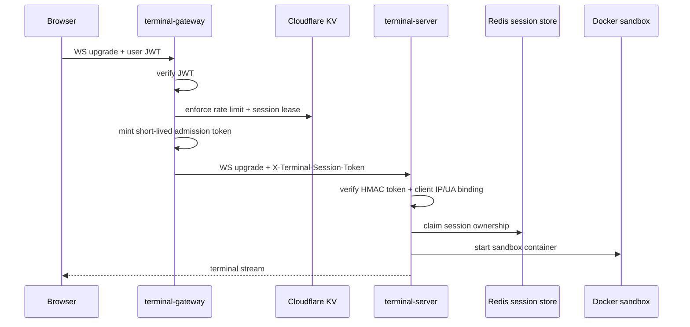

# Terminal Session Flow

```mermaid
sequenceDiagram
    participant Browser
    participant Gateway as terminal-gateway
    participant KV as Cloudflare KV
    participant Origin as terminal-server
    participant Redis as Redis session store
    participant Docker as Docker sandbox

    Browser->>Gateway: WS upgrade + user JWT
    Gateway->>Gateway: verify JWT
    Gateway->>KV: enforce rate limit + session lease
    Gateway->>Gateway: mint short-lived admission token
    Gateway->>Origin: WS upgrade + X-Terminal-Session-Token
    Origin->>Origin: verify HMAC token + client IP/UA binding
    Origin->>Redis: claim session ownership
    Origin->>Docker: start sandbox container
    Origin-->>Browser: terminal stream
```

핵심 변경점:

- `X-Backend-Key` 기반 origin admission 제거
- 사용자/세션 단기 토큰 도입
- 세션 메타데이터를 Redis로 외부화
