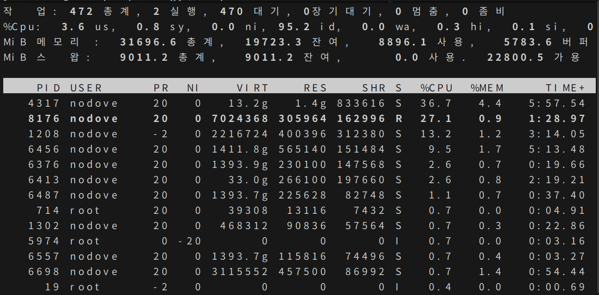

시험을 앞둔 여름밤, 학교 도서관의 형광등 빛이 희미하게 떨리고 있었다. 컴퓨터공학 개론서를 펼쳐놓은 채 친구들과 문제를 맞춰 보던 와중, 나는 문득 운영체제가 사람 관계와 닮았다는 생각을 했다. 누군가는 실행 중이고, 누군가는 잠시 기다리다 다시 무대에 오르는 식으로 말이다.

<!--more-->

## 프로세스 상태를 이해한다는 것

처음 프로세스 상태 다이어그램을 외우려 할 때는 그저 화살표의 방향만 뒤쫓았다. 그러다 콘솔창에서 리눅스 `top` 명령어를 돌려보니, 내가 키보드를 두드리는 순간에도 수십 개의 프로세스가 "준비", "실행", "대기" 상태를 오가며 숨 쉬고 있었다. 강의실에서 그리던 도표가 실시간으로 살아 움직이는 광경을 보니, 책 속의 개념이 갑자기 피부로 와닿았다.

## 스케줄링이 만들어낸 작은 드라마

다중 프로그래밍 환경에서 CPU를 배분하는 작업은 결국 누가 먼저 무대에 오를지를 정하는 일이다. 과제를 하다가 FCFS(First-Come, First-Served)를 시험했을 때는, 어릴 적 줄서기에서 새치기 당했던 기억이 떠올랐다. 먼저 도착한 프로세스가 순서를 지키는 단순한 방식은 깔끔하지만, 너무 긴 작업 하나가 전체 흐름을 막아버릴 때가 있다.

반면 라운드 로빈 스케줄링은 발표회에 초대된 친구들이 차례로 마이크를 돌려 쓰는 모습과 닮았다. 짧은 시간 할당량(quantum) 동안 CPU를 사용하는 동안에는 주인공이 되지만, 시간을 넘기면 다시 줄 끝으로 돌아가야 한다. 나도 협업 프로젝트를 할 때 "이번엔 내가, 다음엔 네가" 하며 시간을 쪼개 쓰던 경험이 있어서인지, 이 알고리즘이 유난히 인간적으로 느껴졌다. 물론, 너무 잦은 컨텍스트 스위칭 때문에 모두가 지쳐버릴 수도 있다는 경고도 잊지 않았다.

## 메모리 할당과 노트 정리의 공통점

밤새 필기를 정리하다 보면, 공책 한 장을 어떻게 나눌지 고민하곤 했다. 운영체제는 주기억장치를 분할하여 프로세스를 적재한다. `최초 적합`, `최적 적합` 같은 전략은 결국 "어디에 이 메모를 붙여야 공간이 덜 낭비될까"를 묻는 일과 다르지 않았다. 실제 서버에서 메모리 사용량이 급증하던 날, 로그를 훑어보며 "내가 메모장을 너무 무작정 붙여댄 건 아닐까" 하는 생각에 웃음이 나왔다.

## 가상 메모리와 나의 밤샘 회상

가상 메모리는 시험에도 자주 등장하는 단골 손님이다. 처음엔 "당장 필요한 것만 주기억장치에 올리고 나머지는 보조기억장치에 두라"는 말이 추상적으로 느껴졌다. 그런데 새벽 두 시, 팀 프로젝트에 쫓겨서도 모든 내용을 머릿속에 올려둘 수는 없었다. 결국 필요한 함수와 자료구조만 따로 정리해두고, 나머지는 상황이 닥치면 꺼내 쓰는 방식으로 버텼다. 페이징을 구현해 놓은 운영체제를 닮은 셈이다.

페이지 교체 알고리즘을 외울 때는 실없는 농담도 했다. "FIFO는 먼저 들어온 기억부터 잊어버리는 우리 뇌와 닮았고, LRU는 최근에 안 본 것을 가장 먼저 잊어버리지 않나?" 하는 식이다. 시험을 준비하며 그렇게 개념에 이야기를 붙여두니, 막상 답안을 쓸 때마다 그 밤의 공기가 떠올랐다.

---

교과서 한 구석에 적어둔 메모에는 지금도 이렇게 쓰여 있다. "운영체제는 결국 자원을 나누어 쓰는 방법에 관한 이야기다. 사람 사이에서도, 코드 사이에서도." 시험이 끝난 뒤 친구들과 허탈하게 웃으며 내려온 도서관 계단에서, 나는 기술이 삶과 만나는 지점을 처음으로 또렷하게 보았다.