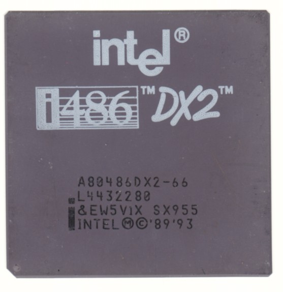

<citation>이미지 출처: Wikipedia (https://en.wikipedia.org/wiki/Intel_80486)</citation>

1980년대 후반의 개인용 컴퓨팅 시장은 새로운 도약을 기다리고 있었다. 마이크로프로세서 기술의 선두주자였던 인텔은 이러한 기대를 인텔 486 마이크로프로세서로 응답하며 1989년 역사적인 변곡점을 만들어 냈다. 이 칩은 단순한 성능 향상 이상의 의미를 지니며, 전반적인 아키텍처 설계와 효율성에서 개인용 컴퓨터의 가능성을 한층 확장했다.

인텔 386이 현대 컴퓨팅의 기반을 다졌다면, 486은 그 위에 혁신을 쌓아 올렸다. 무엇보다 부동소수점 연산 장치(FPU)를 CPU와 같은 다이에 통합해 연산 효율을 크게 끌어올렸고, 8KB 규모의 온칩 캐시를 도입해 데이터 접근 속도를 개선했다. 이러한 변화는 과학, 공학, 그래픽 작업과 같이 정밀한 계산을 요구하는 분야에서 체감 가능한 차이를 제공했다.

486의 파이프라이닝 구조는 이전 명령어가 완료되기 전 다음 명령어를 실행 구간에 투입해 처리량을 극대화했다. 동시에 32비트 아키텍처를 전면적으로 지원하며 더 큰 메모리 공간과 데이터 처리 능력을 보장했다. 운영체제는 이 덕분에 멀티태스킹을 보다 안정적으로 구현할 수 있었고, 사용자들은 한층 민첩해진 응답성을 경험할 수 있었다.

제품 라인업 또한 폭넓었다. 클럭 속도 20MHz부터 100MHz까지 다양한 모델이 제공되면서 가정용 PC부터 서버까지 폭넓은 시장을 커버했다. 도스 게임을 즐기는 사용자부터 복잡한 비즈니스 소프트웨어를 다루는 전문가까지, 486은 성능과 가격의 균형을 찾는 이들에게 매력적인 선택지였다. 이러한 설계 철학은 후속작인 인텔 펜티엄에 그대로 이어져, 486이 마련한 틀을 더욱 확장하게 된다.

1990년대 중반이 되자 인텔 486은 사실상의 표준으로 자리잡았다. 신뢰할 수 있는 멀티태스킹 능력과 향상된 그래픽 처리 덕분에 소프트웨어 개발자와 하드웨어 애호가 모두에게 사랑받았다. 비록 이후 세대의 프로세서가 등장하며 주류 자리에서 물러났지만, 486이 남긴 유산은 여전히 견고하다. 한 시대를 상징하는 기술적 진화의 기록이자, 오늘날 고성능 컴퓨팅 환경이 존재할 수 있도록 한 토대이기 때문이다.