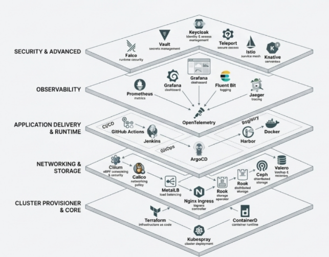
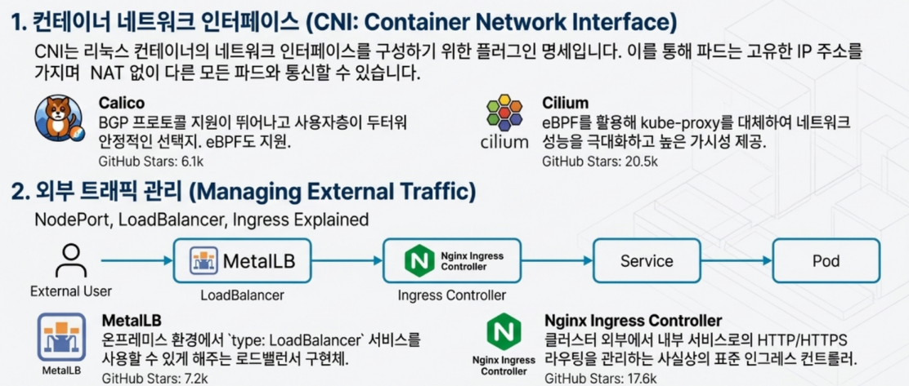
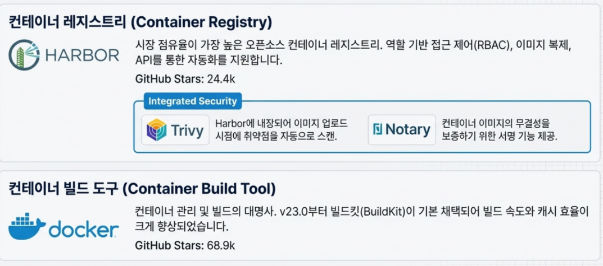
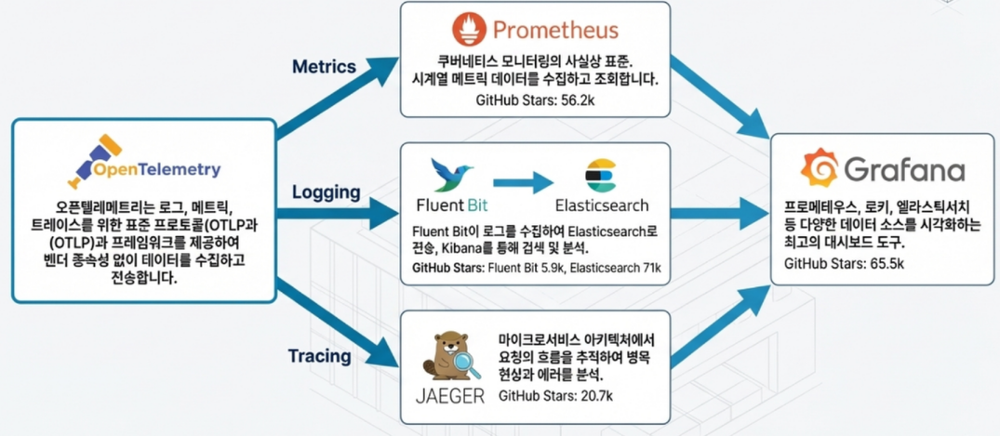
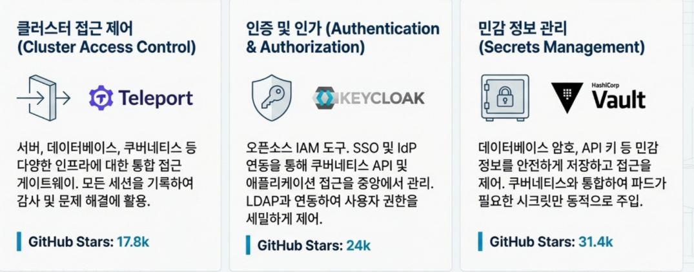
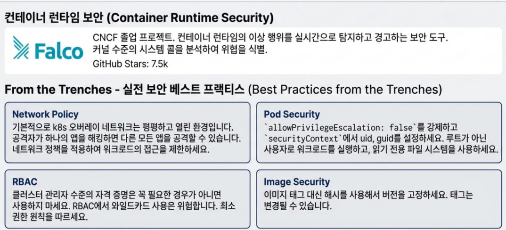

클라우드 네이티브 이야기를 할 때 빠지지 않는 단어가 있습니다. 바로 **쿠버네티스(Kubernetes)** 입니다. 하지만 "쿠버네티스가 뭔지는 알겠는데, 전체 그림이 머릿속에서 한 번에 그려지진 않는다"는 이야기를 자주 듣습니다.

이 글은 그런 분들을 위해 준비한 **개념 지도(Overview)** 입니다. 전통적인 배포 방식에서 출발해 클러스터 프로비저닝, 네트워크, 스토리지, CI/CD, 관측 가능성, 보안, 고급 워크로드와 트러블슈팅까지 한 번에 훑어보도록 구성했습니다.

---

## 1. 전통적 배포에서 컨테이너 시대로

쿠버네티스를 이해하려면 먼저 **배포 방식이 어떻게 진화해 왔는지** 살펴보는 것이 좋습니다.

- **전통적 배포**: 물리 서버에 애플리케이션을 직접 올리던 시절. 리소스 격리가 부족하고 확장성이 떨어집니다.
- **가상화 배포**: 하이퍼바이저 위에 VM을 여러 개 올려 격리와 자원 활용을 개선했지만, 각 VM이 완전한 OS를 포함해 여전히 무겁습니다.
- **컨테이너 배포**: OS 커널을 공유하면서 프로세스를 컨테이너 단위로 격리합니다. 경량이면서도 빠르게 배포/롤백할 수 있어, 대규모 시스템의 기본 단위가 되었습니다.

쿠버네티스는 바로 이 **컨테이너 시대의 운영체제** 역할을 합니다.

위와 같은 기능, 예를 들어 **Self-Healing, 자동 롤아웃/롤백, 수평 확장(HPA)** 가 쿠버네티스가 제공하는 기본 가치입니다.

---

## 2. 쿠버네티스 에코시스템 한눈에 보기

쿠버네티스는 단일 제품이 아니라, 수많은 도구와 플랫폼이 얽혀 있는 **거대한 생태계**입니다.

위 그림처럼, 클러스터 프로비저닝/핵심 런타임, 네트워크와 스토리지, CI/CD, 모니터링, 보안, 고급 워크로드까지 계층적으로 쌓여 있는 구조로 이해하면 전체 그림을 잡기 쉽습니다.

---

## 3. 클러스터 프로비저닝과 컨테이너 런타임

쿠버네티스를 실제로 설치하고 운영하기 위해서는 **클러스터를 어떻게 만들 것인가**, 그리고 **컨테이너를 어떤 런타임으로 실행할 것인가**를 먼저 결정해야 합니다.

- **kubeadm**: 쿠버네티스 공식 CLI 도구로, 가장 기본적인 설치 방법입니다.
- **Kubespray**: Ansible 기반으로 멀티 노드 클러스터를 자동으로 구성합니다.
- **Terraform**: 클라우드 인프라를 코드로 선언(IaC)하여, 노드와 네트워크까지 한 번에 준비할 수 있습니다.

런타임 측면에서는 `containerd`가 사실상 표준이 되었습니다.

도커의 `dockershim`이 제거된 이후, 대다수 배포판에서 `containerd`가 기본 런타임으로 채택되고 있습니다.

---

## 4. 네트워크와 스토리지 기본기

쿠버네티스는 추상화를 제공할 뿐, 실제 네트워크와 스토리지는 별도의 플러그인과 솔루션이 담당합니다.

- **CNI 플러그인(Calico, Cilium 등)**: 파드 간 통신과 네트워크 정책을 담당합니다.
- **MetalLB, Ingress Controller**: 외부에서 서비스에 접근할 수 있도록 LoadBalancer/Ingress를 제공합니다.

스토리지는 **Kubernetes Storage Model**을 통해 추상화됩니다.

- `StorageClass` / `PVC` / `PV` 개념을 기반으로 동적 프로비저닝을 지원합니다.
- **Rook + Ceph**: 클러스터 내부에 분산 스토리지를 구성할 때 널리 쓰이는 조합입니다.
- **Velero**: 네임스페이스/볼륨 단위 백업, 복원, 마이그레이션에 활용됩니다.

---

## 5. CI/CD와 GitOps, 이미지 레지스트리

애플리케이션을 지속적으로 배포하려면 **CI/CD 파이프라인과 컨테이너 이미지 레지스트리**가 필요합니다.

- **GitHub Actions, Jenkins, GitLab CI/CD**: 코드 커밋부터 컨테이너 이미지 빌드, 배포까지 자동화합니다.
- **ArgoCD**: Git 리포지토리를 단일 진실 공급원(SSOT)으로 사용하는 GitOps 도구입니다.

이미지는 보통 중앙 레지스트리에 저장하고, 취약점 스캔과 서명 등 보안 기능을 붙입니다.

Harbor와 같은 레지스트리는 **Trivy, Notary** 등과 결합해 이미지 스캔과 서명, 정책 기반 배포 제어까지 수행할 수 있습니다.

---

## 6. 관측 가능성과 운영 모니터링

안정적인 운영을 위해서는 **Metrics, Logs, Traces** 관점의 관측 가능성이 필수입니다.

- **OpenTelemetry**: 로그, 메트릭, 트레이스를 벤더 중립적으로 수집하는 표준입니다.
- **Prometheus + Grafana**: 메트릭 수집과 대시보드 시각화의 사실상 표준 조합입니다.
- **Fluent Bit + Elasticsearch**: 로그 수집과 검색에 활용됩니다.
- **Jaeger**: 분산 트레이싱으로 마이크로서비스의 병목을 분석할 수 있습니다.

---

## 7. 보안과 서비스 메쉬, 고급 워크로드

클러스터가 커질수록 **접근 제어와 비밀 정보 관리, 런타임 보안, 서비스 메쉬, 서버리스, ML 워크로드**가 중요해집니다.

쿠버네티스는 이제 단순한 컨테이너 오케스트레이션을 넘어, **서비스 메쉬, 서버리스, 머신러닝 파이프라인**까지 포괄하는 플랫폼으로 진화하고 있습니다.

---

## 8. 트러블슈팅을 위한 첫 번째 표

마지막으로, 실제 운영에서 자주 마주치는 **파드(Pod) 상태 문제**를 요약한 표를 한 번에 볼 수 있습니다.

각 증상별로 `kubectl describe pod`, `kubectl logs`로 어떤 정보를 확인해야 하는지, 그리고 리소스 부족/이미지 풀 실패/프로브 실패와 같은 흔한 원인이 무엇인지 한눈에 정리되어 있습니다.

---

이 글은 쿠버네티스의 **전체 지도를 한 번 훑어보는 용도**로 봐 주시면 좋겠습니다. 세부 설정과 실습은 각 섹션을 따로 파고드는 글에서 다루고, 여기서는 "어디에 무엇이 있는지"를 기억할 수 있도록 그림과 함께 개념의 위치를 잡아 두는 것이 목표입니다.
