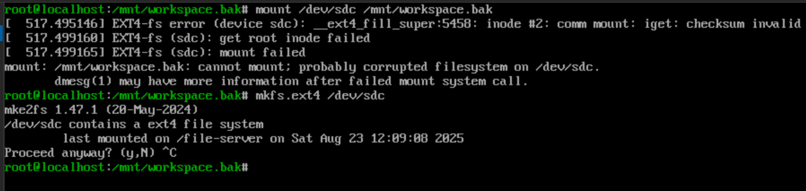

어느 늦은 주말, 서버에서 외장 SD 카드를 언마운트했는데 `/dev/sda1`이 계속 눈앞에 남아 있는 걸 보고 잠시 멍해졌습니다. "umount를 했는데 왜 사라지지 않지?"라는 의문은 결국 리눅스가 장치 파일과 마운트라는 두 세계를 어떻게 다르게 취급하는지 다시 공부하게 만들었죠. 이 글은 그날의 시행착오를 기억해 두기 위한 일기입니다.

### 장치 파일은 단순한 주소였다

처음부터 이야기해 볼까요. `/dev/sda`는 리눅스가 인식한 첫 번째 디스크 자체를 가리키는 블록 장치 파일입니다. `/dev/sda1`은 그 디스크 위에 나눈 첫 번째 파티션을 가리키죠. 중요한 건, 이 파일들이 실제 디스크와 1:1로 대응하는 "주소"라는 사실입니다. 하드웨어가 연결되어 있는 한, 커널은 이 주소를 지우지 않습니다. 우리는 그 주소를 통해 데이터를 읽고 쓰는 방법만 달리할 뿐입니다.

반면 `mount`는 이 주소가 가리키는 파일 시스템을 리눅스 디렉터리 트리에 연결하는 행위입니다. 예를 들어 `mount /dev/sda1 /mnt/data`를 실행하면 `/mnt/data`라는 문을 통해 `/dev/sda1` 안쪽 세계를 탐험할 수 있게 되죠. 반대로 `umount /dev/sda1`을 실행하면 그 문이 닫힐 뿐, 주소 자체가 사라지는 것은 아닙니다. 그래서 언마운트 후에도 `/dev/sda1`이 당당히 남아 있는 건 너무나 정상적인 일이었습니다. `lsblk`로 확인해 보면 마운트 포인트가 비워질 뿐, 장치 파일은 여전히 존재하니까요.

### USB 허브에서 SD 카드를 바꿨는데, 여전히 sda1?

문제는 그 다음이었습니다. USB 허브에 SD 카드를 꽂고 언마운트한 뒤 카드를 교체했는데도, 여전히 `/dev/sda1`이라는 이름으로 남아 있어 새 카드가 인식되지 않는 상황이 온 거죠. 여기서 깨달았습니다. 언마운트는 단지 연결을 끊었을 뿐, 커널은 여전히 "그 장치가 연결되어 있다"고 믿고 있다는 사실을요. 그래서 새로 꽂은 카드를 제대로 인식하려면 하드웨어 측면에서 장치를 다시 초기화해 주어야 했습니다.

### 물리적으로 뽑았다가 다시 꽂는 방법


가장 간단한 해결책은 말 그대로 허브를 뽑았다 다시 꽂는 것이었습니다. 물리적으로 연결을 끊으면 커널은 "장치가 사라졌다"는 사실을 깨닫고, 다시 연결했을 때 새롭게 `/dev/sdb1`과 같은 이름을 할당합니다. 가장 확실하고, 실수할 일이 거의 없죠. 다만 원격 서버거나 접근이 어려운 환경에서는 다른 방법이 필요했습니다.

### 소프트웨어로 USB 재연결하기

그래서 시도한 것이 `lsusb`와 `sysfs`를 이용한 소프트웨어적 재연결이었습니다. 먼저 `lsusb`와 `lsusb -t`를 이용해 카드 리더가 연결된 포트를 확인합니다. 예를 들어 출력이 이렇게 나왔다고 합시다.

```
$ lsusb
Bus 001 Device 005: ID 058f:6366 Alcor Micro Corp. Multi-Flash Reader

$ lsusb -t
/:  Bus 01.Port 1: Dev 1, Class=root_hub, Driver=xhci_hcd/12p, 5000M
    |__ Port 4: Dev 5, If 0, Class=Mass Storage, Driver=usb-storage, 5000M
```

여기서 카드 리더는 `1-4`라는 경로를 차지하고 있음을 알 수 있습니다. 이제 `/sys/bus/usb/drivers/usb` 아래에서 이 장치를 드라이버에서 분리했다가 다시 붙입니다.

```
echo '1-4' | sudo tee /sys/bus/usb/drivers/usb/unbind
echo '1-4' | sudo tee /sys/bus/usb/drivers/usb/bind
```

이렇게 하면 커널이 허브를 잠시 "잊었다가" 다시 새로 인식하게 됩니다. 물론 경로를 잘못 지정하면 키보드나 마우스가 갑자기 끊길 수 있으니, 정확한 포트를 확인하는 것이 중요했습니다.

### SCSI 호스트를 다시 스캔하는 방법

또 다른 방법은 SCSI 호스트를 재스캔하는 것이었습니다. USB 저장 장치는 내부적으로 SCSI 디바이스처럼 다뤄지는 경우가 많기 때문에, `/sys/class/scsi_host/` 아래에서 적절한 호스트를 찾아 다시 스캔하면 됩니다.

```
$ ls /sys/class/scsi_host/
host0  host1  host2

echo "- - -" | sudo tee /sys/class/scsi_host/host2/scan
```

`- - -`는 채널, 타겟, LUN에 대한 와일드카드라서 해당 호스트에 연결된 모든 디바이스를 다시 탐색하도록 하는 요청입니다. 몇 초 뒤 `/dev/sda1`이 사라지고 `/dev/sdb1` 같은 새로운 이름이 생성되는 걸 확인할 수 있었습니다.

### 네트워크 연결 확인까지 이어진 맥락

흥미롭게도 같은 날, 저는 `tcpdump`로 네트워크 상황도 들여다보고 있었습니다. ARP 요청과 응답 로그를 보면서, 10.42.0.1이 10.42.0.201을 찾고 있고, 제 노트북이 거기에 응답하고 있다는 사실을 확인했습니다. 그 뒤에는 DNS 요청 `connectivity-check.ubuntu.com`이 오가며 인터넷 연결이 살아 있음을 보여주더군요. 그러니까 장치 파일은 단지 주소일 뿐이고, mount/umount는 그 주소에 도달하는 길을 열고 닫는 역할이라는 사실이, 네트워크에서 주소와 라우팅을 관리하는 것과 묘하게 닮아 있다는 생각이 들었습니다.

### 앞으로의 체크리스트

이 날 이후로 저는 외장 장치를 다룰 때 아래 순서를 습관처럼 따릅니다.

1. 작업 전 `umount /dev/sdXN`으로 먼저 연결을 끊는다.
2. 카드나 디스크를 교체했다면, 물리적으로 재연결하거나 소프트웨어적으로 `unbind/bind` 또는 `scsi_host` 스캔을 수행한다.
3. `lsblk`나 `dmesg`로 새로운 장치 이름을 확인한다.
4. 필요한 경우에만 다시 `mount`한다.

이렇게 기록을 남겨 두고 나니, `/dev/sda1`이 남아 있는 모습이 더 이상 의문이 아니라 안심의 신호가 되었습니다. 장치 파일이 그대로 있다는 것, 그것 자체가 커널이 하드웨어를 확실히 인식하고 있다는 증거니까요. 언젠가 또 비슷한 상황을 만난다면, 이 글이 다음 번의 당황을 조금 줄여 주길 바라봅니다.
