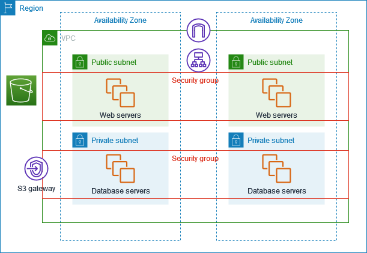

> **이 글은 수업 시간에 떠올린 속마음을 정리한 내용입니다.**

## 1. 수업 시간, 처음 본 전형적인 VPC 그림

클라우드 네트워크 수업 시간이었다. 교수님은 슬라이드를 넘기더니 아주 교과서적인 그림을 하나 띄웠다.

- 왼쪽에 초록색 `Public subnet` 두 개와 거기에 놓인 `Web servers`
- 그 아래 파란색 `Private subnet` 두 개와 `Database servers`
- 양쪽을 가로지르는 `Security group` 선
- 맨 위에는 NAT 아이콘과 라우팅 심볼, 맨 바깥에는 `Region`과 `VPC` 박스
- 한쪽 옆에는 S3 아이콘과 `S3 gateway`

딱 이 그림이었다. 슬라이드에선 이 다이어그램이 이렇게 설명됐다.

> "퍼블릭 서브넷에는 외부에서 접근 가능한 웹 서버를 두고요, 프라이빗 서브넷의 DB 서버는 직접 인터넷과 통신하지 않습니다. 대신 NAT Gateway를 통해 아웃바운드만 허용하고, IGW를 통해 외부와 연결하죠."

논리 구조로 보면 실제로 아주 깔끔했다. 보안도 설명이 잘 된다. 그런데 나는 그 순간, 딱 거기서 멈추지 못했다.

---

## 2. 내 눈에는 '보안 구조도'가 아니라 '깔때기 실험'처럼 보였다

"프라이빗은 직접 인터넷 접근 X"

"NAT = 아웃바운드용 출구"

"IGW = 인터넷 연결 지점"

이 아키텍처 구조에서 뭔가 이상함이 느껴졌다,

여러 개의 서브넷에서 나오는 화살표들이 전부 한 점, 즉 화면 중앙 위쪽의 `NAT Gateway` 아이콘으로 모였다가, 다시 한 줄로 위로 빠져나가 `IGW`를 거쳐 나가는 모습.

내가 본 건 네트워크가 아니라, 거대한 **깔때기**였다.

- 여러 개의 넓은 수조(서브넷)에서 물이 쏟아져 나오는데
- 그 물이 전부 좁은 배수구 하나(NAT Gateway)로 몰리고
- 그 뒤에 또 하나의 관(IGW)을 타고 나가는 구조

그래서 수업을 듣는 와중에, 자연스럽게 이런 문장이 떠올랐다.

> "잠깐만… NAT Gateway가 모든 트래픽의 출구라면, 이게 **그 자체로 병목**이 되는 순간은 언제지?"

---

## 3. "관리형이라 괜찮다"는 설명이 오히려 안심이 되지 않았다

교수님은 곧이어 이렇게 설명했다.

- "요즘은 클라우드에서 **Managed NAT Gateway**를 제공하기 때문에, 우리가 직접 방화벽 박스를 관리할 필요가 없습니다."
- "트래픽이 늘어나면 벤더가 내부에서 알아서 확장해 줍니다."

이 말이 틀린 건 아니라는 걸 안다. 실제로 벤더 문서를 보면 "자동 확장"과 "고가용성"이라는 단어가 강조돼 있다. 하지만 내 머릿속에서는 자꾸 이런 생각이 뒤를 이었다.

- 그래도 결국 어딘가에는 **물리적인 한계**가 있을 텐데?
- NAT Gateway라는 논리 엔드포인트 뒤에는, 분명히 CPU와 메모리, NIC가 붙어 있을 텐데?
- SNAT 포트 수, 동시 연결 수, 초당 세션 수 같은 숫자들은 어디에 숨어 있을까?

슬라이드 위에서는 모든 서브넷 트래픽이 한 점으로 깔끔하게 모였다. 그런데 그 한 점이 갑자기 내게는 이렇게 보였다.

> "이거, 나중에 대규모 트래픽이 몰리면 **여기가 제일 먼저 터지는 지점** 아닌가?"

보안 구조도에서 출발한 그림이, 내 머릿속에서는 어느새 큐잉 이론과 병목 분석의 대상으로 바뀌어 버렸다.

---

## 4. NAT Gateway도 결국 '자원'이라는 직관

그날 수업이 끝날 때쯤, 노트에 이런 문장을 적어 두었다.

> "NAT Gateway도 결국 CPU, 메모리, 포트라는 **유한한 자원** 위에 떠 있는 소프트웨어다."

생각해 보면 당연한 이야기다.

- NAT가 아무리 "관리형"이라 해도, 패킷을 받아서 테이블을 갱신하고, 소스 포트를 매핑하고, 다시 내보내는 과정은 결국 연산이다.
- 한 공인 IP가 가질 수 있는 소스 포트 영역은 유한하고, 동시 연결이 늘어나면 언젠가 그 범위에 닿을 수밖에 없다.
- 클라우드 내부의 데이터 플레인이 아무리 분산되어 있어도, **논리적인 출구**는 여전히 NAT Gateway라는 이름으로 묶인다.

그래서 이 다이어그램을 보는 순간, 내 머릿속에는 세 가지 레이어가 동시에 겹쳐졌다.

1. **논리 레이어** – VPC, Subnet, Route Table, NAT, IGW 아이콘이 그려진 구조도
2. **물리 레이어** – 실제로 패킷을 처리하는 NIC, CPU, 메모리, 라우터, 스위치
3. **수학 레이어** – 큐의 길이, 처리율(throughput), 지연(latency) 등

이러한 개념들은 서로 융합하며 계속 같이 깜빡였다. "이 추상적인 네모와 동그라미 뒤에는, 어떤 수치와 제한이 숨어 있을까?" 라는 질문이 꼬리를 물고 이어졌다.

---

## 5. VPC 그림을 그래프로 바꿔 보는 상상

한 번은 교수님 말이 잠시 느려지는 틈에, 노트 한 켠에 이 다이어그램을 그래프로 다시 그려 봤다.

- 정점(vertex): Public Subnet, Private Subnet, NAT Gateway, IGW, S3 Gateway
- 간선(edge): "이 방향으로 패킷이 흐른다"를 의미하는 화살표들

그러고 나서 스스로에게 물었다.

- 이 그래프에서 **가장 "중심성"이 높은 노드**는 어디일까?
- 특정 정점을 제거했을 때, 그래프가 몇 개의 컴포넌트로 갈라질까?
- NAT Gateway를 여러 개 두고 라우팅을 나눠 가지면, 그래프 구조는 어떻게 달라질까?

이렇게 VPC 그림을 그래프로 환원하는 순간, NAT Gateway는 단순한 네트워크 장비 아이콘이 아니라 **커트(cut)를 어디에 넣느냐에 따라 전체 연결성을 좌우하는 노드**로 보이기 시작했다. 그리고 자연스럽게 이런 상상이 붙었다.

> "여기서 NAT를 여러 개로 쪼개거나, 내부 서비스 트래픽을 우회시키면, 병목이 풀리는 그래프를 그릴 수 있지 않을까?"

아직은 실제로 수십 Gbps 트래픽을 다뤄 본 적도 없고, 클라우드 벤더 내부 구현을 본 것도 아니다. 그럼에도 불구하고, 최소한 한 가지는 분명해졌다.

> "이 다이어그램에서 NAT Gateway는 **성능과 확장성을 설계할 때 반드시 집요하게 들여다봐야 할 노드**다."

---

## 6. 이 글 이후에 내가 더 파고들고 싶은 것들

이 글은 아직 "답"을 주는 글이 아니다. 오히려 수업 시간에 생긴 **질문이 태어나는 순간**을 기록해 둔 메모에 가깝다.

다음에 따로 이어서 정리해 보고 싶은 건 이런 것들이다.

- NAT Gateway가 실제로 어떤 지표(처리량, 동시 연결 수, SNAT 포트 수)를 기준으로 병목이 되는지
- AZ별로 NAT를 쪼개고, 특정 트래픽을 VPC 엔드포인트나 PrivateLink로 우회시키는 설계 패턴들
- NAT를 완전히 우회하는 구조(서비스 자체를 퍼블릭 서브넷에 두고, 보안을 보안 그룹과 WAF로 해결하는 방식)가 언제 더 나은 선택인지

하지만 어떤 기술적인 결론보다도, 내가 이 글에서 정말 남기고 싶었던 순간은 이것 하나다.

> 모든 것을 의심하자.

같은 그림을 보면서도 각자 다른 층위를 떠올리는 이 작은 차이가, 언젠가 설계와 디버깅에서 강점이 되지 않을까 하는 막연한 기대가 있다. 그러한 이유로 이를 기억하기 위해 이렇게 글로 남겨본다.
