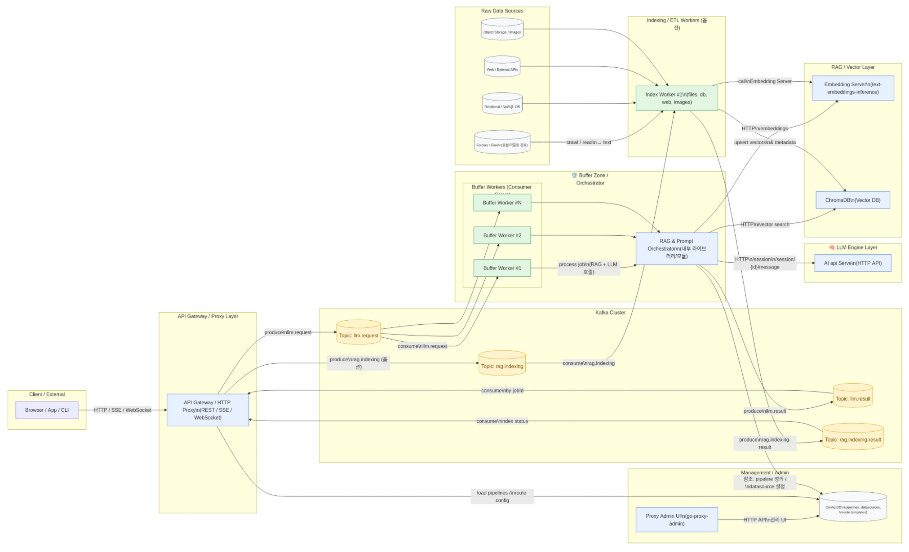

차가운 새벽 공기가 방 안까지 스며들던 어느 날, 나는 모니터 속 작은 다이어그램 하나를 한참 동안 바라보고 있었다. 이미 잘 돌아가고 있는 로컬 LLM 서버가 있고, 옆에는 Kafka, 그 뒤에는 RAG와 embedding 서버, 그리고 여러 워커들이 어지럽게 얽혀 있는 그림이었다.

겉으로 보기에는 꽤 그럴듯한 "AI 서버 아키텍처"처럼 보였지만, 막상 손을 대려고 하면 어딘가 마음 한켠이 불편했다.이걸 그대로 Kafka에 직결해 버리면, 나중에 분명히 크게 후회할 것 같은 느낌 말이다.

처음 떠올랐던 생각은 솔직히 단순했다. "그냥 Kafka에서 AI 서버로 직접 붙이면 안 되나?" Kafka 컨슈머를 LLM 서버 안에 들여보내고, 세션 생성이든 메시지 전송이든 전부 내부에서 처리하면, 겉보기에는 깔끔한 구조가 하나 나온다. 그러나 그 순간 의문점이 하나 더 떠올랐다. "이러다가 나중에 LLM 서버 코드를 통째로 다시 설계해야 하는 거 아니야?" 이미 잘 돌아가고 있는 LLM 서버를, 메시지 버스에 맞추기 위해 억지로 비틀고 싶지 않았다.

그래서 나는 처음 질문을 조금 바꾸어 보기로 했다. "정말로 Kafka가 LLM 서버 안으로 들어와야 할까?" 오히려 그 둘 사이에 작은 완충 지대를 하나 두는 편이 더 자연스럽지 않을까. HTTP를 말하는 세계와 Kafka를 말하는 세계가 서로 직접 끌어당기지 않고, 중간에서 통역해 주는 버퍼 존 같은 곳. LLM 서버는 계속 HTTP만 잘 말하고, Kafka는 여전히 토픽과 파티션의 언어로만 소통하게 두는 것이다. 그 중간에서 누군가가 둘을 부드럽게 이어 준다면, 굳이 양쪽을 동시에 뜯어고칠 필요는 없을 것 같았다.

이렇게 생각을 돌리고 나니, 그림이 조금씩 달라지기 시작했다. 
LLM 서버는 여전히 /session과 /session/{id}/message 같은 HTTP 엔드포인트를 제공하는 LLM 서버로 남는다. 그 앞에는 새로운 프록시 서버가 서서, 바깥에서 들어오는 모든 요청을 한 번 자기 손으로 받은 뒤 어디로 어떻게 보낼지 조용히 결정한다. 어떤 요청은 단순히 LLM 서버에게만 흘려보내고, 어떤 요청은 Kafka라는 거친 강물 위로 올려보내 비동기 파이프라인에 태운다. 프록시는 이 사이에서 작은 교통정리와 번역을 하는 교통 통제자의 역할을 하게 된다.

내가 이 중간 프록시에게 기대했던 역할은 세 가지쯤이었다. 하나는 외부에서 들어오는 HTTP 요청을 한데 모으는 게이트웨이의 얼굴이다. 둘째는 HTTP 요청을 Kafka 메시지로 바꿔 싣고, 다시 Kafka에서 돌아온 응답을 HTTP로 되돌려주는 어댑터의 손이다. 셋째는 LLM과 RAG, 여러 워커들을 조합해 하나의 업무 단위로 보여 주는 도메인 지휘자다. 그렇게 생각하고 나니, 이 프록시는 단순한 프록시라기보다는 작은 관제탑처럼 느껴졌다.

그런데 막상 이 관제탑을 실제로 짓기 시작하려고 보니, 더 이상 추상적인 선만으로는 부족했다. 토픽의 이름도 정해야 하고, 메시지 안에 어떤 필드를 넣을지, 각 워커가 어느 부분까지 책임질지, docker-compose 안에서 컨테이너를 어디에 꽂을지까지 생각해야 했다. 머릿속에서만 떠돌던 선들이 구체적인 JSON 키와 디렉터리 이름, 환경 변수 이름으로 바뀌어 가기 시작한 것이다.

나는 먼저 Kafka 노트의 첫 장에 두 개의 이름을 적어 넣었다. llm.request, llm.result. 이 둘은 가장 기본적인 왕복선이 될 예정이었다. 클라이언트에서 들어온 LLM 요청은 결국 Gateway를 거쳐 llm.request라는 토픽에 한 장의 종이처럼 실려 올라가고, Buffer Worker는 이 종이를 집어 들어 필요한 일을 모두 마친 뒤 llm.result라는 토픽으로 다시 답장을 보낸다. 이 답장에는 최소한 세 가지는 꼭 있어야 했다. 어떤 일을 가리키는지 알려 주는 jobId, 어떻게 끝났는지를 말해 주는 status, 그리고 실제로 사용자에게 보여 줄 output.text.

그 위에 나는 몇 개의 필드를 더 얹었다. 스키마가 혹시 바뀌더라도 서로 당황하지 않기 위해 version을 제일 위에 두었다. 요청이 언제 만들어졌는지 알 수 있도록 createdAt을 넣고, 이 요청이 단순 채팅인지, RAG를 거치는 chat-rag인지, 아니면 더 복잡한 pipeline 실행인지 구분하기 위해 requestType이라는 짧은 꼬리표를 달았다. LLM 관련 설정은 llm 블록에 모으고, RAG와 데이터소스에 관한 것들은 rag 블록 안에서 따로 노는 편이 낫겠다 싶었다. systemPrompt와 promptMode, userMessage, history 같은 프롬프트 관련 정보도 하나의 prompt 블록에 모아 두면, 나중에 프롬프트 실험을 할 때도 구조 변경없이 편리하게 사용가능할 것 같았다.

응답 쪽도 비슷한 방식으로 생각을 정리했다. llm.result 안에는 역시 version과 jobId, 그리고 finishedAt이 가장 위에 온다. status는 success, error, timeout, partial 정도면 충분하다고 적어 두었다. output 안에는 사용자가 직접 보게 될 최종 텍스트와, 필요하다면 전체 메시지 배열이나 LLM 서버에서 온 원본 응답(JSON)을 raw로 넣을 수 있게 해 두었다. RAG가 실제로 사용되었는지 여부와 어떤 문서들이 컨텍스트로 쓰였는지를 rag.context 배열로 남겨 두면, 나중에 "왜 이런 답을 했는지"를 설명해 줄 때 큰 도움이 될 것이다. tokens 블록에는 프롬프트와 응답 토큰 수를 기록하고, error 블록에는 코드와 메시지, 세부 정보까지 담을 수 있도록 틀만 만들어 두었다. metadata에는 traceId와 내부적인 단계 로그를 남겨 두어, 장애가 났을 때 이 하나의 JSON만 봐도 대략 무슨 일이 있었는지 가늠할 수 있도록 만들고 싶었다.

이렇게 토픽과 메시지의 대략적인 모습이 그려지고 나니, 이제는 버퍼 존 안쪽에서 실제로 뛰어다니게 될 워커의 몸체를 상상할 차례였다. 나는 메모장 한 구석에 작은 디렉터리 트리를 그려 보았다. buffer-worker라는 폴더 아래에 src, 그 안에 index.js, config.js, kafka.js, orchestrator.js, rag.js, LLM 서버Client.js, prompt.js, logger.js 같은 파일 이름들이 줄지어 서 있었다. 각 파일이 맡게 될 역할은 꽤 분명했다. config는 환경 변수와 서비스 주소를 읽어 들이고, kafka는 프로듀서와 컨슈머를 감싸는 손잡이가 된다. orchestrator는 한 건의 llm.request를 처음부터 끝까지 책임지는 지휘자이고, rag는 embedding 서버와 ChromaDB를 오가며 컨텍스트를 만들어내는 조용한 연구실 같은 곳이다. LLM 서버Client는 /session과 /session/{id}/message를 대신 호출해 주는 작은 대리인이 되고, prompt는 system 프롬프트와 사용자 메시지, RAG 컨텍스트를 하나의 긴 문장으로 엮어내는 편집자 역할을 맡는다.

한 건의 요청이 이 워커 안에서 어떻게 흐를지 상상해 보면 이렇다. kafka.consume이 llm.request를 한 줄씩 읽어 들이면, orchestrator는 먼저 JSON을 파싱해서 job이라는 객체로 바꾼다. rag.enabled가 참이라면, rag 모듈을 불러 embedding 서버에 사용자의 질문과 관련 문장들을 보내고, 돌아온 벡터를 가지고 Chroma에 쿼리를 던져 topK 문서를 골라낸다. 이 컨텍스트 조각들은 나중에 사용자 메시지 옆에 조용히 붙게 된다. prompt 모듈은 기본 system 템플릿을 불러오고, job.prompt.systemPrompt와 promptMode에 따라 상단에 붙일 문장을 결정한다. 그런 다음 RAG에서 가져온 맥락과 userMessage를 차례대로 이어 붙여 최종 프롬프트를 만든다.

그다음에는 LLM 서버Client의 차례다. 아직 세션이 없다면 /session으로 제목을 하나 던져 새 세션을 만들고, 이미 있다면 그 id를 재사용한다. /session/{id}/message 엔드포인트로 providerID와 modelID, 그리고 방금 만든 프롬프트를 parts 구조에 맞춰 담아 보낸다. 응답이 돌아오면 orchestrator는 그 내용을 llm.result 스키마에 맞게 다시 포장한다. 중간에 어느 단계에서든 에러가 난다면 status를 error나 timeout으로 바꾸고, error 블록 안에 이유를 최대한 솔직하게 적어 준다. 마지막으로 kafka.producer는 이 결과를 llm.result 토픽으로 조용히 흘려보낸다. 이렇게 하면 Gateway는 단지 jobId로 결과를 찾기만 하면 되고, 그 뒤에서 어떤 embedding 서버와 어떤 데이터소스가 오갔는지까지 굳이 알 필요는 없다.

버퍼 워커의 윤곽이 잡히자, 이제는 이 워커와 바깥 세계를 이어 줄 Gateway의 역할을 다시 정리해 볼 수 있었다. Gateway는 사람들의 HTTP 요청이 처음 닿는 얼굴이다. 여기서는 /chat 같은 엔드포인트가 가장 먼저 떠올랐다. 사용자가 이 경로로 POST를 보내면, Gateway는 그 내용을 llm.request 스키마에 맞게 채워서 Kafka에 publish한다. 그 자리에서 결과를 기다릴지, 아니면 jobId만 반환할지는 요청의 성격에 따라 달라질 수 있다. 짧은 대화형 요청이라면 Gateway가 잠시 llm.result를 구독하며 해당 jobId를 기다렸다가 바로 응답을 돌려줄 수도 있고, 긴 파이프라인이라면 일단 jobId만 넘겨주고 그 뒤는 /job/{jobId} 같은 별도 경로에서 결과를 확인하게 할 수도 있다.

이렇게 Gateway와 Buffer Worker가 서로의 책임을 나누어 갖게 되면, LLM 서버는 훨씬 단순한 존재가 된다. 더 이상 Kafka를 신경 쓸 필요도, 데이터소스를 어떻게 나눴는지 알 필요도 없다. 그저 자신의 HTTP 엔드포인트를 통해 세션을 만들고, 메시지를 받아 LLM을 호출하고, 그 결과를 JSON으로 되돌려 주기만 하면 된다. 나머지는 Gateway와 Buffer Worker가 알아서 감당한다. 나는 이 분리가 가져다 줄 정신적 여유가 무척 마음에 들었다.

마지막으로 남은 조각은 이 모든 것을 실제로 띄워 올릴 docker-compose의 구체적인 모습이었다. 이미 compose 파일 어딘가에는 LLM 서버와 embedding 서버, ChromaDB, 그리고 proxy-admin 같은 서비스가 적혀 있다. 여기에 kafka라는 이름의 단일 브로커 서비스를 하나 더 추가하는 장면을 상상했다. bitnami/kafka 이미지를 가져와 9092 포트를 열고, KAFKA_ENABLE_KRAFT와 LISTENERS, ADVERTISED_LISTENERS 같은 환경 변수를 채워 넣는다. 간단한 개발 환경이라면 이 정도면 충분하다. 데이터는 kafka-data 볼륨에 쌓이고, 나머지 서비스들은 KAFKA_BROKERS=kafka:9092 같은 식으로 이 브로커를 바라보게 된다.

그 옆에는 buffer-worker 서비스가 자리를 잡는다. context를 ./buffer-worker 디렉터리로 하고, Node 베이스 이미지 위에 kafkajs와 node-fetch를 설치한 Dockerfile을 사용한다. 환경 변수로는 KAFKA_BROKERS, LLM 서버_BASE=http://localhost:7012, EMBEDDING_BASE=http://localhost:7013, CHROMA_BASE=http://localhost:8000 같은 것들을 채워 놓는다. depends_on에는 kafka와 LLM 서버, embedding-server, chromadb를 넣어, 이들이 먼저 올라오도록 힌트를 준다. 처음에는 이 워커가 하는 일이 단지 llm.request를 받아 콘솔에 찍고, 더미 응답을 llm.result로 던지는 정도라도 괜찮다. "일단 돌아가게 만든다"는 감각이 중요하다. (물론, 이 부분은 테스트용으로 localhost:7012, localhost:7013, localhost:8000은 실제 서비스가 아닌 것임을 명심해주세요.)

조금 더 시간이 지나면 Gateway도 별도의 api-gateway 서비스로 독립시킬 수 있을 것이다. 지금은 기존 auto-chat-proxy를 확장하는 정도로 시작하되, 언젠가는 이 Gateway가 인증과 라우팅, `/chat`과 `/job/{jobId}` 같은 엔드포인트를 책임지는 단일 진입점이 되는 그림을 그리고 있다. 사용자는 이 Gateway만 알고 있으면 되고, 그 너머에서 Kafka와 Buffer Worker, LLM 서버가 어떻게 서로 손을 맞잡고 있는지는 굳이 알 필요가 없다.

이 전체 그림을 정리하면서 나는 몇 가지 원칙을 다시 확인하게 되었다. 첫째, LLM 서버는 가능한 한 그대로 둔다는 것. 우리는 어디까지나 HTTP 클라이언트일 뿐이고, 그 안쪽의 구현을 Kafka에 맞추기 위해 함부로 바꾸지 않는다. 둘째, 중간 프록시는 단순한 패킷 전달자가 아니라, 도메인과 기술을 이어 주는 작은 두뇌가 되어야 한다는 점이다. HTTP와 Kafka 사이를 오가면서도 system prompt와 파이프라인 정의, 데이터소스 선택 같은 더 높은 레벨의 개념을 이해할 줄 아는 존재 말이다. 셋째, Kafka는 여러 서비스를 너무 단단하게 묶는 대신, 적당한 거리와 여유를 두고 느슨하게 연결하는 허브로 쓰자는 것이다.

지금 이 글에 담긴 내용은 아직 완성된 운영 환경의 후기가 아니다. 오히려 "왜 굳이 중간에 버퍼 존을 두기로 했는지, 그리고 그 버퍼 존을 어디까지 구체화해야 실제 코드가 나오기 시작하는지"를 스스로 설득해 가는 과정에 더 가깝다. 앞으로 실제로 프록시 서버를 리팩터링하고, docker-compose에 Kafka와 Buffer Worker를 추가하고, proxy-admin을 통해 파이프라인과 데이터소스를 눈으로 보며 관리하게 되면 또 다른 고민들이 등장할 것이다. 그때마다 이 버퍼 존의 역할과 경계는 조금씩 다듬어질 테고, 다이어그램 속 선들도 몇 번은 다시 그려질 것이다.

그래도 오늘 나는 하나의 방향만큼은 분명히 정해 두고 싶었다. Kafka에서 LLM 서버로 곧장 달려가는 직선 대신, 그 사이에 작지만 단단한 완충지대를 세우는 것. HTTP와 메시지 버스, LLM과 RAG, 실시간과 비동기가 서로 부딪히지 않고 공존할 수 있는 작은 공간을 만드는 것. 언젠가 이 구조가 실제 트래픽과 장애, 예기치 못한 요구사항들을 버텨 내며 조용히 돌아가고 있을 때, 나는 아마 오늘 이 다이어그램을 그리며 뻘짓했던 기억을 다시 떠올리며 미소 지을 수 있을 것 같다. "그래, 그때의 나는 괜히 버퍼 존 이야기를 꺼낸 게 아니었구나" 하고 말이다.

