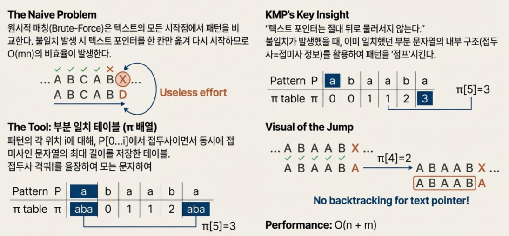
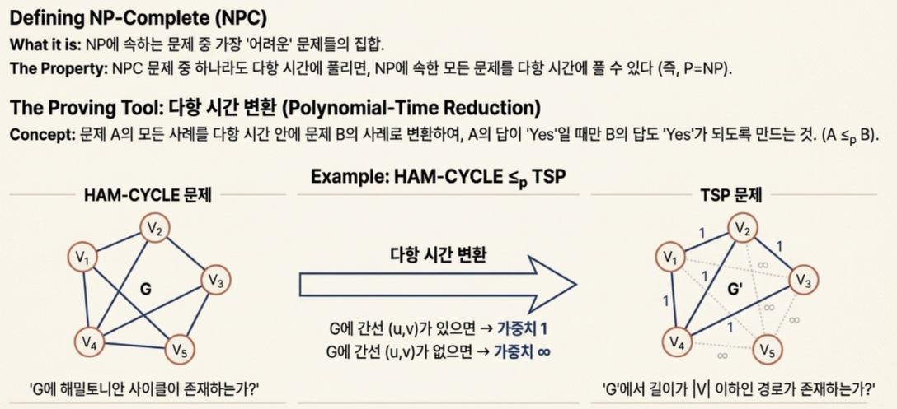
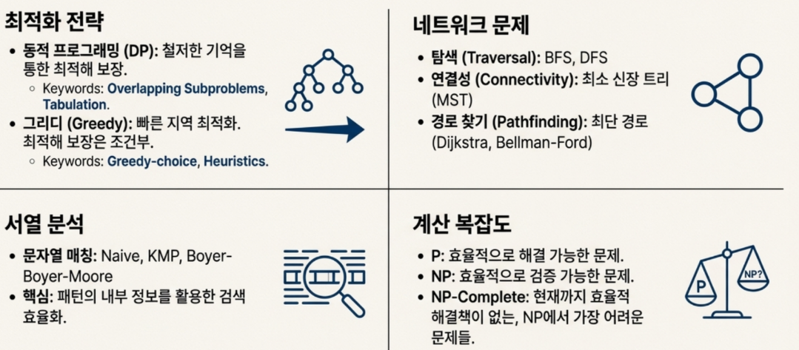

코드를 작성하는 행위는 생각보다 깊은 통찰을 요구합니다. 누구나 코드를 작성할 수 있지만, **'똑똑하게' 문제를 해결하는 것**은 전혀 다른 차원의 이야기입니다.우리는 종종 복잡한 문제 앞에서 가장 직관적인, 그러나 비효율적인 길을 선택하곤 합니다.

마치 과거 역사를 공부하여 미래를 예측하는 것처럼, 컴퓨터 과학의 고전 알고리즘을 들여다보는 것은 단순히 학문적 탐구를 넘어, **문제 해결에 대한 강력하고 종종 직관에 반하는 사고방식을 배우는 기회**입니다. 거장들이 수십 년간 쌓아 올린 지혜의 정수는, 평범한 개발자의 코드를 비범한 솔루션으로 바꾸는 열쇠가 될 수 있기에, 그 지혜를 이해하는 것은 큰 도움이 될 것이라 생각합니다.

## 1. 가장 유명한 예제가 가장 나쁜 예제일 때: 피보나치 수열의 함정

재귀(Recursion)를 처음 배울 때, 우리는 약속이라도 한 듯 **피보나치 수열** 예제를 만납니다. `f(n) = f(n-1) + f(n-2)` 라는 간결하고 우아한 정의는 재귀의 개념을 설명하기에 안성맞춤처럼 보입니다. 하지만 이 유명한 예제는 사실, **재귀를 얼마나 비효율적으로 사용할 수 있는지**를 보여주는 대표적인 사례라고 볼 수 있습니다.

`fib(7)`을 계산하는 과정을 상상해 봅시다. 이 함수는 `fib(6)`과 `fib(5)`를 호출합니다. `fib(6)`은 다시 `fib(5)`와 `fib(4)`를 호출하죠. 여기서 벌써 `fib(5)`이 두 번 호출되었습니다. 호출 트리를 그려보면 `fib(3)`, `fib(2)` 같은 작은 값들은 셀 수 없이 많이 반복적으로 계산됩니다. 이것이 바로 **낭비적인 중복 호출** 문제이며, 입력값이 조금만 커져도 계산 시간은 기하급수적으로 늘어나는 심각한 비효율을 초래합니다.

이 문제의 우아한 해결책이 바로 **동적 프로그래밍(Dynamic Programming)** 입니다. 핵심 아이디어는 놀랍도록 단순합니다.

- 복잡한 문제를 작은 하위 문제(subproblem)로 나누어 해결하는 알고리즘 설계 기법
- 각 하위 문제의 결과를 저장해 두고, 동일한 하위 문제가 다시 등장할 때 재활용하는 방식

마치 전체를 모두 계산하는 것보다는 **필요한 부분만 계산하는 것**이 더 효율적인 것처럼 보입니다. 피보나치 수열에 이를 적용하면, `fib(3)`을 한 번 계산한 뒤 그 값을 배열이나 테이블에 저장해 둡니다. 다음에 또 `fib(3)`이 필요해지면 다시 계산하는 대신 **저장된 값을 즉시 가져다 쓰는 것**이죠.

즉, 현실에서 우리가 한번에 모든 것을 계산하는 것보다 당장 필요한 부분만 계산하여 시간을 절약하는 것이 더 효율적인 것과 비슷해 보입니다.

> 한 번 계산한 결과는 저장해 두고, **절대 다시 계산하지 않는다.**

이 간단한 원칙 하나만으로 재귀 함수의 성능은 극적으로 향상됩니다. 가장 유명한 예제가 우리에게 가르쳐 주는 가장 큰 교훈은, 눈에 보이는 우아함 뒤에 숨은 비효율을 간파하고 **'기억'을 통해 최적화하는 방법**입니다.

---

## 2. 계산 순서만 바꿨을 뿐인데… 성능이 10배 차이 나는 이유

세 개의 행렬 A, B, C를 곱한다고 가정해 봅시다. 수학의 결합법칙에 따라 `(AB)C`와 `A(BC)`의 최종 결과는 같습니다. 그래서 우리는 계산 순서에 대해 깊이 생각하지 않는 경향이 있습니다. 하지만 알고리즘의 세계에서는 이 **'순서'가 성능을 좌우하는 결정적인 요소**가 될 수 있습니다.

구체적인 예시를 통해 그 차이를 확인해 보겠습니다. 각 행렬의 크기가 다음과 같다고 가정합시다.

- `A: 10 × 100`
- `B: 100 × 5`
- `C: 5 × 50`

두 가지 순서에 따라 필요한 총 곱셈 연산 횟수를 계산해 보면 놀라운 결과가 나옵니다.

- **(AB)C 의 곱셈 횟수**

  - `(A × B)` 계산: `10 * 100 * 5 = 5,000`
  - `((AB) × C)` 계산: `10 * 5 * 50 = 2,500`
  - **총합: 7,500번**
- **A(BC) 의 곱셈 횟수**

  - `(B × C)` 계산: `100 * 5 * 50 = 25,000`
  - `(A × (BC))` 계산: `10 * 100 * 50 = 50,000`
  - **총합: 75,000번**

결과는 같은데 계산 순서만 바꿨을 뿐인데, 연산량이 무려 **10배**나 차이 납니다. 이 문제는 동적 프로그래밍으로 해결할 수 있는 문제의 핵심 특징인 **최적 부분 구조(Optimal Substructure)** 를 명확히 보여줍니다. 전체 문제(A부터 C까지의 곱셈)의 최적해는, 부분 문제(어떤 두 행렬을 먼저 곱할 것인가)의 최적해를 조합하여 만들어집니다.

> 최적의 해답은 단순히 올바른 계산을 하는 것을 넘어,
> **가장 효율적인 '순서'를 찾는 데서 비롯됩니다.**

결국, 문제의 구조를 파악하고 **최적의 실행 계획을 세우는 것**이 알고리즘 설계의 핵심입니다. 단순히 코드를 실행하는 것을 넘어, **어떤 순서로 실행할지를 고민하는 것.**

## 3. '최선'의 선택이 항상 '최악'의 결과를 낳는 경우: 그리디 알고리즘의 배신

"매 단계에서 지금 당장 가장 좋아 보이는 선택을 한다."
이것이 바로 **그리디 알고리즘(Greedy Algorithm)** 의 핵심 철학입니다. 매우 직관적이고 단순해서 많은 문제에서 효과적으로 작동합니다. 최소 비용으로 모든 도시를 연결하는 통신망을 설계하는 프림(Prim)이나 크루스칼(Kruskal) 알고리즘, 한 지점에서 다른 모든 지점까지의 최단 경로를 찾는 다익스트라(Dijkstra) 알고리즘은 모두 그리디 전략으로 최적의 해를 찾아내는 대표적인 성공 사례입니다.

하지만 이 매력적인 전략은 때때로 우리를 배신합니다. **'동전 거스름돈' 문제**를 통해 그리디의 함정을 살펴보겠습니다.

- **사례 1 (성공)**대한민국의 표준 `500원, 100원, 50원, 10원` 동전 체계에서 880원을 거슬러 준다고 해봅시다.그리디 방식은 가장 큰 단위인 500원부터 탐욕적으로 선택합니다.그 결과는 `500원 1개`, `100원 3개`, `50원 1개`, `10원 3개`로 총 8개의 동전입니다.이 경우, 그리디 방식은 **최소 개수의 동전**이라는 최적해를 완벽하게 찾아냅니다.
- **사례 2 (실패)**만약 우리나라에 `500원, 400원, 100원, 75원, 50원`이라는 기묘한 동전 체계가 도입되었다고 상상해 봅시다. 이제 `1300원`을 거슬러 줘야 합니다.

  - **그리디 방식의 선택**가장 큰 500원짜리부터 선택합니다.`500원 2개`(1000원)를 쓰고, 남은 300원을 만들기 위해 `100원 3개`를 씁니다.총 **5개의 동전**이 필요합니다.
  - **진정한 최적해**
    `500원 1개`와 `400원 2개`를 사용하면 똑같이 1300원을 만들 수 있습니다.
    이때 필요한 동전은 **단 3개**입니다.

그리디 알고리즘은 눈앞의 이익(가장 큰 단위의 동전)에 눈이 멀어 전체적인 최적해를 놓치고 말았습니다. 왜 이런 차이가 발생할까요? 핵심은 동전 단위 간의 **'배수 관계'** 에 있습니다.

표준 동전 체계에서는 큰 단위 동전이 항상 작은 단위 동전들의 배수 관계를 이루거나, 그 가치를 더 적은 동전으로 효율적으로 대체합니다. 즉, 500원짜리 하나는 100원짜리 5개보다 항상 나은 선택입니다. 하지만 가상의 체계에서는 이 속성이 깨집니다. 800원을 만들 때 500원짜리 1개를 쓰는 것보다 400원짜리 2개를 쓰는 것이 더 효율적이죠. 이처럼 **지역적 최선이 전역적 최선을 보장하지 않는 구조**가 문제의 핵심입니다.

> 눈앞의 최선이 전체의 최선을 보장하지 않는다.
> 때로는 더 나은 미래를 위해 현재의 이익을 포기하는 지혜가 필요하다.

이 사례는 **문제의 구조를 이해하는 것**이 얼마나 중요한지 보여줍니다. 어떤 문제에는 그리디의 직관이 통하지만, 어떤 문제에는 한 걸음 물러나 모든 가능성을 고려하는 **동적 프로그래밍 같은 신중한 접근법**이 필요합니다.

---

## 4. 실패에서 배우는 가장 빠른 길

### 똑똑한 문자열 매칭 검색

방대한 텍스트 문서 안에서 특정 단어(패턴)를 찾는 **문자열 매칭**은 가장 기본적인 컴퓨터 작업 중 하나입니다. 가장 원시적인 방법(브루트포스)은 텍스트의 첫 글자부터 패턴과 비교하고, 일치하지 않으면 텍스트를 한 칸 옆으로 옮겨 다시 처음부터 비교하는 것을 반복합니다. 매우 직관적이지만, 텍스트와 패턴이 길어질수록 **끔찍하게 비효율적**입니다.

여기에 **KMP 알고리즘**이라는 혁신적인 아이디어가 등장합니다. KMP의 핵심은 간단합니다.

> "패턴이 불일치했을 때, 이미 비교했던 정보를 버리지 않고 활용하여
> 불필요한 비교를 건너뛰는 것"

이것이 어떻게 가능할까요? 비밀은 패턴 내부의 구조, 즉 **'접두사(prefix)이면서 동시에 접미사(suffix)인 부분'** 을 미리 분석해 두는 데 있습니다.

예를 들어, 우리가 `"abaab"`라는 부분까지 일치시킨 후 다음 문자에서 불일치가 발생했다고 가정해 봅시다. 원시적인 방법이라면 텍스트 포인터를 한 칸만 옮겨 처음부터 다시 비교를 시작하겠죠. 하지만 KMP는 다릅니다.

`"abaab"`라는 문자열에서, 자기 자신을 제외한 가장 긴 접두사이자 접미사는 `"ab"`라는 사실을 이미 알고 있습니다. 따라서 불일치가 발생했을 때, 알고리즘은 이렇게 판단합니다.

> "방금 텍스트에서 확인한 마지막 두 글자가 `ab`였으니,
> 패턴의 시작 부분에 있는 `ab`를 여기에 맞춰서 비교를 재개하면 되겠다."

텍스트 포인터를 뒤로 돌릴 필요 없이, **패턴만 앞으로 쓱 밀어서** 비교를 이어가는 것입니다.

> 실패는 시간 낭비가 아니다.
> 똑똑한 알고리즘은 실패의 패턴을 분석해, **불필요한 반복을 건너뛰는 지름길**로 활용한다.

이러한 역발상은 **Boyer-Moore 알고리즘**에서 더욱 극대화됩니다. 이 알고리즘은 아예 패턴의 오른쪽 끝부터 비교를 시작하여, 불일치가 발생하면 훨씬 더 멀리 점프하는 과감한 전략을 사용합니다. 이 역시 '실패 정보'를 가장 효율적으로 활용하는 지혜에서 비롯됩니다.

결국, 효율적인 알고리즘은 단순히 계산을 빨리 하는 것이 아니라, **어떻게 하면 불필요한 계산을 피할 것인가**에 대한 깊은 고민의 산물입니다.

---

## 5. '풀 수 없는 문제'의 벽을 마주했을 때: P vs NP 이야기

컴퓨터는 무엇이든 해결할 수 있을 것 같지만, **명백한 한계**가 존재합니다. 컴퓨터 과학계의 가장 큰 난제인 **'P vs NP' 문제**는 바로 이 한계에 대한 이야기입니다.

일반 개발자도 이 개념을 이해하면 문제 해결에 대한 시야가 완전히 달라질 수 있습니다. 쉽게 풀어보겠습니다.

- **P 문제**"현실적인 시간(다항식 시간) 안에 풀 수 있는 문제"들의 집합입니다.정렬, 최단 경로 찾기 등 우리가 일상적으로 해결하는 대부분의 문제가 여기에 속합니다.컴퓨터가 빠르다고 느끼게 해주는 문제들이죠.
- **NP 문제**
  "정답이 주어지면, 그게 정답인지 현실적인 시간 안에 검증할 수 있는 문제"들의 집합입니다.
  예를 들어, 거대한 직소 퍼즐을 맞추는 것은 매우 어렵지만(푸는 것은 어려움),
  완성된 그림을 보고 제대로 맞춰졌는지 확인하는 것은 쉽습니다(검증은 쉬움).

여기서 세기의 질문이 나옵니다.

> **P = NP?**
> 즉, "답을 검증하기 쉬운 모든 문제는, 실제로 풀기도 쉬운가?"

아직 아무도 이 질문에 답하지 못했지만, 대부분의 과학자들은 `P ≠ NP`일 것이라고 추측합니다. 풀기는 어렵지만 검증은 쉬운 문제가 분명히 존재할 것이라는 믿음이죠.

이 **NP 문제들 중에서도 가장 악명 높은 '보스 몬스터'**들이 있는데, 이들을 **NP-Complete 문제**라고 부릅니다. 여행하는 외판원 문제(모든 도시를 방문하는 최단 경로 찾기)가 대표적입니다. 이 문제들은 서로 기묘하게 연결되어 있어서, NP-Complete 문제 중 단 하나라도 현실적인 시간에 풀 수 있는 방법이 발견되면, 나머지 모든 NP-Complete 문제들도 함께 해결할 수 있습니다.

개발자로서 이 개념을 아는 것은 매우 실용적인 가치가 있습니다.

- 어떤 문제가 **매우 어렵다(NP-Complete)** 는 것을 아는 것은 포기가 아니라 **전략의 시작**입니다.
- 완벽한 최적해를 찾는 데 시간을 낭비하는 대신, **"충분히 좋은" 근사 해를 빠르게 찾는 길**로 나아갈 수 있습니다.
- 내가 마주한 새로운 문제가, 알려진 NP-Complete 문제(가령 TSP)로 변환될 수 있음을 증명한다면
  "이 문제는 완벽한 해법을 찾기보다는, 제약 안에서의 근사 해를 목표로 해야겠다"는
  데이터 기반의 의사결정을 내릴 수 있습니다.

문제의 난이도를 파악하고 증명하는 것 자체가 이미 **문제 해결의 중요한 일부**인 셈입니다.

---

이처럼 의심하며 사유하는 것은 단순히 특정 알고리즘을 암기하는 것 이상의 의미를 가집니다.
중복 계산을 피하는 동적 프로그래밍의 지혜, 최적의 순서를 고민하는 통찰력, 눈앞의 이익을 경계하는 그리디의 교훈, 실패를 자산으로 삼는 문자열 검색의 역발상, 그리고 해결 불가능한 문제 앞에서 전략을 바꾸는 유연함까지.

이 모든 것은 코딩 기술을 넘어, **복잡한 세상을 이해하고 문제를 해결하는 데 필요한 구조적이고 논리적인 사고방식**입니다. 

지금 당신이 마주한 문제 속에는, 오늘 살펴본 알고리즘의 역발상적인 지혜를 적용할 부분이 숨어 있지 않을까요?
