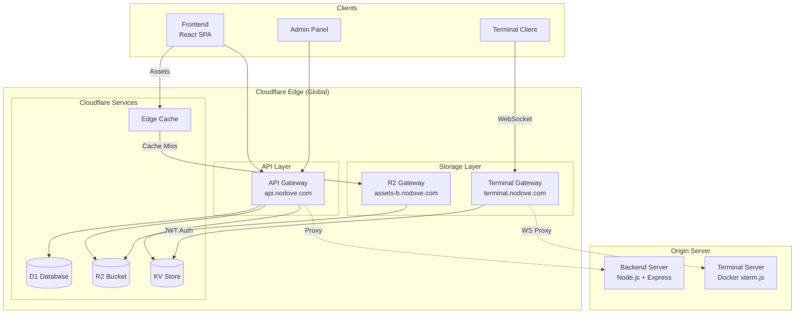
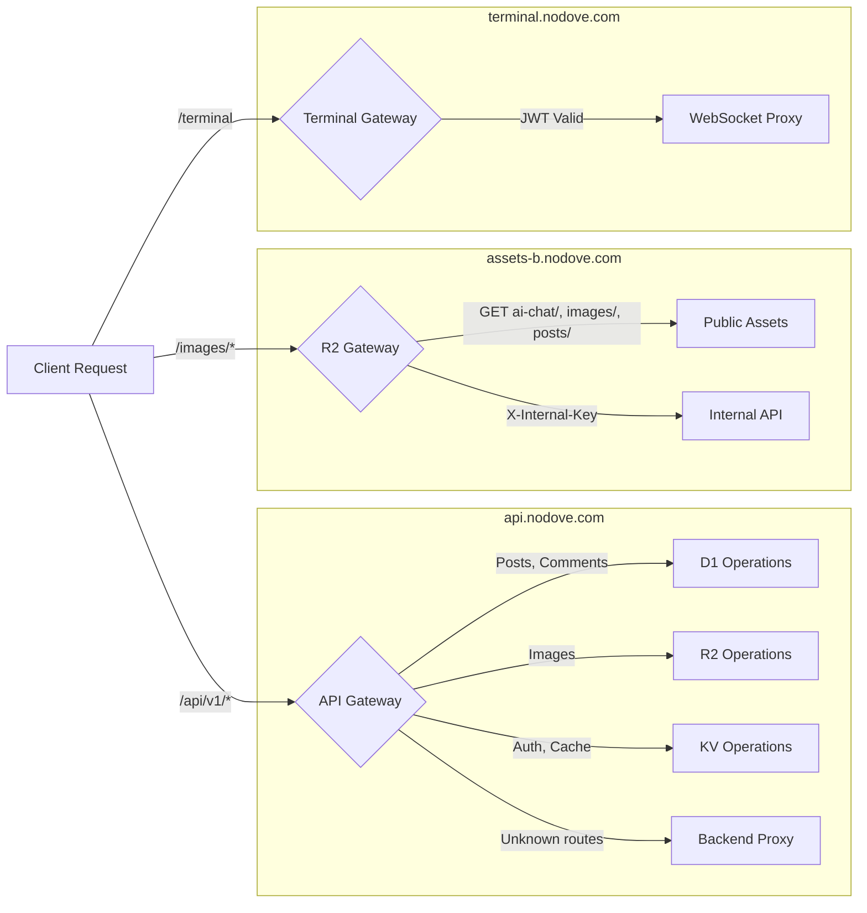
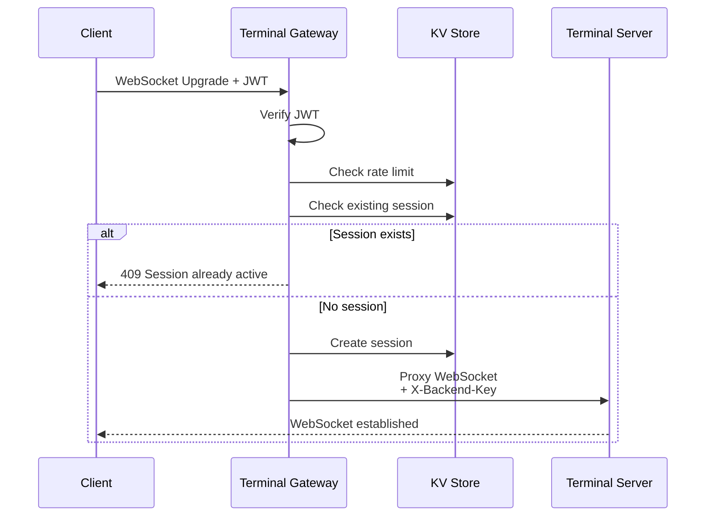

# Cloudflare Workers - Blog Platform

## 1. Service Overview (개요)

### 목적
Cloudflare Workers는 블로그 플랫폼의 **Edge Computing 레이어**입니다. 기존 Cloudflare Tunnel 기반 아키텍처를 대체하여 전 세계 Edge 노드에서 API 요청을 처리합니다. 낮은 지연시간, 높은 확장성, 비용 효율적인 서버리스 아키텍처를 제공합니다.

### 주요 서비스

| Worker | 도메인 | 역할 | 상태 |
|--------|--------|------|------|
| **blog-api-gateway** | `api.nodove.com` | 통합 API Gateway (인증, 콘텐츠, AI, 분석) | ✅ Active |
| **r2-gateway** | `assets-b.nodove.com` | R2 스토리지 접근 제어 및 캐싱 | ✅ Active |
| **terminal-gateway** | `terminal.nodove.com` | WebSocket 터미널 프록시 | ✅ Active |

### 기술 스택
- **Runtime**: Cloudflare Workers (V8 Isolate)
- **Framework**: Hono (경량 Web Framework)
- **Database**: Cloudflare D1 (SQLite 기반)
- **Storage**: Cloudflare R2 (S3 호환)
- **Cache**: Cloudflare KV (Key-Value Store)
- **Language**: TypeScript

---

## 2. Architecture & Data Flow (구조 및 흐름)

### System Architecture



### Request Routing Flow



---

## 3. Workers Specification (서비스 명세)

### 3.1 API Gateway (`blog-api-gateway`)

**역할**: 블로그 플랫폼의 단일 진입점 (Single Entry Point)

| 기능 | 설명 | Binding |
|------|------|---------|
| **인증/인가** | JWT + Email OTP 2FA | KV |
| **콘텐츠 관리** | 게시글, 댓글 CRUD | D1 |
| **이미지 업로드** | 멀티파트 처리 후 R2 저장 | R2 |
| **AI 서비스** | 요약, 번역, RAG 질의응답 | External API |
| **분석/추천** | 조회수, 트렌딩, 에디터 픽 | D1 |
| **백엔드 프록시** | 미처리 요청 전달 | Fetch API |

**Route Structure:**
```
/api/v1
├── /auth         - 인증 (login, verify-otp, refresh, logout)
├── /posts        - 게시글 CRUD
├── /comments     - 댓글 관리
├── /ai           - AI 기능 (sketch, prism, chain)
├── /chat         - AI 채팅
├── /images       - 이미지 업로드
├── /analytics    - 조회수/트렌딩/에디터 픽
├── /translate    - 번역
├── /rag          - RAG 질의응답
├── /memos        - 메모 기능
├── /admin/*      - 관리자 기능
└── /*            - Backend Proxy (fallback)
```

**Cron Triggers:**
- `0 6 * * *` (매일 06:00 UTC): 분석 데이터 갱신, 에디터 픽 선정, 오래된 데이터 정리

---

### 3.2 R2 Gateway (`r2-gateway`)

**역할**: R2 Object Storage 접근 제어 및 Edge 캐싱

| 경로 | 접근 수준 | 설명 |
|------|-----------|------|
| `GET /images/*` | Public | 게시글 이미지 |
| `GET /posts/*` | Public | Markdown 원본 |
| `GET /ai-chat/*` | Public | AI 채팅 이미지 |
| `GET /assets/*` | Public | 정적 에셋 (레거시) |
| `/internal/*` | Internal | 서비스 간 CRUD |

**캐싱 전략:**
- `Cache-Control: public, max-age=31536000, immutable`
- ETag 기반 304 Not Modified 지원
- 변경 시 URL 변경 (immutable pattern)

---

### 3.3 Terminal Gateway (`terminal-gateway`)

**역할**: Docker 터미널 WebSocket 보안 프록시

| 기능 | 설명 |
|------|------|
| **JWT 인증** | API Gateway와 동일한 JWT 검증 |
| **Rate Limiting** | IP당 5회/분 연결 제한 |
| **Single Session** | 사용자당 1개 세션만 허용 |
| **Geo-blocking** | 특정 국가 차단 (CN, RU, KP) |
| **Backend 인증** | X-Backend-Key 헤더 주입 |

**Request Flow:**


---

## 4. Database Schema (D1)

### 마이그레이션 파일

| 파일 | 설명 |
|------|------|
| `0001_init.sql` | 초기 스키마 (posts, comments, tags) |
| `0002_seed_admin.sql` | 관리자 시드 데이터 |
| `0004_post_analytics.sql` | 조회수, 트렌딩 분석 테이블 |
| `0005_translation_cache.sql` | 번역 캐시 테이블 |
| `0006_user_content.sql` | 사용자 생성 콘텐츠 |
| `0007_comment_reactions.sql` | 댓글 리액션 |
| `0008_memo_versions.sql` | 메모 버전 관리 |
| `0009_user_memories.sql` | AI 메모리 저장 |
| `0010_config_management.sql` | 동적 설정 관리 |
| `0011_ai_model_management.sql` | AI 모델 관리 |
| `0014_secrets_management.sql` | 시크릿 관리 |
| `0016_ai_traces.sql` | AI 요청 추적 |
| `0017_ai_playground.sql` | AI 플레이그라운드 |

### 마이그레이션 실행

```bash
# 개발 환경
cd workers/api-gateway
npx wrangler d1 migrations apply blog-db

# 프로덕션 환경
npx wrangler d1 migrations apply blog-db-prod --env production
```

---

## 5. Dependencies & Environment (의존성)

### Cloudflare Bindings (통합)

| Worker | Binding | Type | Description |
|--------|---------|------|-------------|
| api-gateway | `DB` | D1 | 메인 데이터베이스 |
| api-gateway | `R2` | R2 Bucket | 이미지/파일 스토리지 |
| api-gateway | `KV` | KV | 세션, 토큰, 캐시 |
| r2-gateway | `MY_BUCKET` | R2 Bucket | 에셋 스토리지 |
| terminal-gateway | `KV` | KV | Rate limit, 세션 |

### Secrets 설정

```bash
# ============================================
# API Gateway Secrets
# ============================================
cd workers/api-gateway

# 필수 - 인증
npx wrangler secret put JWT_SECRET --env production
npx wrangler secret put ADMIN_USERNAME --env production
npx wrangler secret put ADMIN_PASSWORD --env production
npx wrangler secret put ADMIN_EMAIL --env production

# 필수 - 백엔드 프록시
npx wrangler secret put BACKEND_ORIGIN --env production
npx wrangler secret put BACKEND_KEY --env production

# 필수 - R2 Gateway 호출
npx wrangler secret put INTERNAL_KEY --env production

# 선택 - Email OTP
npx wrangler secret put RESEND_API_KEY --env production
npx wrangler secret put NOTIFY_FROM_EMAIL --env production

# 선택 - AI 기능
npx wrangler secret put GEMINI_API_KEY --env production
npx wrangler secret put OPENROUTER_API_KEY --env production
npx wrangler secret put AI_API_KEY --env production
npx wrangler secret put AI_DEFAULT_MODEL --env production
npx wrangler secret put AI_VISION_MODEL --env production
npx wrangler secret put PERPLEXITY_MODEL --env production

# 선택 - 런타임 설정(실시간 변경 권장)
npx wrangler secret put API_BASE_URL --env production
npx wrangler secret put ASSETS_BASE_URL --env production
npx wrangler secret put ALLOWED_ORIGINS --env production

# ============================================
# R2 Gateway Secrets
# ============================================
cd workers/r2-gateway
npx wrangler secret put INTERNAL_KEY --env production

# ============================================
# Terminal Gateway Secrets
# ============================================
cd workers/terminal-gateway
npx wrangler secret put JWT_SECRET --env production
npx wrangler secret put BACKEND_KEY --env production
```

### Environment Variables

| Worker | Variable | Dev | Prod |
|--------|----------|-----|------|
| api-gateway | `ENV` | `development` | `production` |
| api-gateway | `ALLOWED_ORIGINS` | `localhost:5173,...` | secret 권장 |
| api-gateway | `API_BASE_URL` | `https://api.nodove.com` | secret 권장 |
| r2-gateway | `ALLOWED_ORIGINS` | `*` | `noblog.nodove.com,...` |
| terminal-gateway | `TERMINAL_ORIGIN` | `https://terminal-origin.nodove.com` | 동일 |

---

## 6. Deployment (배포)

### 수동 배포

```bash
# API Gateway
cd workers/api-gateway
npm install
npm run deploy:prod  # 또는: npx wrangler deploy --env production

# R2 Gateway
cd workers/r2-gateway
npm install
npx wrangler deploy --env production

# Terminal Gateway
cd workers/terminal-gateway
npm install
npx wrangler deploy --env production
```

### GitHub Actions 자동 배포

| Workflow | 파일 | 트리거 |
|----------|------|--------|
| Workers Deploy | `deploy-workers.yml` | `workers/**` 변경 시 |
| Full Blog Deploy | `deploy-blog-workflow.yml` | 전체 배포 파이프라인 |

```yaml
# deploy-workers.yml 트리거 조건
on:
  push:
    branches: [main]
    paths:
      - 'workers/**'
```

### Dry-run (변경사항 미리보기)

```bash
npx wrangler deploy --dry-run --env production
```

---

## 7. Edge Cases & Troubleshooting (운영 가이드)

### 제약 사항

| 제약 | Workers Free | Workers Paid |
|------|--------------|--------------|
| CPU 시간 | 10ms/요청 | 30s/요청 |
| 메모리 | 128MB | 128MB |
| 요청 크기 | 100MB | 100MB |
| D1 쿼리 | 100ms CPU | 동일 |
| KV 일관성 | Eventually Consistent | 동일 |

### 예상 에러 상황

| 상황 | HTTP Code | 원인 | 해결 |
|------|-----------|------|------|
| Cold Start 지연 | - | 첫 요청 시 ~50ms | 정상 동작 |
| CPU 시간 초과 | 500 | 복잡한 연산 | 로직 최적화 또는 백엔드 위임 |
| D1 쿼리 실패 | 500 | 쿼리 타임아웃 | 인덱스 최적화 |
| KV 읽기 불일치 | - | Eventual Consistency | TTL 설계 재검토 |
| R2 404 | 404 | 잘못된 키 경로 | 키 컨벤션 확인 |

### 디버깅

```bash
# 실시간 로그 (Worker별)
npx wrangler tail --env production                    # api-gateway
npx wrangler tail r2-gateway --env production        # r2-gateway
npx wrangler tail terminal-gateway-prod              # terminal-gateway

# 로컬 개발 서버
cd workers/api-gateway
npx wrangler dev

# D1 쿼리 실행
npx wrangler d1 execute blog-db-prod --command "SELECT * FROM posts LIMIT 5" --env production

# KV 확인
npx wrangler kv:key list --binding KV --env production
```

---

## 8. Directory Structure (디렉토리 구조)

```
workers/
├── api-gateway/                 # 메인 API Gateway
│   ├── src/
│   │   ├── index.ts            # 엔트리포인트 (Hono app)
│   │   ├── routes/             # API 라우트들
│   │   │   ├── auth.ts         # 인증
│   │   │   ├── posts.ts        # 게시글
│   │   │   ├── comments.ts     # 댓글
│   │   │   ├── ai.ts           # AI 기능
│   │   │   ├── analytics.ts    # 분석
│   │   │   └── ...
│   │   ├── lib/                # 유틸리티
│   │   │   ├── auth.ts         # JWT 처리
│   │   │   ├── db.ts           # D1 쿼리
│   │   │   └── ai-service.ts   # AI 서비스
│   │   ├── middleware/         # Hono 미들웨어
│   │   └── types.ts            # TypeScript 타입
│   ├── wrangler.toml           # D1, R2, KV, Cron 설정
│   └── package.json
│
├── r2-gateway/                  # R2 스토리지 Gateway
│   ├── src/index.ts            # 퍼블릭/내부 R2 접근 제어
│   ├── wrangler.toml
│   └── README.md               # R2 Gateway 문서
│
├── terminal-gateway/            # Terminal WebSocket Gateway
│   ├── src/
│   │   ├── index.ts            # WebSocket 프록시
│   │   ├── auth.ts             # JWT 검증
│   │   ├── ratelimit.ts        # Rate limiting
│   │   └── types.ts            # 타입 정의
│   └── wrangler.toml
│
├── db-api/                      # DB API (템플릿)
│   └── wrangler.toml.tpl
│
└── migrations/                  # D1 마이그레이션 파일들
    ├── 0001_init.sql
    ├── 0002_seed_admin.sql
    └── ...
```

---

## Quick Reference

### 도메인 매핑

| 서비스 | 도메인 | 설명 |
|--------|--------|------|
| API Gateway | `api.nodove.com` | 모든 API 요청 |
| R2 Gateway | `assets-b.nodove.com` | 정적 에셋 |
| Terminal Gateway | `terminal.nodove.com` | WebSocket 터미널 |
| Frontend | `noblog.nodove.com` | React SPA |
| Backend | `blog-b.nodove.com` | Node.js 서버 |

### 배포 체크리스트

1. [ ] TypeScript 컴파일 확인: `npm run build`
2. [ ] Dry-run 확인: `npx wrangler deploy --dry-run`
3. [ ] Secrets 설정 확인: `npx wrangler secret list`
4. [ ] 배포: `npx wrangler deploy --env production`
5. [ ] 로그 확인: `npx wrangler tail --env production`
6. [ ] Health check: `curl https://api.nodove.com/health`

### 관련 문서

- [API Gateway README](./api-gateway/README.md) - 상세 API 명세
- [R2 Gateway README](./r2-gateway/README.md) - 스토리지 접근 제어
