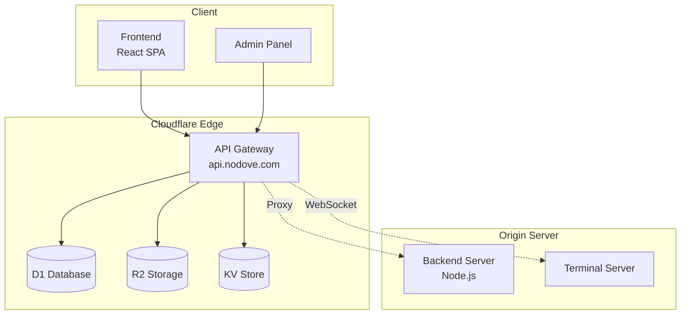
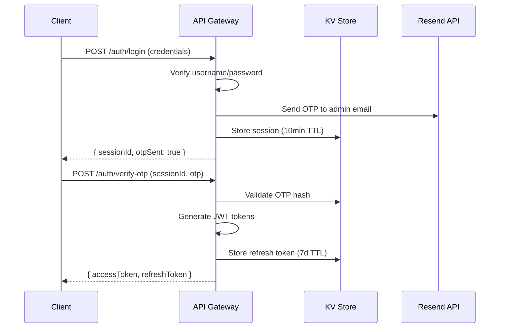
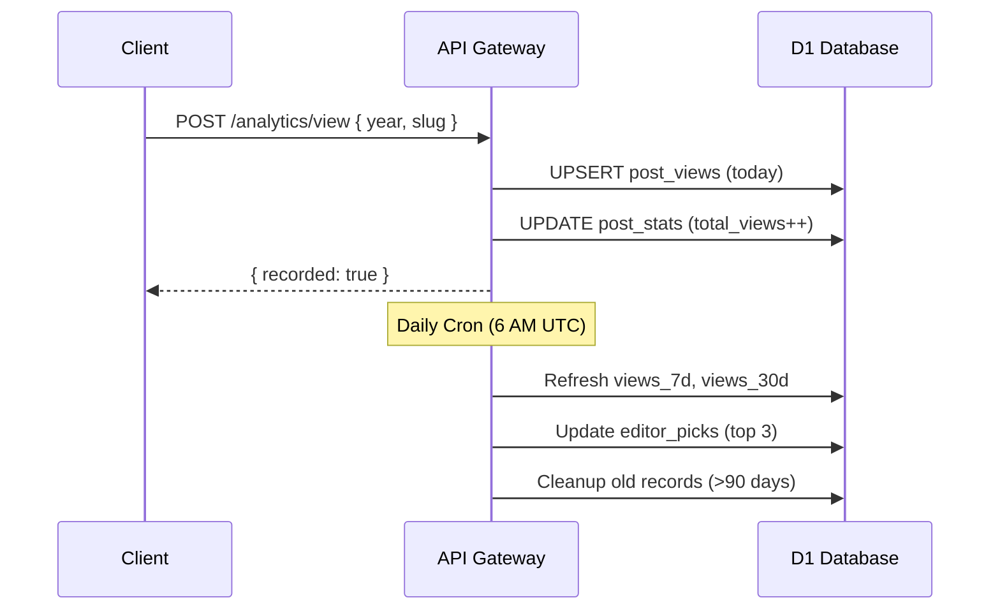

# Blog API Gateway

## 1. Service Overview (개요)

### 목적
Blog API Gateway는 블로그 플랫폼의 **단일 진입점(Single Entry Point)**으로서, Cloudflare Workers 기반의 Edge Computing 환경에서 모든 API 요청을 처리합니다. 기존 Cloudflare Tunnel을 대체하여 더 낮은 지연시간과 높은 확장성을 제공합니다.

### 주요 기능
| 기능 | 설명 |
|------|------|
| **인증/인가** | JWT 기반 인증 + Email OTP 2단계 검증 |
| **콘텐츠 관리** | 게시글, 댓글, 이미지 CRUD 처리 |
| **AI 서비스** | 텍스트 요약, 번역, RAG 기반 질의응답 |
| **분석/추천** | 조회수 추적, 트렌딩 분석, 에디터 픽 자동 선정 |
| **백엔드 프록시** | Workers에서 처리하지 않는 요청을 백엔드 서버로 전달 |

### 기술 스택
- **Runtime**: Cloudflare Workers (V8 Isolate)
- **Framework**: Hono (경량 Web Framework)
- **Database**: Cloudflare D1 (SQLite 기반)
- **Storage**: Cloudflare R2 (S3 호환 Object Storage)
- **Cache/KV**: Cloudflare KV (Key-Value Store)
- **Language**: TypeScript

---

## 2. Architecture & Data Flow (구조 및 흐름)

### System Architecture



### Request Flow (Authentication)



### Request Flow (Analytics)



---

## 3. API Specification (인터페이스 명세)

### Authentication Routes (`/api/v1/auth`)

| Method | Endpoint | Input | Output | Description |
|--------|----------|-------|--------|-------------|
| `POST` | `/login` | `{ username, password }` | `{ sessionId, otpSent }` | 자격증명 확인 후 OTP 발송 |
| `POST` | `/verify-otp` | `{ sessionId, otp }` | `{ accessToken, refreshToken }` | OTP 검증 후 토큰 발급 |
| `POST` | `/refresh` | `{ refreshToken }` | `{ accessToken }` | Access Token 갱신 |
| `POST` | `/logout` | `{ refreshToken }` | `{ success: true }` | Refresh Token 무효화 |
| `GET` | `/me` | `Authorization: Bearer <token>` | `{ user }` | 현재 사용자 정보 |

### Content Routes

| Method | Endpoint | Input | Output | Auth |
|--------|----------|-------|--------|------|
| `GET` | `/posts` | `?status=&limit=&tag=` | `{ items: Post[] }` | - |
| `GET` | `/posts/:slug` | - | `{ post, tags }` | - |
| `POST` | `/posts` | `{ title, slug, content, ... }` | `{ id }` | Admin |
| `GET` | `/comments?postId=` | `postId` (required) | `{ comments }` | - |
| `POST` | `/comments` | `{ postId, author, content }` | `{ id }` | - |
| `DELETE` | `/comments/:id` | - | `{ deleted: true }` | Admin |
| `POST` | `/images/upload` | `multipart/form-data` | `{ urls }` | Admin |

### Analytics Routes (`/api/v1/analytics`)

| Method | Endpoint | Input | Output | Description |
|--------|----------|-------|--------|-------------|
| `POST` | `/view` | `{ year, slug }` | `{ recorded }` | 조회수 기록 |
| `GET` | `/stats/:year/:slug` | - | `{ stats }` | 게시글 통계 조회 |
| `GET` | `/trending?limit=&days=` | - | `{ trending }` | 트렌딩 게시글 |
| `GET` | `/editor-picks?limit=` | - | `{ picks }` | 에디터 픽 |

### AI Routes (`/api/v1/ai`)

| Method | Endpoint | Input | Output | Description |
|--------|----------|-------|--------|-------------|
| `POST` | `/sketch` | `{ paragraph, postTitle? }` | `{ result }` | 텍스트 스케치 생성 |
| `POST` | `/prism` | `{ paragraph, postTitle? }` | `{ result }` | 다각도 분석 |
| `POST` | `/chain` | `{ paragraph, postTitle? }` | `{ result }` | 연쇄 사고 분석 |

### Response Format

모든 API는 표준 응답 형식을 따릅니다:

```typescript
// Success
{ "ok": true, "data": { ... } }

// Error
{ "ok": false, "error": { "code": "ERR_CODE", "message": "설명" } }
```

---

## 4. Key Business Logic (핵심 로직 상세)

### JWT 기반 인증 + Email OTP 2FA

```
인증 흐름:
1. 사용자가 username/password 제출
2. 환경변수(GitHub Secrets)에 저장된 관리자 자격증명과 비교
3. 일치 시 6자리 OTP 생성 → SHA-256 해시 후 KV 저장
4. Resend API로 관리자 이메일에 OTP 발송
5. OTP 검증 성공 시 JWT Access Token(15분) + Refresh Token(7일) 발급
```

**보안 고려사항:**
- Timing Attack 방지를 위한 500-1000ms 랜덤 지연
- OTP는 10분 후 만료, 단일 사용
- Refresh Token은 KV에 저장되어 언제든 무효화 가능

### 에디터 픽 자동 선정 알고리즘

```
Score = (views_7d × 0.5) + (views_30d × 0.3) + (total_views × 0.2)

선정 기준:
- views_7d > views_30d × 0.5 → "Trending this week"
- total_views > 100 → "Evergreen favorite"
- 그 외 → "Popular post"
```

매일 06:00 UTC Cron Trigger로 실행되며, 상위 3개 게시글이 자동 선정됩니다.

### 백엔드 프록시 메커니즘

Workers에서 처리하지 않는 라우트는 자동으로 백엔드 서버로 프록시됩니다:

```
요청 변환:
- Host 헤더 → 백엔드 도메인으로 교체
- X-Backend-Key → 공유 시크릿 추가
- X-Forwarded-For, X-Real-IP → Cloudflare 헤더에서 추출
- CF-Ray, CF-IPCountry → 디버깅용 전달
```

---

## 5. Dependencies & Environment (의존성)

### Cloudflare Bindings

| Binding | Type | Description |
|---------|------|-------------|
| `DB` | D1 Database | 메인 데이터베이스 (게시글, 댓글, 분석) |
| `R2` | R2 Bucket | 이미지/파일 스토리지 |
| `KV` | KV Namespace | 세션, 토큰, 설정 캐시 |

### Required Secrets (`wrangler secret put`)

| Secret | Description | Required |
|--------|-------------|----------|
| `JWT_SECRET` | JWT 서명 키 | ✅ |
| `ADMIN_USERNAME` | 관리자 사용자명 | ✅ |
| `ADMIN_PASSWORD` | 관리자 비밀번호 | ✅ |
| `ADMIN_EMAIL` | OTP 수신 이메일 | ✅ |
| `BACKEND_ORIGIN` | 백엔드 서버 URL | ✅ |
| `BACKEND_KEY` | 백엔드 인증 키 (X-Backend-Key) | ✅ |
| `INTERNAL_KEY` | R2 Gateway 인증 키 (X-Internal-Key) | R2 Internal API |
| `RESEND_API_KEY` | Resend 이메일 API 키 | Email OTP |
| `NOTIFY_FROM_EMAIL` | 발신자 이메일 | Email OTP |
| `AI_API_KEY` | AI 서버 인증 키 | AI 기능 |

### Environment Variables

| Variable | Dev | Prod |
|----------|-----|------|
| `ENV` | `development` | `production` |
| `ALLOWED_ORIGINS` | `localhost:5173,...` | `noblog.nodove.com,...` |
| `API_BASE_URL` | `https://api.nodove.com` | `https://api.nodove.com` |

---

## 6. Edge Cases & Troubleshooting (운영 가이드)

### 예상 에러 상황

| 상황 | HTTP Code | Error Code | 해결 방법 |
|------|-----------|------------|-----------|
| OTP 만료 | 401 | `OTP_EXPIRED` | 로그인 재시도 |
| 잘못된 OTP | 401 | `INVALID_OTP` | 최대 5회 시도 후 세션 만료 |
| Refresh Token 만료 | 401 | `TOKEN_EXPIRED` | 재로그인 필요 |
| 백엔드 연결 실패 | 503 | `BACKEND_UNAVAILABLE` | 백엔드 서버 상태 확인 |
| D1 쿼리 실패 | 500 | `DATABASE_ERROR` | D1 대시보드에서 쿼리 로그 확인 |

### 제약 사항

1. **Cold Start**: Workers는 요청이 없으면 인스턴스가 종료됨. 첫 요청 시 ~50ms 지연 발생 가능
2. **CPU 시간 제한**: 무료 플랜 10ms, 유료 플랜 30s (AI 요청 주의)
3. **D1 쿼리 제한**: 단일 요청당 최대 100ms CPU 시간
4. **KV 일관성**: Eventually Consistent (캐시 TTL 고려)

### 디버깅 명령어

```bash
# 실시간 로그 확인
npx wrangler tail --env production

# 로컬 개발 서버
npx wrangler dev

# D1 쿼리 실행
npx wrangler d1 execute blog-db-prod --command "SELECT * FROM post_stats LIMIT 5"

# Secrets 설정
npx wrangler secret put JWT_SECRET --env production
```

### 배포

```bash
# 개발 환경
npx wrangler deploy

# 프로덕션
npx wrangler deploy --env production

# Dry-run (변경사항 확인)
npx wrangler deploy --dry-run
```

---

## Quick Reference

### Route Mounting Structure

```
/api/v1
├── /auth         - 인증 (login, verify-otp, refresh, logout)
├── /posts        - 게시글 CRUD
├── /comments     - 댓글 관리
├── /ai           - AI 기능 (sketch, prism, chain)
├── /chat         - AI 채팅
├── /images       - 이미지 업로드
├── /og           - Open Graph 이미지 생성
├── /analytics    - 조회수/트렌딩
├── /translate    - 번역
├── /config       - 동적 설정 (Admin)
├── /rag          - RAG 질의응답
├── /gateway      - 외부 API 프록시
├── /memos        - 메모 기능
├── /memories     - AI 메모리 저장
├── /admin/ai     - AI 모델 관리 (Admin)
├── /admin/secrets- 시크릿 관리 (Admin)
├── /personas     - AI 페르소나
└── /user-content - 사용자 생성 콘텐츠
```
