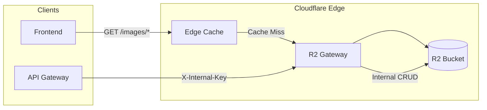
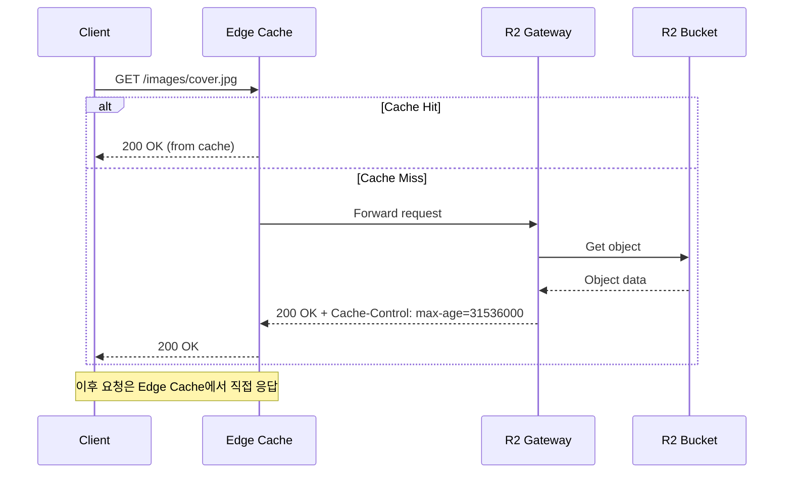
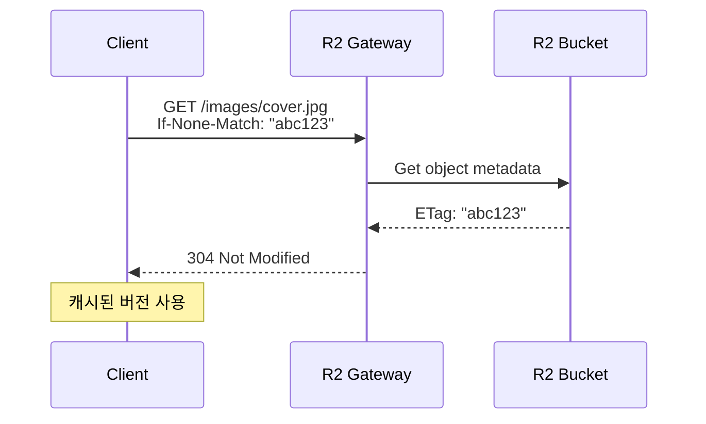

# R2 Gateway

## 1. Service Overview (개요)

### 목적
R2 Gateway는 Cloudflare R2 Object Storage에 대한 **접근 제어 및 캐싱 레이어**입니다. R2 버킷의 직접 노출을 방지하고, Cloudflare Edge Cache를 활용하여 읽기 비용을 절감하며, 공개/내부 접근을 구분하여 보안을 강화합니다.

### 주요 기능
| 기능 | 설명 |
|------|------|
| **공개 에셋 서빙** | 이미지, 게시글 등 공개 콘텐츠 제공 |
| **Edge 캐싱** | 1년 TTL + immutable 캐싱으로 R2 읽기 최소화 |
| **ETag 기반 캐시 검증** | 304 Not Modified 응답으로 대역폭 절감 |
| **내부 API** | 인증된 서비스 간 JSON 데이터 CRUD |
| **CORS 제어** | Origin 기반 접근 제한 |

### 기술 스택
- **Runtime**: Cloudflare Workers
- **Storage**: Cloudflare R2 (S3 호환)
- **Language**: TypeScript
- **Cache**: Cloudflare Edge Cache (자동)

---

## 2. Architecture & Data Flow (구조 및 흐름)

### System Architecture



### Request Flow (Public Asset)



### Request Flow (ETag Validation)



---

## 3. API Specification (인터페이스 명세)

### Public Endpoints (인증 불필요)

공개 프리픽스: `ai-chat/`, `images/`, `posts/`, `assets/`

| Method | Path | Input | Output | Description |
|--------|------|-------|--------|-------------|
| `GET` | `/{public_prefix}/*` | - | Binary data | 공개 에셋 조회 |
| `HEAD` | `/{public_prefix}/*` | - | Headers only | 메타데이터 조회 |
| `OPTIONS` | `/*` | - | 204 No Content | CORS Preflight |
| `GET` | `/assets/*` | - | Binary data | 레거시 경로 지원 |

**Response Headers:**
```
Content-Type: <object content type>
ETag: "<hash>"
Cache-Control: public, max-age=31536000, immutable
Accept-Ranges: bytes
```

### Internal Endpoints (인증 필요)

인증 방법: `X-Internal-Key` 헤더 또는 허용된 Referer

| Method | Path | Input | Output | Description |
|--------|------|-------|--------|-------------|
| `GET` | `/internal/{resource}/{userId}/` | `?cursor=&limit=` | `{ objects[], cursor }` | 오브젝트 목록 조회 |
| `GET` | `/internal/{resource}/{userId}/{id}` | - | JSON data | 단일 오브젝트 조회 |
| `PUT` | `/internal/{resource}/{userId}/{id}` | JSON body | `{ ok, etag }` | 오브젝트 생성/수정 |
| `DELETE` | `/internal/{resource}/{userId}/{id}` | - | 204 No Content | 오브젝트 삭제 |

**Conditional Requests (Optimistic Locking):**
- `If-Match: <etag>` - ETag 일치 시에만 수정/삭제
- ETag 불일치 시 `412 Precondition Failed`

### Response Format

```typescript
// Success
{ "ok": true, "data": { ... } }

// List Response
{
  "ok": true,
  "cursor": "next_page_token",
  "truncated": false,
  "objects": [
    { "key": "...", "size": 1234, "httpEtag": "...", "uploaded": "..." }
  ]
}

// Error
{ "ok": false, "error": "Error message" }
```

---

## 4. Key Business Logic (핵심 로직 상세)

### 공개 경로 vs 내부 경로 라우팅

```
URL 분석:
1. 빈 경로 → { ok: true, service: "r2-gateway" }
2. assets/* → 레거시 호환, prefix 제거 후 서빙
3. ai-chat/, images/, posts/, assets/ → 공개 서빙
4. internal/* → 인증 검증 후 CRUD 처리
5. 그 외 → 404 Not Found
```

### 인증 로직 (Internal Calls)

```typescript
function isInternalCall(request: Request, env: Env): boolean {
  // 방법 1: API 키 검증
  const key = request.headers.get("X-Internal-Key");
  if (env.INTERNAL_KEY && key === env.INTERNAL_KEY) {
    return true;
  }
  
  // 방법 2: Referer 검증
  const referer = request.headers.get("Referer");
  return ALLOWED_INTERNAL_ORIGINS.some(origin => referer?.startsWith(origin));
}
```

### ETag 기반 캐시 검증

```
클라이언트 요청: GET /images/x.jpg, If-None-Match: "abc123"
           ↓
R2에서 현재 ETag 조회: "abc123"
           ↓
ETag 비교: 일치 → 304 Not Modified
          불일치 → 200 OK + 새 데이터
```

### Optimistic Locking (PUT/DELETE)

```
PUT /internal/memories/user1/session1
If-Match: "old_etag"

1. 기존 오브젝트 ETag 조회
2. If-Match 헤더와 비교
3. 불일치 → 412 Precondition Failed (동시 수정 감지)
4. 일치 → 업데이트 진행
```

---

## 5. Dependencies & Environment (의존성)

### Cloudflare Bindings

| Binding | Type | Description |
|---------|------|-------------|
| `MY_BUCKET` | R2 Bucket | 블로그 에셋 저장소 |

### Required Secrets

| Secret | Description | Required |
|--------|-------------|----------|
| `INTERNAL_KEY` | 내부 서비스 인증 키 (X-Internal-Key) | Internal API |

### Environment Variables

| Variable | Dev | Prod |
|----------|-----|------|
| `ALLOWED_ORIGINS` | `*` | `noblog.nodove.com,...` |
| `ALLOWED_INTERNAL_ORIGINS` | - | API Gateway URL |

---

## 6. Edge Cases & Troubleshooting (운영 가이드)

### 예상 에러 상황

| 상황 | HTTP Code | 원인 | 해결 |
|------|-----------|------|------|
| 오브젝트 없음 | 404 | R2에 해당 키 없음 | 키 경로 확인 |
| 접근 거부 | 403 | Internal API 인증 실패 | `X-Internal-Key` 확인 |
| ETag 불일치 | 412 | 동시 수정 충돌 | 최신 데이터 다시 조회 후 재시도 |
| 메서드 불허 | 405 | 지원하지 않는 HTTP 메서드 | GET/HEAD/OPTIONS만 허용 (Public) |
| CORS 에러 | - | Origin 불일치 | `ALLOWED_ORIGINS` 설정 확인 |

### 제약 사항

1. **Public 경로는 GET/HEAD/OPTIONS만 허용** - 업로드는 Internal API 사용
2. **페이지네이션 제한**: 최대 100개/페이지
3. **Internal API JSON 전용**: Content-Type은 자동으로 `application/json`
4. **R2 객체 크기 제한**: 최대 5GB (멀티파트 업로드 필요)

### 디버깅

```bash
# 공개 에셋 테스트
curl -I https://assets-b.nodove.com/images/cover.jpg

# ETag 검증 테스트
curl -H "If-None-Match: \"abc123\"" https://assets-b.nodove.com/images/cover.jpg

# Internal API 테스트
curl -H "X-Internal-Key: your-key" \
  "https://assets-b.nodove.com/internal/memories/user1/"

# 실시간 로그
npx wrangler tail r2-gateway --env production
```

### 배포

```bash
cd workers/r2-gateway

# 개발 환경
npx wrangler deploy

# 프로덕션
npx wrangler deploy --env production

# Secrets 설정
npx wrangler secret put INTERNAL_KEY --env production
```

---

## Quick Reference

### 공개 프리픽스

| Prefix | 용도 |
|--------|------|
| `ai-chat/` | AI 채팅 이미지 |
| `images/` | 게시글 이미지 |
| `posts/` | Markdown 원본 |
| `assets/` | 정적 에셋 |

### 캐싱 전략

| 리소스 | Cache-Control | 설명 |
|--------|---------------|------|
| 모든 공개 에셋 | `max-age=31536000, immutable` | 1년 캐싱, 변경 시 URL 변경 |
| 304 응답 | 동일 | ETag 일치 시 |

### Storage Path Convention

```
R2 Bucket: blog
├── images/
│   ├── 2025/
│   │   └── post-slug/
│   │       └── cover.jpg
├── posts/
│   └── 2025/
│       └── post-slug.md
├── ai-chat/
│   └── {userId}/
│       └── {timestamp}.png
└── {resource}/
    └── {userId}/
        └── {id}.json  (Internal API)
```
